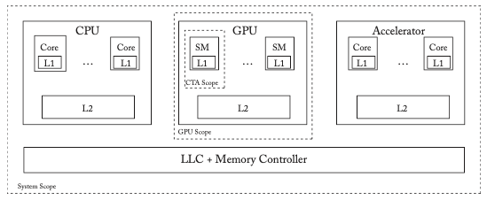
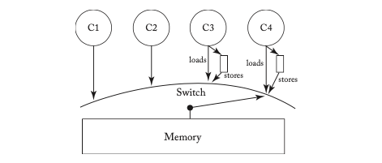
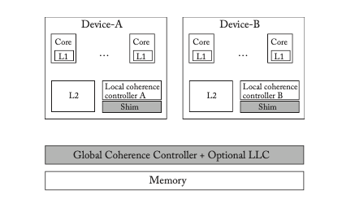
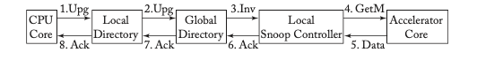
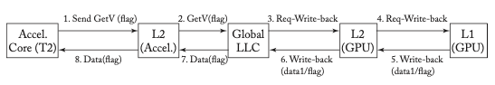
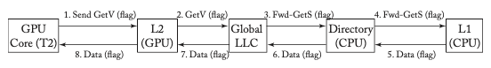
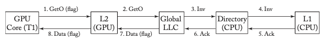
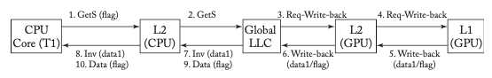

# CHAPTER 10 Consistency and Coherence for Heterogeneous Systems

This is the age of specialization. Today’s server, mobile, and desktop processors contain not only conventional CPUs, but also various flavors of accelerators. The most prominent among the accelerators are Graphics Processing Units (GPUs). Other types of accelerators including Digital Signal Processors (DSPs), AI accelerators (e.g., Apple’s Neural Engine, Google’s TPU), cryptographic accelerators, and field-programmable-gate-arrays (FPGAs) are also becoming common.

Such heterogeneous architectures, however, pose a programmability challenge. How to synchronize and communicate within and across the accelerators? And, how to do this efficiently? One promising trend is to expose a global shared memory interface across the CPUs and the accelerators. Recall that shared memory helps not only with programmability by providing an intuitive load-store interface for communication, but also helps in reaping the benefits of locality via programmer-transparent caching.

CPUs, GPUs, and other accelerators can either be tightly integrated and actually share the same physical memory, as is the case in mobile systems-on-chips, or they may have physically independent memories with a runtime that provides a logical abstraction of shared memory. Unless specified otherwise, we assume the former. As shown in Figure 10.1, each of the CPUs, GPUs, and accelerators may have multiple cores with private per-core L1s and a shared L2. The CPUs and the accelerators also may share a memory-side last-level cache (LLC) that, unless specified otherwise, is non-inclusive. (Recall that a memory-side LLC does not pose coherency issues). The LLC also serves as an on-chip memory controller.

Shared memory automatically raises questions. What is the consistency model? How is the consistency model (efficiently) enforced? In particular, how are the caches within an accelerator (the L1s) and across the CPUs and accelerators (L1s and L2s) kept coherent?

In this chapter, we discuss potential answers to these questions in this fast moving area. We first study consistency and coherence within an accelerator, focusing on GPUs. We then consider consistency and coherence across the accelerators and the CPU.

*Figure 10.1: System model of a heterogeneous system-on-chip containing a CPU, GPU, and accelerator. SM refers to a streaming multi-processor; CTA refers to cooperative thread array.*
 
(Description: The diagram shows a CPU with multiple cores, each with L1 caches, and a shared L2; a GPU with Streaming Multiprocessors (SMs), each with L1 caches, and a shared L2; an accelerator with similar structure; an LLC + Memory Controller shared among all; labels indicate CTA scope (L1), GPU scope (L2), System scope (LLC).)

## 10.1 GPU CONSISTENCY AND COHERENCE

We start this section by briefly summarizing early GPU architectures and their programming model. This will help us appreciate the design choices with regard to consistency and coherence in such GPUs, which were primarily targeted toward graphics workloads. We then discuss the trend of using GPU-like architectures to run general-purpose workloads in so-called General-Purpose Graphics Processing Units (GPGPUs) [5]. Specifically, we discuss the new demands that GPGPUs place on consistency and coherence. We then discuss in detail some of the recent proposals for fulfilling these demands.

### 10.1.1 EARLY GPUS: ARCHITECTURE AND PROGRAMMING MODEL

Early GPUs were primarily tailored toward embarrassingly parallel graphics workloads. Roughly speaking, the workloads involve computing independently each of the pixels that constitute the display. Thus, the workloads are characterized by a very high degree of data-parallelism and low degrees of data sharing, synchronization, and communication.

#### GPU Architecture

To exploit the abundance of parallelism, GPUs typically have tens of cores called **Streaming Multiprocessors (SMs)** (NVIDIA terminology; Compute Units (CUs) in AMD parlance), as shown in Figure 10.1. Each SM is highly multithreaded, capable of running on the order of a thousand threads. The threads mapped to an SM share the L1 cache and a local scratchpad memory (not shown). All of the SMs share an L2 cache.

In order to amortize the cost of fetching and decoding instructions for all of these threads, GPUs typically execute threads in groups called **warps** (NVIDIA) or **wavefronts** (AMD). All of the threads in a warp share the program counter (PC) and the stack, but can still execute independent thread-specific paths using mask-bits that specify which threads among the warps are active and which threads should not execute. This style of parallelism is known as “Single-Instruction-Multiple-Threads” (SIMT). Because all of the threads in a warp share the PC, traditionally the threads in a warp were scheduled together. Recently, however, GPUs are starting to allow for threads within a warp to have independent PCs and stacks, and consequently allow for the threads to be independently scheduled. For the rest of the discussion, we assume that threads can be independently scheduled.

Because graphics workloads do not share data or synchronize frequently—synchronization and communication typically happening infrequently at a coarser level of granularity—early GPUs chose not to implement hardware cache coherence for the L1 caches. (They did not enforce the SWMR invariant.) The absence of hardware cache coherence makes synchronization a trickier prospect for the programmer, as we see next.

#### GPU Programming model

Analogously to the CPU instruction set architecture (ISA), the GPUs also have virtual ISAs. NVIDIA’s virtual ISA, for example, is known as Parallel Thread Execution (PTX). In addition, there are higher-level language frameworks. Two such frameworks are especially popular: CUDA and OpenCL. The high-level programs in these frameworks are compiled down to virtual ISAs, which in turn are translated into native binaries at kernel installation time. A **kernel** refers to a unit of work offloaded by the CPU onto the GPU and typically consists of a large number of software threads.

GPU virtual ISAs as well as language frameworks choose to expose the hierarchical nature of GPU architectures to the programmer via a thread hierarchy known as **scopes** [15]. In contrast to CPU threads where all threads are “equal”, GPU threads from a kernel are grouped into clusters called **Cooperative Thread Arrays (CTA)** (PTX terminology; Workgroups in OpenCL; thread blocks in CUDA). A **CTA scope** refers to the set of threads from the same CTA. Such threads are guaranteed to be mapped to the same SM and hence share the same L1. Thus, the CTA scope also implicitly refers to the memory hierarchy level (L1 and local scratchpad) that all of these threads share. A **GPU scope** refers to the set of threads from the same GPU. These threads could be from the same or different CTAs from that GPU. All of these threads share the L2. Thus, the GPU scope implicitly refers to the L2. Finally, **System scope** refers to the set of all threads from the whole system. These threads can be from the CPU, GPU, or other accelerators that constitute the system. All of these threads may share a cache (LLC). Thus, the System scope implicitly refers to the LLC, or unified shared memory if there is no shared LLC.

Why expose the thread and memory hierarchy to the software? In the absence of hardware cache coherence, this allows for programmers and hardware to cooperatively achieve synchronization efficiently. Specifically, if the programmer ensures that two synchronizing threads are within the same CTA, the threads can synchronize and communicate efficiently via the L1 cache.

How can two threads belonging to different CTAs from the same GPU kernel synchronize? Somewhat surprisingly, early GPU consistency models did not explicitly allow this. In practice, though, programmers could achieve GPU-scoped synchronization via specially crafted loads and stores that bypass the L1 and synchronize at the shared L2. Needless to say, this was causing a great deal of confusion among the programmers [8]. In the next section, we explore GPU consistency in detail with examples.

#### GPU Consistency

GPUs support relaxed memory consistency models. Like relaxed consistency CPUs, GPUs enforce only the memory orderings indicated by the programmer, e.g., via FENCE instructions.

However, because of the absence of hardware cache coherence in GPUs, the semantics of a FENCE instruction is different. Recall that a FENCE instruction in a multicore CPU ensures that loads and stores before the FENCE are performed, with respect to all threads, before the loads and stores following the FENCE. A GPU FENCE provides similar semantics, but only with respect to other threads belonging to the same CTA. A corollary of this is that GPU stores lack atomicity. Recall that store atomicity (Section 5.5.2) mandates that a thread’s store is logically seen by all other threads at once. In GPUs, however, a store may become visible to a thread belonging to the same CTA before other threads.

Consider the message-passing example shown in Table 10.1 where the programmer intends for load Ld2 to read NEW and not the old value of 0. How does one ensure this?

**Table 10.1: Message passing example. T1 and T2 belong to the same CTA.**

| Thread T1 | Thread T2 | Comments |
|-----------|-----------|----------|
| St1: St data = NEW; | Ld1: Ld r1 = flag; | Initially data and flag are 0. |
| FENCE; | B1: if (r1 ≠ SET) goto Ld1; | Can r2==0? |
| St2: St flag = SET; | FENCE; | |
| | Ld2: Ld r2 = data; | |

First of all, note that without the two FENCE instructions, Ld2 can read the old value of 0—GPUs, being relaxed, may perform loads and stores out of order.

Now, let us suppose that the two threads T1 and T2 belong to the same CTA, and are hence mapped to the same SM. At the microarchitectural level, a GPU FENCE works similarly to a FENCE in XC, as we discussed in Chapter 5. The reorder unit ensures that the Load/Store → FENCE and FENCE → Load/Store orderings are enforced. Because T1 and T2 share an L1, honoring the above rules is sufficient to ensure that the two stores from T1 are made visible to T2 in program order, ensuring that load L2 reads NEW.

**Table 10.2: Message passing example. T1 and T2 belong to different CTAs.**

| Thread T1 | Thread T2 | Comments |
|-----------|-----------|----------|
| St1: St.GPU data = NEW; | Ld1: Ld.GPU r1 = flag; | Initially data and flag are 0. |
| FENCE; | B1: if (r1 ≠ SET) goto Ld1; | Can r2==0? |
| St2: St.GPU flag = SET; | FENCE; | |
| | Ld2: Ld.GPU r2 = data; | |

On the other hand, if the two threads T1 and T2 belong to different CTAs, and hence are mapped to different SMs (SM1 and SM2), it is possible for load Ld2 to read 0. To see how, consider the following sequence of events.

- Initially, both data and flag are cached in both L1s.
- St1 and St2 perform in program order, writing NEW and SET, respectively, in SM1’s L1 cache.
- The cache line holding flag is evicted from SM1’s L1, and flag=SET is written to the L2.
- The cache line holding flag in SM2’s L1 is evicted.
- The load Ld1 performs and misses in SM2’s L1, so the line from the L2 is fetched and reads SET.
- The load Ld2 performs, hits in SM2’s L1, and reads 0.

Thus, although the FENCE ensures that the two stores are written to SM1’s L1 in the correct order, they may become visible to T2 in a different order in the absence of hardware cache coherence. That is why early GPU programming manuals explicitly disallow this type of inter-CTA synchronization between threads of the same kernel.

Is inter-CTA synchronization then impossible to achieve? In practice, a workaround is possible, leveraging special load and store instructions that directly target specific levels of the memory hierarchy. As we can see in Table 10.2, the two stores in T1 explicitly write to the GPU scope (i.e., to the L2) bypassing the L1. Likewise, the two loads from T2 bypass the L1 and read directly from the L2. Thus, the two threads of GPU scope, T1 and T2, are explicitly made to synchronize at the L2 by using loads and stores that bypass the L1.

However, there are problems with the above workaround—the primary issue being performance inefficiency owing to loads and stores bypassing the L1. In this simple example, the two variables in question must be communicated across SMs, so bypassing is a necessary evil. However, bypassing may be problematic with more variables, only some of which are communicated across SMs. In such a situation, the programmer is confronted with the onerous task of carefully directing loads/stores to the appropriate memory hierarchy level in order to make effective use of the L1.

> **Flashback to Quiz Question 8:** GPUs do not support hardware cache coherence. Therefore, they are unable to enforce a memory consistency model. True or false?  
> **Answer:** False! Early GPUs did not support cache coherence in hardware, yet supported scoped relaxed consistency models.

#### Summary: Limitations and Requirements

Early GPUs were primarily targeted toward embarrassingly parallel workloads that neither synchronized nor shared data frequently. Therefore, such GPUs chose not to support hardware cache coherence for keeping the local caches coherent, at the cost of a scoped memory consistency model that permitted only intra-CTA synchronization. More flexible inter-CTA synchronization was either too inefficient or placed a huge burden on programmers.

Programmers are starting to use GPUs for general purpose workloads. Such workloads tend to involve relatively frequent fine-grained synchronization and more general sharing patterns. Thus, it is desirable for a GPGPU to have:
- a rigorous and intuitive memory consistency model that permits synchronization across all threads; and
- a coherence protocol that enforces the consistency model while allowing for efficient data sharing and synchronization, while at the same time keeping the simplicity of the conventional GPU architecture, as GPUs will still cater to graphic workloads predominantly.

### 10.1.2 BIG PICTURE: GPGPU CONSISTENCY AND COHERENCE

We already outlined the desired properties for GPGPU consistency and coherence. One straightforward approach to meeting these demands is to use a multicore CPU-like approach to coherence and consistency, i.e., use one of the consistency-agnostic coherence protocols (that we covered at length in Chapters 6–9) to ideally enforce a strong consistency model such as sequential consistency (SC). Despite ticking almost all boxes—the consistency model is certainly intuitive (without the notion of scopes) and the coherence protocol allows for the efficient sharing of data—the approach is ill-suited for a GPU. There are two major reasons for this [30].

First, a CPU-like coherence protocol that invalidates sharers upon a write would incur a high traffic overhead in the GPU context. This is because the aggregate capacity of the local caches (L1s) in GPUs is typically comparable to, or even greater than, the size of the L2. The NVIDIA Volta GPU, for example, has an aggregate capacity of about 10 MB of L1 cache and only 6 MB of L2 cache. A standalone inclusive directory would not only incur a large area overhead owing to the duplicate tags, but also significant complexity because the directory would need to be highly associative. On the other hand, an embedded inclusive directory would result in a significant amount of recall traffic upon L2 evictions, given the size of the aggregate L1s.

Second, because GPUs maintain thousands of active hardware threads, there is a need to track a correspondingly high number of coherence transactions, which would cost significant hardware overhead.

Without writer-initiated invalidations, how can a store be propagated to other non-local L1 caches? (I.e., how can the store be made visible to threads belonging to other CTAs?) Without writer-initiated invalidations, how can a consistency model—let alone a strong consistency model—be enforced?

In Sections 10.1.3 and 10.1.4, we discuss two proposals that employ **self-invalidation** [18], whereby a processor invalidates lines in its local cache to ensure that stores from other threads become visible.

What consistency model can the self-invalidation protocols enforce efficiently? We argue that such protocols are amenable to efficiently enforcing relaxed consistency models directly, rather than enforcing consistency-agnostic invariants such as the SWMR invariant.

Whether or not the consistency model should include scopes is under debate [15, 16, 23]. Whereas scopes adds complexity for programmers, they arguably simplify coherence implementations. Because scopes cannot be ruled out, we outline a scoped consistency model that does not limit synchronization to within a subset of scopes in Section 10.1.4. It is worth noting that the consistency model we introduce is similar in spirit to the ones used in today’s industrial GPUs (which all use scoped models that do not limit synchronization to within a subset of scopes).

### 10.1.3 TEMPORAL COHERENCE

In this section, we discuss a self-invalidation based approach for enforcing coherence called **temporal coherence** [30]. The key idea is that each reader brings in a cache block for a finite period of time called the **lease**, at the end of which time the block is self-invalidated. We discuss two variants of temporal coherence: (1) a consistency-agnostic variant that enforces SWMR, in which a writer stalls until all of the leases for the block expire; and (2) a more efficient consistency-directed variant that directly enforces a relaxed consistency model, in which FENCEs, rather than writers, stall. For the following discussion, we assume that the shared cache (L2) is inclusive: a block not present in the shared L2 implies that it is not present in any of the local L1s. We also assume that the L1s use a **write-through/no write-allocate** policy: writes are directly written to the L2 (write-through) and a write to a block that is not present in the L1 does not allocate a block in the L1 (no write-allocate).

#### Consistency-agnostic Temporal Coherence

Instead of a writer invalidating all sharers in non-local caches, as is common with CPU coherence, consider a protocol in which the writer is made to wait until all of the sharers have evicted the block. By making the write wait until there are no sharers, the protocol ensures that there are no concurrent readers at the instant when the write succeeds—thereby enforcing SWMR.

How can the writer know how long to wait? That is, how can the writer ascertain that there are no more sharers for the block? Temporal coherence achieves this by leveraging a global notion of time. Specifically, it requires that each of the L1s and the L2 have access to a register that keeps track of global time.

On an L1 miss, the reader predicts how long it expects to hold the block in the L1, and informs the L2 of this time duration known as the **lease**. Every L1 cache block is tagged with a timestamp (TS) that holds the lease for that block. A read for an L1 block with current time greater than its lease is treated as a miss.

Furthermore, each block in the L2 is tagged with a timestamp. When a reader consults the L2 on an L1 cache miss, it informs the L2 of its desired lease; the L2 updates the timestamp for the block subject to the invariant that the timestamp holds the latest lease for that block across all L1s.

Every write—even if the block is present in the L1 cache—is written through to the L2; the write request accesses the block’s timestamp held in the L2, and if the timestamp corresponds to a time in the future, the write stalls until this time. This stalling ensures that there are no sharers of the blocks when the write performs in the L2, thereby ensuring SWMR.

**Example.** In order to understand how temporal coherence works, let us consider the message passing example in Table 10.3, ignoring the FENCE instructions for now. Let us assume that threads T1 and T2 are from two different CTAs mapped to two different SMs (SM1 and SM2) with separate local L1s.

**Table 10.3: Message passing example. T1 and T2 belong to different CTAs.**

| Thread T1 | Thread T2 | Comments |
|-----------|-----------|----------|
| St1: St data1 = NEW; | Ld1: Ld r1 = flag; | Initially all variables are 0. |
| St2: St data2 = NEW; | B1: if (r1 ≠ SET) goto Ld1; | Can r2 == 0? |
| FENCE; | FENCE; | |
| St3: St flag = SET; | Ld2: Ld r2 = data2; | |

We illustrate a timeline of events at SM1, SM2, and the shared L2 in Table 10.4. Initially, let us assume that flag, data1, and data2 are cached in the local L1 of SM2 with lease values of 35, 30, and 20, respectively. At time=1, St1 is performed. Since the L1s use a write-through/no write-allocate policy, a write request is issued to the L2. Since data1 is valid in the L1 cache of SM2 until time=30, the write stalls until this time. At time=31, the write performs at the L2. St2 then issues a write request to the L2 at time=37 that reaches the L2 at time=42. By this time the lease for data2 (20) would have already expired, and so the write performs at the L2 without any stalling. Similarly, St3 issues a write request at time=48, and flag is written to the L2 at time=53 without any stalling, since the lease for flag would have expired by this time. Meanwhile, at time=50, Ld1 checks its L1 and finds that the lease for flag has expired, so a read request is issued to the L2 and completes at time=60. Likewise, Ld2 also issues a read request to the L2 at time=61, reads the expected value of NEW from the L2 and completes at time=71. Because this variant of temporal coherence enforces SWMR, as long as GPU threads issue memory operations in program order, SC is enforced.

**Table 10.4: Temporal coherence: Timeline of events for example in Table 10.3**

*T1 and T2 (belonging to different CTAs) are mapped to SM1 and SM2, respectively. flag = 0 (lease = 35), data1 = 0 (lease = 30) and data2 = 0 (lease = 20) are cached in L1 of SM2.*

| Time | SM1 | SM2 | L2 |
|------|-----|-----|-----|
| 1 | St1 issues write request | | |
| 6 | write for data1 stalled until lease for data1 (30) | | |
| 31 | | | data1 = NEW written; Ack sent to SM1 |
| 36 | St1 completes | | |
| 37 | St2 issues write request | | |
| 42 | | | data2 = NEW written without stalling since current time>lease for data2 (20); Ack sent to SM1 |
| 47 | St2 completes | | |
| 48 | St3 issues write request | | |
| 50 | | L1 lease for flag (35) has expired, so Ld1 issues read request | |
| 53 | | | flag = SET written without stalling since current time>lease for flag (35); Ack sent to SM1 |
| 55 | | | flag = SET read; get new lease; sent to L1 of SM2 |
| 58 | St3 completes | | |
| 60 | | Ld1 completes | |
| 61 | | L1 lease for data2 (20) has expired, Ld2 issues read request | |
| 66 | | | data2 = NEW read; gets new lease; sent to L1 of SM2 |
| 71 | | Ld2 completes | |

#### Protocol Specification

We present the detailed protocol specification for the L1 and L2 controllers in Tables 10.5 and 10.6, respectively. The L1 has two stable states: I(nvalid) and V(alid). The L1 communicates with the L2 using the GetV(t), Write, and WriteV(t) requests. GetV(t), which carries a timestamp as a parameter, asks for the specified block to be brought into the L1 in valid state for the requested lease period, at the end of which time the block is self-invalidated. The Write request asks for the specified value to be written through to the L2 without bringing the block into the L1. The WriteV(t) request is used for writing to a block that is already valid in L1, and carries a timestamp holding its current lease as a parameter. For presentational reasons, we present only a high-level specification of the protocol (and for all other protocols in this chapter). Specifically, we show only stable states and the transitions between the stable states.

A load in state I causes a GetV(t) request to be sent to the L2; upon the receipt of data from the L2, the state transitions to V. A store in state I causes a Write request to be sent to the L2. Upon the receipt of an ack from the L2—indicating that the L2 has written the data—the store completes. Since the L1 uses a no-write-allocate policy, data is not brought to the L1 and the state of the block remains in state I.

Recall that a block becomes invalid if the global time advances past the lease for that block—this is represented logically by the V to I transition upon lease expiry. Upon a store to a block in state V, a WriteV(t) request is sent to the L2. The purpose of WriteV(t) is to exploit the fact that if the block is held privately in the L1 of the writer, there is no need for the write to stall at the L2. Instead, the write can simply update the L2 as well as the L1, and continue to cache the block in the L1 until its lease runs out. The reason why the WriteV(t) request carries a timestamp is to determine whether or not the block is held privately in the L1 of the writer, as we will see next.

We now describe the L2 controller. The L2 has four stable states: I(nvalid), indicating that the block is neither present in the L2 nor in any of the L1s; P(rivate), indicating that the block is present in exactly one of the L1s; S(hared), indicating that the block may be present in one or more L1s; and Exp(ired), indicating that the block is present in the L2, but not valid in any of the L1s. Upon receiving a GetV(t) request in state I, the L2 fetches the block from memory, updates the block’s timestamp in accordance with the requested lease, and transitions to P. Upon receiving a Write in state I, it fetches the block from memory, updates the value in the L2, sends back an ack, and transitions to Exp, as it is not valid in any of the L1s.

Upon receiving a GetV(t) request in state P, the L2 responds with the data, extends the timestamp if the requested lease is greater than the current timestamp, and transitions to S. For a WriteV(t) request received in state P, there are two cases. In the straightforward case, the only SM holding the block privately writes to it; in this case, the L2 can simply update the block without any stalling and reply with an ack. But there is a tricky corner case in which the WriteV(t) message from a private block is delayed such that the block is now held privately, but in a different SM! In order to disambiguate these two cases, every WriteV(t) message carries a timestamp with the lease for that block, and a match with the timestamp held in the L2 indicates the former straightforward case. A mismatch indicates the latter, in which case the WriteV(t) request stalls until the block expires, at which time the L2 is updated and an ack is sent back to the L1. A WriteV(t) or a Write request received in state S, on the other hand, will have to always wait until the block’s lease at the L2 expires. Finally, an L2 block is allowed to be evicted only in Exp state because writes must know how long to stall in order to enforce SWMR.

In summary, we saw how temporal coherence enforces SWMR using leased reads and stalling writes. In combination with a processor that presents memory operations in program order, temporal coherence can be used to enforce sequential consistency (SC).

**Table 10.5: Enforcing SWMR via Temporal Coherence: L1 Controller**

| State | Load | Store | Eviction/Expiry |
|-------|------|-------|-----------------|
| I | send GetV(t) to L2 rec. Data from L2 / V | send Write to L2 rec. Write-Ack from L2 | — |
| V | read hit | send WriteV(t) to L2 rec. Write-Ack from L2 | - / I |

**Table 10.6: Enforcing SWMR via Temporal Coherence: L2 Controller**

| State | GetV(t) | Write | WriteV(t) | L2: Eviction | L2: Expiry |
|-------|---------|-------|-----------|--------------|------------|
| I | send Fetch to Mem rec. Data from Mem send Data to L1 TS←t / P | send Fetch to Mem rec. Data from Mem write send Write-Ack to L1 / Exp | — | — | — |
| P | send Data to L1 TS←max(TS,t) / S | — | stall (until expiry) if(t = TS) write send Write-Ack to L1 else stall (until expiry) | stall (until expiry) / Exp | — |
| S | send Data to L1 TS←max(TS,t) | stall (until expiry) | stall (until expiry) | stall (until expiry) / Exp | — |
| Exp | send Data to L1 TS←t / P | write send Write-Ack to L1 | write send Write-Ack to L1 | if(dirty) send Write-back to Mem rec. Ack from Mem / I | — |

#### Consistency-directed Temporal Coherence

Temporal coherence as described previously enforces SWMR but at a significant cost, with every write to an unexpired shared block needing to stall at the L2 controller. Since the L2 is shared across all threads, stalling at the L2 can indirectly affect all of the threads, thereby reducing overall GPU throughput.

Recall that in Section 2.3 we discussed two classes of coherence interfaces: consistency-agnostic and consistency-directed. A consistency-agnostic coherence interface enforces SWMR by propagating writes to other threads synchronously before the write returns. Given the cost of enforcing SWMR in the GPU setting, can we explore consistency-directed coherence? That is, instead of making writes visible to other threads synchronously, can we make them visible asynchronously without violating consistency? Specifically, a relaxed consistency model such as Chapter 5’s XC mandates only the memory orderings indicated by the programmer via FENCE instructions. Such a model allows for writes to propagate to other threads asynchronously.

Considering the message-passing example shown in Table 10.3, XC merely requires that St1 and St2 become visible to T2 before St3 becomes visible. It does not mandate that by the time St1 performs it must have propagated to T2. In other words, XC does not require SWMR. Consequently, XC permits a variant of temporal coherence in which only FENCEs, rather than writes, require stalling. When a write request reaches the L2 and the block is shared, the L2 simply replies back to the thread initiating the write with the timestamp associated with the block. We refer to this time as the **Global Write Completion Time (GWCT)**, as this indicates the time until which the thread must stall upon hitting a FENCE in order to ensure that the write has become globally visible to all threads.

For each thread mapped to an SM, the SM keeps track of the maximum of GWCTs returned for the writes in the per-thread stall-time register. Upon hitting a FENCE, stalling the thread until this time ensures that all of the writes before the FENCE have become globally visible.

**Example.** We illustrate a timeline of events in Table 10.7 for the same message-passing example (Table 10.3), but now taking into account the effect of FENCE instructions, because we are seeking to enforce a relaxed XC-like model.

At time=1, a write request due to St1 is issued to the L2. At time=6, the write is performed at the L2 without any stalling although its lease (30) would not have expired then; L2 replies with a GWCT of 30 which is remembered at SM1 in its per-thread stall-time register. In a similar vein, a write request due to St2 is issued at time=12. At time=17, the write is performed at the L2 and the L2 replies back with a GWCT of 20. Upon receiving the GWCT, SM1 does not update its stall-time because the current value (30) is higher. The FENCE instruction is executed at time=23 and blocks thread T1 until its stall-time of 30. At time=31, a write-request due to St3 is issued to the L2 and the write is performed at the L2 at time=36. Because the lease for flag (35) would have expired, the L2 does not respond with a GWCT, and St3 completes at time=41. Meanwhile, at time=40, Ld1 attempts to read flag from the L1 but its lease would have expired at time=35. Therefore, a read request for flag is issued to the L2, reads SET from the L2 at time=45, and completes at time=50. In a similar vein, a read request due to Ld2 is issued at time=51, reads from L2 at time=56 and completes at time=57, returning the expected value of NEW.

**Table 10.7: Consistency-directed Temporal coherence: Timeline for Table 10.3**

*T1 and T2 (belonging to different CTAs) are mapped to SM1 and SM2, respectively. flag = 0 (lease = 35), data1 = 0 (lease = 30), and data2 = 0 (lease = 20) are cached in L1 of SM2.*

| Time | SM1 | SM2 | L2 |
|------|-----|-----|-----|
| 1 | St1 issues write request | | |
| 6 | | | data1=NEW written although current time < lease for data1 (30); Ack sent to SM1 with GWCT=30 |
| 11 | St1 completes, stall-time ←30 | | |
| 12 | St2 issues write request | | |
| 17 | | | data2=NEW written although current time < lease for data2 (20); Ack sent to SM1 with GWCT=20 |
| 22 | St2 completes; GWCT(20) < stall-time(30), so stall-time unchanged | | |
| 23 | FENCE stalls thread until stall-time (30) | | |
| 31 | St3 issues write request | | |
| 36 | | | flag=SET written since current time > lease for flag (35); Ack sent to SM1 |
| 40 | | L1 lease for flag (35) has expired, so Ld1 issues read request | |
| 41 | St3 completes | | |
| 45 | | | flag=SET read; gets new lease; sent to L1 of SM2 |
| 50 | | Ld1 completes | |
| 51 | | L1 lease for data2 (20) has expired so Ld2 issues read request | |
| 56 | | | data2=NEW read; gets new lease; sent to L1 of SM2 |
| 57 | | Ld2 completes | |

#### Protocol Specification

The consistency-directed temporal coherence protocol specifications are mostly similar to the consistency-agnostic variant—we highlight the differences in bold in Table 10.8 (L1 controller) and Table 10.9 (L2 controller).

The main difference with the L1 controller (Table 10.8) is due to the fact that Write-Acks from the L2 now carry GWCTs. Accordingly, upon receiving a Write-Ack, the L1 controller extends the stall-time if the incoming GWCT is greater than the currently held stall-time for that thread. (Recall that upon hitting a FENCE, the thread is stalled until the time held in the stall-time register.)

The main difference with the L2 controller (Table 10.9) is that Write requests do not induce a stall; instead, the write is performed and a GWCT is returned along with the Write-Ack. In a similar vein, a WriteV(t) request in state S also does not stall.

**Table 10.8: Consistency-directed Temporal Coherence: L1 Controller (diffs in bold)**

| State | Load | Store | Eviction/Expiry |
|-------|------|-------|-----------------|
| I | send GetV(t) to L2 rec. Data from L2 / V | send Write to L2 rec. Write-Ack+GWCT from L2 **stall-time←max(stall-time,GWCT)** | — |
| V | read hit | send WriteV(t) to L2 rec. Write-Ack+GWCT from L2 **stall-time←max(stall-time,GWCT)** | - / I |

**Table 10.9: Consistency-directed Temporal Coherence: L2 Controller (diffs in bold)**

| State | GetV(t) | Write | WriteV(t) | L2: Eviction | L2: Expiry |
|-------|---------|-------|-----------|--------------|------------|
| I | send Fetch to Mem rec. Data from Mem send Data to L1 TS←t / P | send Fetch to Mem rec. Data from Mem write send Write-Ack to L1 / Exp | — | — | — |
| P | send Data to L1 TS←max(TS,t) / S | — | **stall** write send Write-Ack+GWCT to L1 if(t = TS) write send Write-Ack to L1 else stall (until expiry) | stall (until expiry) / Exp | — |
| S | send Data to L1 TS←max(TS,t) | **stall** write send Write-Ack+GWCT to L1 | **stall** write send Write-Ack+GWCT to L1 | stall (until expiry) / Exp | — |
| Exp | send Data to L1 TS←t / P | write send Write-Ack to L1 | write send Write-Ack to L1 | if(dirty) send Write-back to Mem rec. Ack from Mem / I | — |

#### Temporal Coherence: Summary and Limitations

We saw how temporal coherence can either be used to enforce SWMR or directly enforce a relaxed consistency model such as XC. The key benefit with the latter approach is that it eliminates expensive stalling at the L2; instead writes stall at the SM upon hitting a FENCE. More optimizations are possible that further reduce stalling [30]. However, there are some critical limitations with temporal coherence.

- Supporting a non-inclusive L2 cache is cumbersome. This is because temporal coherence requires that a block that is valid in one or more L1s must have its lease time available at the L2. A complex workaround is possible wherein an unexpired block may be evicted from the L2 provided the evicted block’s lease is held someplace, for instance along with the L2 miss status holding register (MSHR) [30].
- It requires global timestamps. With modern GPUs being relatively large area-wise, maintaining globally synchronized timestamps could be hard. A recent proposal, however, has shown how a variant of temporal coherence can be implemented without using global timestamps [25].
- Performance could be sensitive to the choice of the lease period. A lease period that is too short increases the L1 miss rate; a lease period that is too long causes the writes (or FENCEs) to stall more.
- Temporal coherence cannot directly take advantage of scoped synchronization. For instance, stores involved in CTA-scoped synchronization (intuitively) need not be written to the L2s—but in temporal coherence every store is written to the L2 since it is designed under the assumption of write-through/no-write-allocate L1 caches.
- Temporal coherence involves timestamps. Timestamps introduce complexities (e.g., timestamp rollover) in the design and verification process.

In summary, although workarounds are possible for most of the above limitations, they do tend to add complexity to an already unconventional timestamp-based coherence protocol.

### 10.1.4 RELEASE CONSISTENCY-DIRECTED COHERENCE

Temporal coherence, which is based on the powerful idea of leases, is versatile enough to enforce both consistency-agnostic and consistency-directed variants of coherence. On the other hand, protocols involving leases and timestamps are arguably cumbersome. In this section, we discuss an alternative approach to GPGPU coherence called **release consistency-directed coherence (RCC)** that directly enforces release consistency (RC), which differs from XC by distinguishing acquires from releases, whereas XC treats all synchronization the same.

RCC compromises on flexibility, in that it can only enforce variants of RC. But in return for this reduced flexibility, RCC is arguably simpler, can naturally exploit scope information, and can be made to work with non-inclusive L2 caches. In the following, we start by briefly recapping the RC memory model and then extend it with scopes. We then describe a simple RCC protocol followed by two optimizations. Each of the protocols can enforce both the scoped and non-scoped variants of RC.

#### Release Consistency: Non-scoped and scoped variants

In this section, we discuss the RC memory model starting with the non-scoped variant, and then extend it with scopes.

Recall that RC (introduced in Section 5.5.1) has special atomic operations that order memory accesses in one direction as opposed to the bidirectional ordering enforced by a FENCE. Specifically, RC has a **release (Rel)** store and an **acquire (Acq)** load that enforce the following orderings.

- Acq Load → Load/Store
- Load/Store → Rel Store
- Rel Store/Acq Load → Rel Store/Acq Load

Consider the message-passing example shown in Table 10.10. Marking St2 as a release ensures St1 → St2; marking Ld1 as an acquire ensures Ld1 → Ld2 orderings. The acquire (Ld1) reads the value written by the release (St2). In doing so, the release synchronizes with the acquire, ensuring St2 → Ld1 in the global memory order. Combining all of the above orderings implies St1 → Ld2, thus ensuring that Ld2 sees the new value and not 0.

**Table 10.10: Message passing example. Non-scoped RC.**

| Thread T1 | Thread T2 | Comments |
|-----------|-----------|----------|
| St1: St data1 = NEW; | Ld1: Acq Ld r1 = flag; | Initially all variables are 0. |
| St2: Rel St flag = SET; | B1: if (r1 ≠ SET) goto Ld1; | Can r2==0? |
| | Ld2: Ld r2 = data1; | |

In the variant of the memory model without scopes, a release synchronizes with an acquire as long as the acquire returns the value written by the release, irrespective of whether the threads to which they belong are from the same scope or different scope. Thus, in the above example, Ld2 will see the new value irrespective of whether T1 and T2 belong to the same CTA or different CTAs.

#### A Scoped RC Model

In a scoped RC model, each atomic operation is associated with a scope. A release is said to synchronize with an acquire if: (1) the acquire load returns the value written by the release store and (2) the scope of each atomic operation includes the thread executing the other operation. For instance, a release of CTA scope is said to synchronize with an acquire of CTA scope only if the two threads executing the acquire and release belong to the same CTA. On the other hand, a release of GPU scope is said to synchronize with an acquire of GPU scope irrespective of whether the two threads are from the same CTA or different CTAs (as long as they are issued on the same GPU).

**Table 10.11: Message passing example. Scoped RC.**

| Thread T1 | Thread T2 | Comments |
|-----------|-----------|----------|
| St1: St data1 = NEW; | Ld1: CTA Acq Ld r1 = flag; | Initially all variables are 0. |
| St2: GPU Rel St flag = SET; | B1: if (r1 ≠ SET) goto Ld1; | Can r2==0? (could be 0, if T1 and T2 are from different CTAs) |
| | Ld2: Ld r2 = data1; | |

For more intuition, consider the scoped variant of the message-passing example shown in Table 10.11. As we can see, the release St2 carries a GPU scope whereas the acquire Ld1 carries only a CTA scope. If T1 and T2 are from different CTAs, then the scope of the acquire (Ld1) does not include T1. Therefore, in such a situation the release is said not to synchronize with the acquire, which means that r2 could in fact read the old value of 0. On the other hand, if T1 and T2 are from the same CTA, r2 cannot read a 0.

One approach to formalizing scoped RC is to employ a variant of Shasha and Snir’s formalism [28] and use a partial order, instead of a global memory order, to order conflicting operations. More specifically, not all conflicting operations are ordered—only releases and acquires that synchronize with each other are ordered. It is worth noting that NVIDIA adopted this approach to formalizing its PTX memory consistency model [20].

#### Release Consistency-directed Coherence (RCC)

In this section, we introduce a protocol that directly enforces RC instead of enforcing SWMR. Specifically, the protocol does not eagerly propagate writes to other threads—i.e., it does not enforce SWMR. Instead, writes are written to the L2 upon a release and become visible to another thread when that thread self-invalidates the L1 on an acquire and pulls in new values from the L2.

For the following discussion let us assume write-back/write-allocate L1 caches. Also, for now let us ignore scopes and assume that synchronization is between threads from two different CTAs. We will describe later how RCC can handle intra-CTA synchronization efficiently. The main steps involved in RCC are as follows.

- Loads and stores that are not marked acquire or release behave like normal loads and stores in a write-back/write-allocate L1 cache.
- Upon a store marked release, all dirty blocks in the L1, except the one written by the release, are written to the L2. Then, the block written by the release is written to the L2, ensuring Load/Store → Rel Store.
- A load marked acquire reads a fresh copy of the block from the L2. Then, all valid blocks in the L1, other than the one read by the acquire, are self-invalidated, thereby ensuring Acq Load → Load/Store.

**Example.** Consider the message-passing example in Table 10.10, assuming that T1 and T2 are from different CTAs, mapped to two different SMs (SM1 and SM2). Initially let us assume the cache blocks containing data1 and flag are cached in the L1s of both SM1 and SM2. We illustrate a timeline of events in Table 10.14. At time=t1, St1 is performed, causing NEW to be written to data1 cached in SM1’s L1. At time=t2, St2 (marked release) causes all of the dirty blocks in SM1’s L1 to be written to the L2. Therefore, data1 is written to the L2 at time=t3. Then, at time=t4, the release write is performed, causing SET to be written to flag cached in SM1’s L1 and subsequently written back to the L2 at time=t5. At time=t7, Ld1 (marked acquire) issues a read for flag, causing flag=SET to be read from the L2. At time=t9, when the value is received, all of the valid blocks in SM2’s L1, except the block read by the acquire, are self-invalidated. Thus, data1 is self-invalidated. At time=t10, Ld2 causes a read request for data1 to be sent to the L2 and the up-to-date value of NEW is read.

**Table 10.14: RCC: Timeline of events (for Table 10.10)**

*T1 and T2 (belonging to different CTAs) are mapped to SM1 and SM2, respectively. flag = 0 and data1 = 0 are cached in L1s of both SM1 and SM2.*

| Time | SM1/L1 | SM2/L1 | L2 |
|------|--------|--------|-----|
| t1 | St1 writes data1=NEW and completes | | |
| t2 | Rel St2 issues Write-back of data1 | | |
| t3 | | | data1=NEW written and Ack sent back to L1 of SM1 |
| t4 | Ack received; flag=SET written and its Write-back initiated | | |
| t5 | | | flag=SET written and Ack sent back to L1 of SM1 |
| t6 | Rel St2 completes | | |
| t7 | | Acq Ld1 issues read for flag | |
| t8 | | | flag=SET read and sent to L1 of SM2 |
| t9 | | value received; data1 self-invalidated; Acq Ld1 completes | |
| t10 | | Ld2 issues read for data1 | |
| t11 | | | data1=NEW read and sent to L1 of SM2 |
| t12 | | Ld2 completes | |

#### Exploiting Scopes

If all atomic operations are of GPU scope, the protocol described above is applicable as is. This is because the protocol already pushes all of the dirty data to the L2 (the cache level corresponding to GPU scope) on a release, and pulls data from the L2 upon an acquire. Notably, the RCC protocol can take advantage of CTA scopes: a CTA-scoped release need not write-back dirty blocks to the L2; a CTA-scoped acquire need not self-invalidate any of the valid blocks in the L1.

#### Protocol Specification

We present the detailed specifications of the L1 and L2 controllers in Tables 10.12 and 10.13. There are two stable states: I(nvalid) and V(alid). The L1 communicates with the L2 using the GetV and the Write-back requests. GetV asks for the specified block to be brought into the L1 in Valid state. Differently from GetV(t) used in temporal coherence, GetV does not carry a timestamp as a parameter; a block brought into the L1 via GetV is self-invalidated upon an acquire. The Write-back request copies the specified block from the L1 into the L2, without evicting the block from the L1.

Table 10.12 shows the L1 controller. If the release and acquire are of GPU scope (or if the releases and acquire carry no scope information), the protocol must write-back all dirty blocks on a release and self-invalidate all valid blocks on an acquire. Releases and acquires of CTA scope behave like ordinary stores and loads in a write-back/write-allocate cache.

Finally, it is worth noting that the protocol does not rely on cache inclusion. Indeed, as shown in Table 10.13, a valid L2 block can be silently evicted without informing the L1. Intuitively, this is because the L2 does not hold any critical metadata such as sharers or ownership information.

**Table 10.12: RCC: L1 controller**

| State | Load / Acq.scope = CTA | Store / Rel.scope = CTA | Acq.scope = GPU / Acq (no scope) | Rel.scope = GPU / Rel (no scope) | L1: Eviction |
|-------|------------------------|-------------------------|----------------------------------|----------------------------------|---------------|
| I | send GetV to L2 rec. Data from L2 read / V | send GetV to L2 rec. Data from L2 write / V | send GetV to L2 rec. Data from L2 read / V | for all other valid blocks Invalidate for all dirty blocks send Write-back to L2 rec. Ack send GetV to L2 rec. Data from L2 write / V | — |
| V | read hit | write hit | send GetV to L2 rec. Data from L2 read for all other valid blocks Invalidate | for all dirty blocks send Write-back to L2 rec. Ack write hit | if(dirty) send Write-back to L2 rec. Ack from L2 / I |

**Table 10.13: RCC: L2 controller**

| State | GetV | Write-back | L2: Eviction |
|-------|------|------------|---------------|
| I | send Fetch to Mem rec. Data from Mem send Data to L1 / V | allocate block write send Ack to L1 / V | — |
| V | send Data to L1 | write send Ack to L1 | if(dirty) send Write-back to Mem rec. Ack from Mem / I |

#### Summary

In summary, RCC is a simple protocol that directly enforces RC. Because it does not hold any protocol metadata at the L2, it does not require the L2 to be inclusive and allows for L2 blocks to be evicted silently. The protocol can take advantage of scope information—specifically, if the release and acquire are of CTA scope it does not require expensive write-backs or self-invalidations. On the other hand, without knowledge of scopes, intra-CTA synchronization is inefficient: RCC has to assume conservatively that releases and acquires are of GPU scope and write-back/self-invalidate data from the L1 even if the synchronization is within one CTA.

#### Exploiting Ownership: RCC-O

Releases (which cause all dirty lines to be written back to the L2) and acquires (which cause all valid lines to be self-invalidated) are expensive operations in the simple protocol described above. One approach to reduce the cost of releases and acquires is to track ownership [13, 16], so that owned blocks need not be self-invalidated on an acquire nor written-back upon a release.

The key idea is to add an **O(wned)** state—every store must obtain ownership of the L1 cache line before a subsequent release. For each block, the L2 maintains the owner, which refers to the identity of the L1 that owns the block. Upon a request for ownership, the L2 first downgrades the previous owner (if there is one), causing the previous owner to write-back dirty data to the L2. After sending the current data to the new owner, the L2 changes ownership. Because a block in state O implies the absence of remote writers, there is no need to self-invalidate an Owned block on an acquire. Because the L2 tracks owners, there is no need to write-back an Owned block upon a release.

There is yet another benefit to ownership tracking: even in the absence of scope information, ownership tracking can help in reducing the cost of intra-CTA acquires. Consider the message passing example shown in Table 10.10, assuming now that the threads T1 and T2 belong to the same CTA. In the absence of scope information, recall that RCC will have to treat both releases and acquires conservatively, writing back all of the dirty data on a release, and self-invalidating all valid blocks on an acquire. With RCC-O, releases still have to be treated conservatively; all of the stores before the release will still have to obtain ownership. If a block that is acquired is in Owned state, it implies that the corresponding release must have been from a thread that is within the same CTA. Consequently, the acquire can be treated like a CTA-scoped acquire and the self-invalidation of valid blocks can be obviated.

#### Protocol Specification

We present the detailed specification of the L1 controller in Table 10.15 and the L2 controller in Table 10.16. The main change is the addition of the O state. Every store in V (or I) state has to contact the L2 controller and request ownership. Having obtained ownership, any subsequent store to that line can simply update the line in the L1 without contacting the L2. Thus, a block in O state is potentially stale at the L2. For this reason, when the L2 receives a request for ownership of a line already in O state, the L2 first requests the previous owner to write-back the block, sends the up-to-date data to the current requester, and then changes ownership.

Upon hitting a release (CTA-scoped, GPU-scoped, or non-scoped), there is no need to write-back dirty data from the L1 to the L2. Instead, the protocol merely requires that all previous stores must have obtained ownership. Upon an acquire (GPU-scoped or non-scoped), only non-owned valid blocks need to be self-invalidated. If the acquire is of CTA scope or if the acquire is to a block that is already owned, it implies that the synchronization is intra-CTA and hence there is no need for self-invalidation.

Finally, because the protocol hinges on the L2 maintaining ownership information, an L2 block in O state cannot be silently evicted; instead, it must first downgrade the current owner, requesting it to write-back the block in question.

**Table 10.15: RCC-O: L1 controller. In non-scoped version, scope=GPU.**

| State | Load / Acq.scope = CTA | Store / Rel.scope = CTA | Acq.scope = GPU / Acq (no scope) | Rel.scope = GPU / Rel (no scope) | L1: Eviction | From L2: Req-Write-back |
|-------|------------------------|-------------------------|----------------------------------|----------------------------------|--------------|--------------------------|
| I | send GetV to L2 rec. Data from L2 read / V | send GetO to L2 rec. Data from L2 write / O | send GetV to L2 rec. Data from L2 read / V | for all other valid non-O blocks Invalidate send GetO to L2 rec. Data from L2 write / O | — | — |
| V | read hit | send GetO to L2 rec. Data from L2 write / O | send GetV to L2 rec. Data from L2 read for all other valid non-O blocks Invalidate | send GetO to L2 rec. Data from L2 write / O | / I | — |
| O | read hit | write hit | read hit | write hit | send Write-back to L2 rec. Ack from L2 / I | send Data to L2 / V |

**Table 10.16: RCC-O: L2 controller**

| State | GetV | GetO | Write-back | L2: Eviction |
|-------|------|------|------------|---------------|
| I | send Fetch to Mem rec. Data from Mem send Data to L1 / V | send Fetch to Mem rec. Data from Mem send Data to L1 set owner / O | allocate block write send Ack to L1 / V | — |
| V | send Data to L1 | send Data to L1 set owner / O | write send Ack to L1 | / I |
| O | send Req-Write-back to L1 (owner) rec. Data from L1 (owner) write / V send Data to L1 (requestor) | send Req-Write-back to L1 (owner) rec. Data from L1 (owner) send Data to L1 (requestor) update owner / O | write send Ack to L1 / V | send Req-Write-back to L1 (owner) rec. Data from L1 (owner) send Write-back to Mem rec. Ack from Mem / I |

#### Summary

By tracking ownership, RCC-O allows for a reduced number of self-invalidations in comparison to RCC. In the absence of scopes, ownership tracking also enables the detection of intra-CTA acquires and obviates the need for self-invalidation in such a situation. However, intra-CTA releases are treated conservatively—each store to a previously unowned block still obtains ownership before a subsequent release. Finally, RCC-O cannot allow for blocks in state O to be evicted from the L2 silently; it has to first downgrade the current owner.

#### Lazy Release Consistency-directed Coherence: LRCC

In the absence of scope information, RCC treats both releases and acquires conservatively. In RCC-O, intra-CTA acquires can be detected and efficiently handled but releases are treated conservatively.

Is there a way for intra-CTA releases to also be efficiently handled? **Lazy release consistency-directed coherence (LRCC)** enables this. In LRCC, ordinary stores do not obtain ownership. Only release stores obtain ownership, on behalf of the stores before it in program order. When a block that is released is later acquired, the state of the block at the time of the acquire determines the coherence actions.

If the block is owned by the L1 of the acquiring thread, it implies that the synchronization is intra-CTA; hence, there is no need for self-invalidation. If the block instead is owned by a remote L1, it implies that the synchronization is inter-CTA. In that case, dirty cache blocks in that remote L1 are first written back and the valid blocks in the acquiring L1 are self-invalidated. Thus, by delaying coherency actions until an acquire, LRCC is able to handle intra-CTA synchronization very efficiently.

**Example: Inter-CTA synchronization.** Consider the message passing example shown in Table 10.10, assuming that the threads T1 and T2 belong to different CTAs. Initially, let us assume the cache blocks containing data1 and flag are cached in the L1s of both SM1 and SM2. We illustrate a timeline of events in Table 10.17. At time=t1, St1 is performed causing NEW to be written to data1 cached in SM1’s L1, without obtaining ownership. At time=t2, St2 (marked release) is performed, causing an ownership request for flag to be sent to the L2. With flag previously unowned by any SM, the L2 grants ownership by simply setting the owner to SM1 and responds to SM1. Upon receiving the response, SET is written to flag at SM1’s L1, and St2 completes at time=t4. At time=t5, Ld1 (marked acquire) is performed, causing a read request for flag to be sent to the L2. At the L2, the block containing flag is found to be owned by SM1’s L1; therefore, the L2 requests for SM1’s L1 to write-back flag. Upon receiving this request at time=t7, SM1’s L1 first writes back all dirty non-owned blocks (including data1=NEW); then, at time=t9, it writes back flag=SET. At time=t10, L2 receives flag, writes it locally and forwards the value to SM2. At time=t11, SM2 receives flag=SET and Ld1 completes. Finally, at time=t12, Ld2 causes a read request for data1 to be sent to the L2 and the up-to-date value of NEW is read.

**Table 10.17: LRCC: Timeline of events (for Table 10.10), inter-CTA synchronization**

*T1 and T2 (belonging to different CTAs) are mapped to SM1 and SM2, respectively. flag = 0 and data1 = 0 are cached in L1s of both SM1 and SM2.*

| Time | SM1/L1 | SM2/L1 | L2 |
|------|--------|--------|-----|
| t1 | St1 writes data1=NEW and completes | | |
| t2 | Rel St2 issues ownership request for flag | | |
| t3 | | | ownership for flag obtained; and sent to SM1 |
| t4 | ownership received; flag=SET written and St2 completes | | |
| t5 | | Acq Ld1 issues read for flag | |
| t6 | | | write-back request for flag issued to L1 of SM1 (since it owns flag) |
| t7 | (before responding with flag) write-back of data1 initiated | | |
| t8 | | | data1=NEW written and Ack sent to L1 of SM1 |
| t9 | Ack received; flag=SET sent to L2 | | |
| t10 | | | flag value written and sent to L1 of SM2 |
| t11 | | Acq Ld1 completes | |
| t12 | | Ld2 issues read for data1 | |
| t13 | | | data1=NEW read; sent to L1 of SM2 |
| t14 | | Ld2 completes | |

**Example: Intra-CTA synchronization.** Let us consider the message passing example shown in Table 10.10, now assuming that the threads T1 and T2 belong to the same CTA, and hence are mapped to the same SM, SM1. We illustrate a timeline of events in Table 10.18. At time=t1, St1 is performed, causing NEW to be written to data1 cached in the L1. At time=t2, St2 (marked release) is performed, causing an ownership request for flag to be sent to the L2. Upon obtaining ownership, SET is written to flag cached in the L1. At time=t5, Ld1 (marked acquire) is performed. Since flag is owned by SM1, there are no self-invalidations and flag=SET is simply read from the L1. At time=t6, Ld2 is performed, reading data1=NEW from the L1.

**Table 10.18: LRCC: Timeline of events (for Table 10.10), intra-CTA synchronization**

*Both T1 and T2, belonging to the same CTA, are mapped to SM1. flag = 0 and data1 = 0 are cached in SM1’s L1.*

| Time | T1 (SM1/L1) | T2 (SM1/L1) | L2 |
|------|-------------|-------------|-----|
| t1 | St1 writes data1=NEW and completes | | |
| t2 | Rel St2 issues ownership request | | |
| t3 | | | ownership for flag obtained and sent to SM1 |
| t4 | ownership received; flag=SET written and St2 completes | | |
| t5 | | Acq Ld1 reads flag=SET from L1 and completes | |
| t6 | | Ld2 reads data1=NEW from L1 and completes | |

#### Protocol Specification

We present the detailed specification of the L1 controller in Table 10.19. The L2 controller is identical to the one for RCC-O (Table 10.16). In contrast to RCC-O, not all stores obtain ownership; only non-scoped/GPU-scoped releases obtain ownership. Like in RCC-O, a CTA-scoped acquire or an acquire for a block owned at the L1 implies intra-CTA synchronization; hence, there are no self-invalidations. Conversely, a GPU-scoped/non-scoped acquire for a block not owned by the L1 implies inter-CTA synchronization and involves self-invalidations. Specifically, a GetV request is sent to the L2 to obtain the up-to-date value of the block that is acquired. (If at the L2, the requested block is owned by a different L1, the L2 causes that L1 to write back all of its dirty, non-owned blocks before writing back the requested block.) Then all valid non-owned L1 blocks, except the block just read by the acquire, are self-invalidated. Finally, like in RCC-O, LRCC hinges on the L2 maintaining ownership information. Therefore, an L2 block in state O cannot be evicted silently; instead, it must downgrade the current owner, asking it to write-back not only the block in question but also any other non-owned dirty blocks in that L1.

**Table 10.19: LRCC: L1 controller. In non-scoped version scope is set to GPU.**

| State | Load / Acq.scope = CTA | Store / Rel.scope = CTA | Acq.scope = GPU / Acq (no scope) | Rel.scope = GPU / Rel (no scope) | L1: Eviction | From L2: Req-Write-back |
|-------|------------------------|-------------------------|----------------------------------|----------------------------------|--------------|--------------------------|
| I | send GetV to L2 rec. Data from L2 read / V | send GetV to L2 rec. Data from L2 write / V | send GetV to L2 rec. Data from L2 read / V | for all other valid non-O blocks Invalidate send GetO to L2 rec. Data from L2 write / O | — | — |
| V | read hit | write hit | send GetV to L2 rec. Data from L2 read for all other valid non-O blocks Invalidate | send GetO to L2 rec. Data from L2 write / O | if(dirty) send Write-back to L2 rec. Ack from L2 / I | — |
| O | read hit | write hit | read hit | write hit | for all other dirty non-O blocks send Write-back to L2 rec. Ack from L2 / V send Write-back to L2 rec. Ack from L2 / I | for all other dirty non-O blocks send Write-back to L2 rec. Ack from L2 / V send Data to L2 / V |

#### Summary

By delaying coherence actions until the acquire, LRCC allows for intra-CTA synchronization to be detected and handled efficiently even in the absence of scope information. LRCC cannot allow for blocks in state O to be silently evicted from the L2, but the impact of this is limited to synchronization objects, since only release stores obtain ownership.

### Release Consistency-directed Coherence: Summary

In this section, we discussed three variants of release consistency-directed coherence that can be used to enforce both scoped and non-scoped flavors of release consistency. While all of the variants can exploit knowledge of scopes, LRCC can handle intra-CTA synchronization efficiently even in the absence of scopes.

Given that LRCC can handle synchronization efficiently even in the absence of scopes, can we get rid of scoped memory consistency models? Not quite, in our opinion. Whereas laziness helps in avoiding wasteful write-backs in case of intra-CTA synchronization, it makes inter-CTA acquires slower. This is because laziness forces all of the write-backs from the L1 of the releasing thread to be performed on the critical path of the acquire. This effect becomes more pronounced in the case of synchronization between two devices, e.g., between a CPU and a GPU.

Thus, whether or not GPU and heterogeneous memory models must involve scopes is a complex programmability vs. performance tradeoff.

## 10.2 MORE HETEROGENEITY THAN JUST GPUS

In this section, we consider the problem of how to expose a global shared memory interface across multiple multicore devices consisting of CPUs, GPUs, and other accelerators.

What makes the problem challenging is that each of the devices might guarantee a distinct consistency model enforced via a distinct coherence protocol. For instance, a CPU may choose to enforce a relatively strong consistency model such as TSO, using a consistency-agnostic protocol that enforces SWMR. On the other hand, a GPU may choose to enforce scoped RC, by employing a consistency-directed lazy release consistency protocol.

When two or more devices with distinct consistency models are integrated, what is the resulting consistency model of the heterogeneous device? How can it be programmed? How to integrate the coherence protocols of the two devices? Most of these questions are being actively researched by academia and industry. In the following section, we attempt to understand these questions better and outline the design space.

### 10.2.1 HETEROGENEOUS CONSISTENCY MODELS

Let us first understand the semantics of composing two distinct consistency models. Suppose two component multicore devices A and B are integrated such that they share memory—what is the resulting consistency model?

A seemingly straightforward answer is to declare the weaker of the two memory models to be the overall model. However, this simple solution will not work if the two memory models are incomparable as we saw in Section 5.8.1. Even if one of the models subsumes the other, a more efficient solution is possible.

For example, suppose multicore A enforces SC and multicore B satisfies TSO, how does the heterogeneous multicore made up of A and B behave?

Figure 10.2 shows the operational model of the heterogeneous multicore processor. Intuitively, operations coming out of a thread from A should satisfy the memory ordering rules of A (which in our example is SC) and operations coming out of B should satisfy the memory model ordering rules of B (TSO).

*Figure 10.2: Semantics of a heterogeneous architecture in which cores C1 and C2 support SC, whereas C3 and C4 support TSO.*

(Description: A diagram with a central “Memory Switch” connected to four cores: C1, C2 (SC) and C3, C4 (TSO). Memory switch interleaves loads and stores.)

Consider the Dekker’s example in Table 10.20. Is it possible for both Ld1 and Ld2 to read zeroes? This is indeed possible since TSO does not enforce the St2 → Ld2 ordering. As shown in Table 10.21, once a FENCE instruction is inserted between St2 and Ld2, this is rendered impossible, since the FENCE now enforces the St2 → Ld2 ordering. Note, however, that a FENCE is not needed between St1 and Ld1 since SC already enforces St1 → Ld1.

**Table 10.20: Dekker’s example. Combined SC + TSO memory model. Thread T1 is mapped to an SC core whereas T2 is mapped to a TSO core.**

| Thread T1 (SC) | Thread T2 (TSO) | Comments |
|----------------|-----------------|----------|
| St1: St flag1 = NEW; | St2: St flag2 = NEW; | Initially all variables are 0. |
| Ld1: Ld r1 = flag2; | Ld2: Ld r2 = flag1; | Can both r1 and r2 read 0? Yes! |

**Table 10.21: Dekker’s example with a FENCE inserted on the TSO side. Combined SC + TSO memory model.**

| Thread T1 (SC) | Thread T2 (TSO) | Comments |
|----------------|-----------------|----------|
| St1: St flag1 = NEW; | St2: St flag2 = NEW; | Initially all variables are 0. |
| Ld1: Ld r1 = flag2; | FENCE | Can both r1 and r2 read 0? No! |
| | Ld2: Ld r2 = flag1; | |

Thus, a heterogeneous shared memory architecture that is formed by composing component multicores with distinct consistency models results in a compound consistency model such that memory operations originating from each component satisfy the memory ordering rules of that component. Although this notion seems intuitive, to our knowledge this has not been formalized yet.

#### Programming with Heterogeneous Consistency Models

How do we program such a heterogeneous shared memory architecture in which not all devices support the same consistency model? As we saw above, one approach is to simply target the compound consistency model. However, as one can imagine, programming with compound memory models can quickly get tricky, especially if very different memory consistency models are involved.

A more promising approach is to program with languages such as HSA or OpenCL with formally specified (scoped) synchronization primitives. Recall that C11 is a language model based on Sequential Consistency for data-race-free (“SC for DRF”) that we saw in Section 5.4. HSA and OpenCL extend the SC for DRF paradigm with scopes, dubbed **Sequential Consistency for Heterogeneous-Race-Free (SC for HRF)** [15].

HRF is conceptually similar to the scoped RC model we introduced in the previous section, but with a couple of differences. First, HRF is at the language-level, whereas the scoped RC model is at the virtual ISA level. Second, whereas HRF does not provide any semantics for programs with races, the scoped RC model provides semantics for such codes. Thus, the relationship between HRF and scoped RC is akin to the relationship between DRF-based language models and RC.

HRF has two variants: HRF-direct and HRF-indirect. In HRF-direct, two threads can synchronize only if the synchronization operations (releases and acquires) have the same exact scope. HRF-indirect, on the other hand, allows for transitive synchronization using different scopes. For example, in HRF-indirect, if thread T1 synchronizes with T2 using scope S1, and subsequently T2 synchronizes with T3 using scope S2, T1 is said to transitively synchronize with T3. HRF-direct, which does not allow this transitivity, could be restrictive for programmers. It is worth noting that the scoped RC model, like HRF-indirect, allows for transitive synchronization.

The language level scoped-synchronization primitives are mapped to hardware instructions; each device with a unique hardware consistency model has separate mappings. Lustig et al. [21] provide a framework dubbed **ArMOR** for algorithmically deriving correct mappings based on their precise way to specify different memory consistency models.

The third approach toward programming with heterogeneity is to program with one of the component hardware memory consistency models, while instrumenting the code running in each of the other components with FENCE instructions and other instructions to ensure they are compatible with the chosen memory model. Again, the ArMOR framework can be used to translate between memory consistency models.

### 10.2.2 HETEROGENEOUS COHERENCE PROTOCOLS

Consider two multicore devices A and B with each device adhering to a distinct consistency model enforced via a distinct coherence protocol. As we can see in Figure 10.3, each of the devices has a local coherence protocol for keeping its local L1s coherent. How do we integrate the two devices into one heterogeneous shared memory machine? In particular, how do we stitch the two coherence protocols together correctly? Correctness hinges on whether the heterogeneous machine satisfies the compound consistency model, i.e., memory operations from each device must satisfy the memory ordering rules of the device’s consistency model.

*Figure 10.3: Integrating two or more devices into one heterogeneous machine via hierarchical coherence involves composing the two local coherence protocols together via a global coherence protocol.*

(Description: A diagram showing Device A and Device B, each with cores, L1, L2, and a “Shim” connecting to a “Global Coherence Controller + Optional LLC”. Memory is shared below.)

We first discuss **hierarchical coherence**, wherein the two intra-device coherence protocols are stitched together via a higher-level inter-device coherence protocol. We then discuss how coarse-grained coherence tracking can help in mitigating the bandwidth demands of hierarchical coherence when used for multi-chip CPU-GPU systems. Finally, we will conclude with a simple approach to CPU-GPU coherence wherein blocks cached by the CPU are not cached in the GPU.

#### A Hierarchical Approach to Heterogeneous Coherence

Recall that in Section 9.1.6, we introduced hierarchical coherence for integrating two separate yet homogeneous coherence protocols. The same idea also can be extended for supporting heterogeneous coherence.

More specifically, hierarchical coherence works as follows. A local coherence controller, upon receiving a coherence request, attempts to fulfill the request locally within the device. Requests that cannot be completely fulfilled locally—e.g., a GetM request with sharers present in the other device—are forwarded to the global coherence controller, which in turn forwards the request to the other device’s local coherence controller. Upon serving the forwarded request, that local controller responds back to the global coherence controller, which in turn forwards the response to the requestor.

To accomplish all of this:
- the global controller must be designed with an interface that is rich enough to handle coherence requests initiated by the devices’ local controllers; and
- each of the local controllers must be extended with **shims** that not only serve as translators between the local and the global coherence controller interfaces, but also choose the appropriate global coherence requests to make, and interpret global coherence responses appropriately.

In order to better understand what the global coherence interface must look like, and the task of the shims, let us consider the following scenarios.

**Scenario 1: consistency-agnostic + consistency-agnostic.**  
Suppose we want to connect a multicore CPU with a CPU-like accelerator. Let us assume that both devices employ consistency-agnostic, SWMR-enforcing coherence protocols; however, the actual protocols employed by the two devices are different: the CPU uses a directory protocol whereas the accelerator uses snooping on a bus. Further, let us assume that the two protocols are stitched together via a global directory protocol with a coarse-grained sharer list, maintaining whether or not a cache block is present in one or more of the devices.

Now, suppose a CPU core performs a store to a block that is globally shared across the CPU and the accelerator. As shown in Fig. 10.4, the CPU core 1 would send an Upg(rade) request to the local directory which must not only invalidate sharers within the CPU, but also 2 send an Upg request to the global directory for invalidating sharers in the accelerator. Upon receiving the Upg, the global directory 3 must forward an Inv(alidation) request to the local snooping controller of the accelerator. The local snooping controller must interpret the Inv request as a GetM, because the GetM request is the one that invalidates sharers in a snooping protocol. 4 The local snooping controller would then issue the GetM on its local bus to invalidate sharers.

Thus, for stitching together consistency-agnostic protocols, the global coherence controller must have an interface that can handle requests and responses similar to Table 6.4 from Chapter 6. Further, the shims must issue requests to the global controller as per its interface, and interpret forwarded requests and responses from the global controller in accordance with the local controller’s interface. For example, the snooping controller must interpret an Inv request from the global directory as a GetM.

*Figure 10.4: Stitching together two consistency-agnostic protocols: Coherence transactions for a store from a CPU core.*

(Sequence diagram: CPU Core → Local Directory → Global Directory → Accelerator Local Snoop Controller → ... with arrows and labels 1.Upg, 2.Upg, 3.Inv, 4.GetM, 5.Data, 6.Ack, 7.Ack, 8.Ack.)

**Scenario 2: consistency-directed + consistency-directed.**  
Suppose we want to connect a GPU with another GPU-like accelerator via a shared LLC that serves as the global coherence controller. Let us assume that both the GPU and the accelerator enforce non-scoped release consistency using variants of release consistency-directed coherence protocols: the GPU employs the LRCC protocol whereas the accelerator employs the RCC protocol.

Consider the message passing example shown in Table 10.10, assuming that T1 is on the GPU and T2 is on the accelerator. Let us assume that St1 and St2 have already been performed and the cache lines containing flag and data are in one of the GPU’s L1s, with flag in O(wned) state. We show in Fig. 10.5 the sequence of coherence transactions that must be generated when T2 performs the acquire Ld1 in the accelerator. 1 The accelerator would send a GetV request for flag to its local L2 controller. Since the accelerator’s local L2 does not have the block containing flag, 2 its shim must forward the GetV to the global LLC controller. The global LLC controller, upon finding flag to be owned by the GPU, 3 must send a request to the GPU’s local L2 controller for writing back all dirty blocks. The GPU’s L2 controller would 4 forward this request to the GPU L1 that owns the block. 5 The GPU L1 controller would then write back all of the dirty blocks (including flag and data) to the GPU’s L2. 6 The GPU’s L2, in turn, must write back the dirty blocks to the LLC, which is now the point of coherence. Then, 7 the global LLC controller must respond to the accelerator’s L2 controller with the block containing flag. 8 Finally, the accelerator’s L2 would respond to the requester, thereby completing the request.

Thus, with regard to stitching together consistency-directed protocols, the global LLC controller serves as the point of coherence. Therefore, the shims must forward requests (e.g., write-backs) to the LLC.

*Figure 10.5: Stitching together two consistency-directed protocols.*

(Sequence diagram: Accelerator Core → L2(Accel) → Global LLC → L2(GPU) → L1(GPU) → ... with arrows and labels: 1.GetV, 2.GetV, 3.Req-Write-back, 4.Req-Write-back, 5.Write-back(data1/flag), 6.Write-back(data1/flag), 7.Data(flag), 8.Data(flag).)

**Scenario 3: consistency-agnostic + consistency-directed.**  
Suppose we want to connect a CPU and a GPU together. Let us assume that the CPU enforces SC using a consistency-agnostic MSI directory protocol; the GPU enforces non-scoped RC using a consistency-directed LRCC protocol. Further, let us assume we want to connect the two via a global directory that is embedded in a globally shared LLC (Figure 10.3). How should the two coherence protocols be stitched together?

Consider the message passing example shown in Table 10.22, assuming that T1 is from the CPU and T2 is from the GPU. Initially, let us assume that both data and flag are cached in the L1s of the GPU as well as the CPU with initial values of 0.

**Table 10.22: T1 from CPU adheres to SC. T2 from GPU adheres to non-scoped RC.**

| Thread T1 (CPU) | Thread T2 (GPU) | Comments |
|-----------------|-----------------|----------|
| St1: St data1 = NEW; | Ld1: Acq Ld r1 = flag; | Initially all variables are 0. |
| St2: St flag = SET; | B1: if(r1 ≠ SET) goto Ld1; | Can r2==0? |
| | Ld2: Ld r2 = data1; | |

When St1 is performed by the CPU, as shown in Figure 10.6, it would 1 send an Upg request for data1 to the local directory controller which in turn 2 must forward the request to the global directory. Importantly, the global directory need not forward the Upg to the GPU despite the GPU caching data1. This is because the LRCC protocol on the GPU does not require sharers to be invalidated upon a write since sharers are self-invalidated upon an acquire. Therefore, the global directory 3 can simply respond with an Ack. When the release (St2) is performed in the CPU, it must result in a similar sequence of coherence transactions.

*Figure 10.6: Stitching together a consistency-agnostic protocol with a consistency-directed one: Coherence transactions for St1 from the CPU.*

(Sequence: CPU Core → Local Directory → Global Directory → Ack.)

When the acquire Ld1 from T2 is performed by the GPU, as shown in Fig. 10.7, it would 1 send a GetV for flag to the GPU L2 controller which in turn 2 must forward the request to the global LLC/directory. The global directory, upon finding that the block containing flag is in M(odified) state in the CPU, 3 must send a Fwd-GetS request to the CPU’s directory. The CPU’s directory must 4 forward that request to the CPU L1 that contains the block in state M. The CPU L1 would then 5 respond with the block containing flag, which must eventually be forwarded to the requestor.

*Figure 10.7: Stitching together a consistency-agnostic protocol with a consistency-directed one: Coherence transactions for Acquire Ld1 from the GPU.*

(Sequence: GPU Core → L2(GPU) → Global LLC/Directory → Directory(CPU) → L1(CPU) → ... with labels 1.GetV, 2.GetV, 3.Fwd-GetS, 4.Fwd-GetS, 5.Data(flag), 6.Data(flag), 7.Data(flag), 8.Data(flag).)

Let us consider the same message passing example, assuming now that T1 is on the GPU and T2 is on the CPU, as shown in Table 10.23. When St1 is performed by the GPU, it simply writes data1 to its local L1.

**Table 10.23: T1 from GPU adheres to non-scoped RC. T2 from CPU adheres to SC.**

| Thread T1 (GPU) | Thread T2 (CPU) | Comments |
|-----------------|-----------------|----------|
| St1: St data1 = NEW; | Ld1: Ld r1 = flag; | Initially all variables are 0. |
| St2: Rel St flag = SET; | B1: if(r1 ≠ SET) goto Ld1; | Can r2==0? |
| | Ld2: Ld r2 = data1; | |

When the release St2 is performed by the GPU, as shown in Fig. 10.8, the GPU would 1 issue a GetO request for flag to the GPU L2 controller which in turn 2 must forward it to the global directory. Because flag is cached in the CPU, the global directory 3 must forward an Inv request to the local directory controller of the CPU which would 6 respond after invalidating the cached copies of flag.

*Figure 10.8: Stitching together a consistency-directed protocol with a consistency-agnostic one: Coherence transactions for St1 from the GPU.*

(Sequence: GPU Core → L2(GPU) → Global LLC/Directory → Directory(CPU) → L1(CPU) → Ack and Data back.)

When Ld1 is performed by the CPU, as shown in Figure 10.9, 1 a GetS request for flag would be sent to the local directory controller which in turn 2 must forward it to the global LLC/directory controller. The global directory controller, upon finding that the block containing flag is owned by the GPU, 3 must send a request to the GPU’s local L2 controller for writing back all dirty blocks. The GPU L2 controller must, in turn, 4 request a write-back of all dirty blocks from that L1. The GPU L1 controller, upon receiving the request, would 5 perform a write-back of its dirty blocks (including data1 and flag) to the GPU L2 controller. The GPU L2 controller must in turn 6 write back these blocks to the global directory/LLC. When the write-back for data1 reaches the global directory/LLC, the LLC upon finding that the block has sharers in the CPU, must 7 forward an Inv request for data1 to the CPU local directory, which in turn would 8 invalidate the L1 cached copy of data1 and respond with an ack. When the write-back for flag reaches the global directory/LLC, it must 9 forward the value to the L2 of the CPU, which in turn would 10 forward it to the L1, thereby completing the Ld1 request. Since data1 is now invalid in the L1 of the CPU, when Ld2 is performed by the CPU, it would get the correct value of NEW from the LLC.

*Figure 10.9: Stitching together a consistency-directed protocol with a consistency-agnostic one: Coherence transactions for Acquire Ld1 from the CPU.*

(Complex sequence: CPU Core → L2(CPU) → Global LLC → L2(GPU) → L1(GPU) with multiple arrows for 1.GetS, 2.GetS, 3.Req-Write-back, 4.Req-Write-back, 5.Write-back(data1/flag), 6.Write-back(data1/flag), 7.Inv(data1), 8.Inv(data1), 9.Data(flag), 10.Data(flag).)

The examples we considered in Scenario 3 shed light on how the global coherence interface should behave. Any coherence request due to a GPU store must invalidate CPU sharers of that block. Therefore, for such requests, the global coherence interface must forward invalidations to the CPU, if there are any sharers. In contrast, any coherence request due to a CPU store need not invalidate GPU sharers since the GPUs are responsible for self-invalidating their cache blocks upon an acquire. In other words, the global coherence interface must disambiguate CPU sharers from GPU sharers. One way to realize this is to have two types of Read requests as part of the interface: (1) GetS, that requests a block for reading and asks the directory to track the block, so that the block can be invalidated upon a remote write; and (2) GetV [10], that requests a block for reading and is responsible for self-invalidating the block, and so the directory need not track the block.

**Summary.** Hierarchical coherence is an elegant solution to integrating heterogeneous coherence protocols. Hierarchical coherence requires: (1) a global coherence protocol with an interface that is rich enough to handle a range of coherence protocols; and (2) extensions to the original coherence protocols (shims) for interfacing with the global coherence protocol.

Is there a universal coherence interface that can be used to stitch together any two coherence protocols? Whereas the interface specified in Table 6.4 from Chapter 6 can handle any type of consistency-agnostic protocol, it falls short of handling a consistency-directed coherence protocol. Specifically, consistency-directed coherence protocols are characterized by read requests where the onus of invalidating the line lies with the requestor itself. A GetV, as opposed to a GetS, is a good match for such a read request. It is worth noting that a number of such coherence interfaces have been proposed both in academia (Crossing guard [22] and Spandex [10]) and industry (CCIX [2], OpenCAPI [4], Gen-Z [3], and AMBA CHI [1]).

#### Mitigating Bandwidth Demands of Heterogeneous Coherence

One problem with hierarchical coherence—especially for CPU-GPU multi-chip systems—is that the inter-chip coherent interconnect can become a bottleneck.

As the name suggests, in multi-chip systems the CPU and GPU are in separate chips and hence the global directory has to be accessed by the GPU via an off-chip coherent interconnect. Because GPU workloads typically incur high cache miss ratios, the global directory needs to be accessed frequently, which explains why the coherent interconnect can become saturated.

One approach [24] to mitigating this bandwidth demand is to employ **coarse-grained coherence tracking** [12], wherein coherence state is tracked at a coarse granularity (e.g., at page size granularity) locally in the GPU (as well as the CPU). When the GPU incurs a miss and the page corresponding to the location is known to be private to the GPU or read-only, there is no need to access the global directory. Instead the block may be directly accessed from memory via a high-bandwidth bus.

#### A Low-Complexity Solution to Heterogeneous CPU-GPU Coherence

CPUs and GPUs are not always designed by the same vendor. Unfortunately, hierarchical coherence typically requires modest extensions (shims) to both the CPU as well as the GPU protocol.

One simple approach to CPU-GPU coherence in multi-chip systems is **selective GPU caching** [7]. Any data that is mapped to CPU memory is not cached in the GPU. Furthermore, any data from the GPU memory that is currently cached in the CPU is also not cached in the GPU. This simple policy trivially enforces coherence. To enforce this policy, the GPU maintains a coarse-grained remote directory that maintains the data that is currently cached by the CPU. Whenever a block from the GPU memory is accessed by the CPU, that coarse-grained region is inserted into the remote directory. (If the GPU was caching the line, that line is flushed.) Any location present in the remote directory is not cached in the GPU.

Unfortunately, the above naive scheme can incur a significant penalty because any location that is cached in the CPU must be retrieved from the CPU. To offset the cost, several optimizations including GPU request coalescing (multiple requests to the CPU are coalesced), and CPU-side caching (a special CPU-side cache for GPU remote requests) have been proposed [7].

## 10.3 FURTHER READING

In this chapter we saw how consistency-directed coherence protocols are used for keeping GPUs coherent. Although most of the literature on CPU coherence uses the consistency-agnostic definition, there have been some classic works that have targeted coherence protocols to the consistency model.

Afek et al. [6] proposed lazy coherence that directly enforces SC without satisfying SWMR. Lebeck and Wood proposed dynamic self invalidation [18], the first self-invalidation based coherence protocol that targets both SC as well as weaker models directly without satisfying SWMR. Kontothanassis [17] proposed lazy release consistency for CPU processors, the precursor to similar such protocols proposed for the GPU.

The advent of multicores sparked renewed interest in consistency-directed coherence protocols. DeNovo [13] showed that targeting coherence toward DRF models can lead to simpler and scalable coherence protocols. VIPS [26] proposed a directory-less approach for directly enforcing release consistency, relying on TLBs for tracking private and read-only data. TSO-CC [14] and Tardis [31] are consistency-directed coherence protocols that directly target TSO and SC respectively.

A number of proposals for GPU coherence were adaptations of CPU coherence protocols. Temporal coherence [30] was the first to propose coherence for GPUs by adapting library coherence [19], a timestamp-based protocol for CPU coherence. HRF [15] extended DRF to a heterogeneous context and showed how scoped consistency models can be enforced. Meanwhile, Sinclair et al. [16, 29] adapted DeNovo for GPUs—specifically, by obtaining ownership for stores—and showed that non-scoped memory models can perform almost as well as scoped consistency models [16]. Alsop et al. [9] improved upon this by adapting lazy release consistency for GPUs. Finally, Ren and Lis [25] adapted Tardis for GPUs and showed that SC can be enforced efficiently on GPUs.

One challenge that we have not explicitly addressed is that accelerators, especially GPUs, often have programmer-controlled memories called scratchpads in addition to caches. There has been a body of work that has looked at integrating scratchpads as well as caches into the global address space [11, 16, 27].

## 10.4 REFERENCES

[1] The AMBA CHI Specification. https://developer.arm.com/architectures/system-architectures/amba/amba-5

[2] The CCIX Consortium. https://www.ccixconsortium.com/

[3] The GenZ Consortium. https://genzconsortium.org/

[4] The OpenCAPI Consortium. https://opencapi.org/

[5] T. M. Aamodt, W. W. L. Fung, and T. G. Rogers. *General-Purpose Graphics Processor Architectures*. Synthesis Lectures on Computer Architecture. Morgan & Claypool Publishers, 2018. DOI: 10.2200/s00848ed1v01y201804cac044

[6] Y. Afek, G. M. Brown, and M. Merritt. Lazy caching. *ACM Transactions on Programming Languages and Systems*, 15(1):182–205, 1993. DOI: 10.1145/151646.151651

[7] N. Agarwal, D. W. Nellans, E. Ebrahimi, T. F. Wenisch, J. Danskin, and S. W. Keckler. Selective GPU caches to eliminate CPU-GPU HW cache coherence. In *IEEE International Symposium on High Performance Computer Architecture (HPCA)*, Barcelona, Spain, March 12–16, 2016. DOI: 10.1109/hpca.2016.7446089

[8] J. Alglave, M. Batty, A. F. Donaldson, G. Gopalakrishnan, J. Ketema, D. Poetzl, T. Sorensen, and J. Wickerson. GPU concurrency: Weak behaviours and programming assumptions. In *Proc. of the 20th International Conference on Architectural Support for Programming Languages and Operating Systems (ASPLOS)*, pages 577–591, Istanbul, Turkey, March 14–18, 2015. DOI: 10.1145/2775054.2694391

[9] J. Alsop, M. S. Orr, B. M. Beckmann, and D. A. Wood. Lazy release consistency for GPUs. In *49th Annual IEEE/ACM International Symposium on Microarchitecture (MICRO)*, pages 26:1–26:13, Taipei, Taiwan, October 15–19, 2016. DOI: 10.1109/micro.2016.7783729

[10] J. Alsop, M. D. Sinclair, and S. V. Adve. Spandex: A flexible interface for efficient heterogeneous coherence. In *ISCA*, 2018. DOI: 10.1109/isca.2018.00031

[11] L. Alvarez, L. Vilanova, M. Moretó, M. Casas, M. González, X. Martorell, N. Navarro, E. Ayguadé, and M. Valero. Coherence protocol for transparent management of scratchpad memories in shared memory manycore architectures. In *Proc. of the 42nd Annual International Symposium on Computer Architecture*, pages 720–732, Portland, OR, June 13–17, 2015. DOI: 10.1145/2749469.2750411

[12] J. F. Cantin, J. E. Smith, M. H. Lipasti, A. Moshovos, and B. Falsafi. Coarse-grain coherence tracking: RegionScout and region coherence arrays. *IEEE Micro*, 26(1):70–79, 2006. DOI: 10.1109/mm.2006.8

[13] B. Choi, R. Komuravelli, H. Sung, R. Smolinski, N. Honarmand, S. V. Adve, V. S. Adve, N. P. Carter, and C. Chou. DeNovo: Rethinking the memory hierarchy for disciplined parallelism. In *International Conference on Parallel Architectures and Compilation Techniques (PACT)*, pages 155–166, Galveston, TX, October 10–14, 2011. DOI: 10.1109/pact.2011.21

[14] M. Elver and V. Nagarajan. TSO-CC: Consistency directed cache coherence for TSO. In *20th IEEE International Symposium on High Performance Computer Architecture (HPCA)*, pages 165–176, Orlando, FL, February 15–19, 2014. DOI: 10.1109/hpca.2014.6835927

[15] D. R. Hower, B. A. Hechtman, B. M. Beckmann, B. R. Gaster, M. D. Hill, S. K. Reinhardt, and D. A. Wood. Heterogeneous-race-free memory models. In *Architectural Support for Programming Languages and Operating Systems (ASPLOS)*, pages 427–440, Salt Lake City, UT, March 1–5, 2014. DOI: 10.1145/2541940.2541981

[16] R. Komuravelli, M. D. Sinclair, J. Alsop, M. Huzaifa, M. Kotsifakou, P. Srivastava, S. V. Adve, and V. S. Adve. Stash: Have your scratchpad and cache it too. In *Proc. of the 42nd Annual International Symposium on Computer Architecture*, pages 707–719, Portland, OR, June 13–17, 2015. DOI: 10.1145/2872887.2750374

[17] L. I. Kontothanassis, M. L. Scott, and R. Bianchini. Lazy release consistency for hardware-coherent multiprocessors. In *Proc. Supercomputing*, page 61, San Diego, CA, December 4–8, 1995. DOI: 10.21236/ada290062

[18] A. R. Lebeck and D. A. Wood. Dynamic self-invalidation: Reducing coherence overhead in shared-memory multiprocessors. In *Proc. of the 22nd Annual International Symposium on Computer Architecture (ISCA)*, pages 48–59, Santa Margherita Ligure, Italy, June 22–24, 1995. DOI: 10.1109/isca.1995.524548

[19] M. Lis, K. S. Shim, M. H. Cho, and S. Devadas. Memory coherence in the age of multicores. In *IEEE 29th International Conference on Computer Design (ICCD)*, Amherst, MA, October 9–12, 2011. DOI: 10.1109/iccd.2011.6081367

[20] D. Lustig, S. Sahasrabuddhe, and O. Giroux. A formal analysis of the NVIDIA PTX memory consistency model. In *Proc. of the 24th International Conference on Architectural Support for Programming Languages and Operating Systems (ASPLOS)*, 2019. DOI: 10.1145/3297858.3304043

[21] D. Lustig, C. Trippel, M. Pellauer, and M. Martonosi. ArMOR: Defending against memory consistency model mismatches in heterogeneous architectures. In *Proc. of the 42nd Annual International Symposium on Computer Architecture*, pages 388–400, Portland, OR, June 13–17, 2015. DOI: 10.1145/2749469.2750378

[22] L. E. Olson, M. D. Hill, and D. A. Wood. Crossing guard: Mediating host-accelerator coherence interactions. In *Proc. of the 22nd International Conference on Architectural Support for Programming Languages and Operating Systems (ASPLOS)*, pages 163–176, Xi’an, China, April 8–12, 2017. DOI: 10.1145/3093336.3037715

[23] M. S. Orr, S. Che, A. Yilmazer, B. M. Beckmann, M. D. Hill, and D. A. Wood. Synchronization Using Remote-Scope Promotion. In *Proc. of the 22nd International Conference on Architectural Support for Programming Languages and Operating Systems (ASPLOS)*, pages 73–86, Istanbul, Turkey, March 14–18, 2015. DOI: 10.1145/2694344.2694350

[24] J. Power, A. Basu, J. Gu, S. Puthoor, B. M. Beckmann, M. D. Hill, S. K. Reinhardt, and D. A. Wood. Heterogeneous system coherence for integrated CPU-GPU systems. In *The 46th Annual IEEE/ACM International Symposium on Microarchitecture (MICRO-46)*, pages 457–467, Davis, CA, December 7–11, 2013. DOI: 10.1145/2540708.2540747

[25] X. Ren and M. Lis. Efficient sequential consistency in GPUs via relativistic cache coherence. In *IEEE International Symposium on High Performance Computer Architecture (HPCA)*, pages 625–636, Austin, TX, February 4–8, 2017. DOI: 10.1109/hpca.2017.40

[26] A. Ros and S. Kaxiras. Complexity-effective multicore coherence. In *International Conference on Parallel Architectures and Compilation Techniques (PACT)*, pages 241–252, Minneapolis, MN, September 19–23, 2012. DOI: 10.1145/2370816.2370853

[27] Y. S. Shao, S. L. Xi, V. Srinivasan, G. Wei, and D. M. Brooks. Co-designing accelerators and SOC interfaces using gem5-aladdin. In *49th Annual IEEE/ACM International Symposium on Microarchitecture (MICRO)*, pages 48:1–48:12, Taipei, Taiwan, October 15–19, 2016. DOI: 10.1109/micro.2016.7783751

[28] D. E. Shasha and M. Snir. Efficient and correct execution of parallel programs that share memory. *ACM Transactions on Programming Languages and Systems*, 10(2):282–312, 1988. DOI: 10.1145/42190.42277

[29] M. D. Sinclair, J. Alsop, and S. V. Adve. Chasing away RAts: Semantics and evaluation for relaxed atomics on heterogeneous systems. In *Proc. of the 44th Annual International Symposium on Computer Architecture (ISCA)*, pages 161–174, New York, NY, ACM, 2017. DOI: 10.1145/3079856.3080206

[30] I. Singh, A. Shriraman, W. W. L. Fung, M. O’Connor, and T. M. Aamodt. Cache coherence for GPU architectures. In *19th IEEE International Symposium on High Performance Computer Architecture (HPCA)*, pages 578–590, Shenzhen, China, February 23–27, 2013. DOI: 10.1109/mm.2014.4

[31] X. Yu and S. Devadas. Tardis: Time traveling coherence algorithm for distributed shared memory. In *International Conference on Parallel Architecture and Compilation (PACT)*, pages 227–240, San Francisco, CA, October 18–21, 2015. DOI: 10.1109/pact.2015.12
