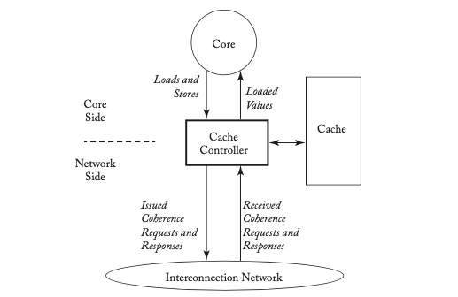
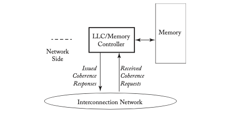
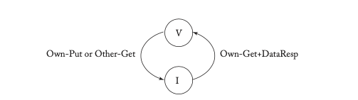
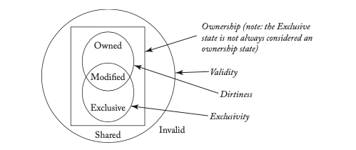

# CHAPTER 6 Coherence Protocols

In this chapter, we return to the topic of cache coherence that we introduced in Chapter 2. We defined coherence in Chapter 2, in order to understand coherence’s role in supporting consistency, but we did not delve into how specific coherence protocols work or how they are implemented. This chapter discusses coherence protocols in general, before we move on to specific classes of protocols in the next two chapters. We start in Section 6.1 by presenting the big picture of how coherence protocols work, and then show how to specify protocols in Section 6.2. We present one simple, concrete example of a coherence protocol in Section 6.3 and explore the protocol design space in Section 6.4.

## 6.1 THE BIG PICTURE

The goal of a coherence protocol is to maintain coherence by enforcing the invariants introduced in Section 2.3 and restated here.

1. **Single-Writer, Multiple-Read (SWMR) Invariant.** For any memory location A, at any given (logical) time, there exists only a single core that may write to A (and can also read it) or some number of cores that may only read A.
2. **Data-Value Invariant.** The value of the memory location at the start of an epoch is the same as the value of the memory location at the end of its last read-write epoch.

To implement these invariants, we associate with each storage structure—each cache and the LLC/memory—a finite state machine called a **coherence controller**. The collection of these coherence controllers constitutes a distributed system in which the controllers exchange messages with each other to ensure that, for each block, the SWMR and data value invariants are maintained at all times. The interactions between these finite state machines are specified by the **coherence protocol**.

Coherence controllers have several responsibilities. The coherence controller at a cache, which we refer to as a **cache controller**, is illustrated in Figure 6.1. The cache controller must service requests from two sources. On the “core side,” the cache controller interfaces to the processor core. The controller accepts loads and stores from the core and returns load values to the core. A cache miss causes the controller to initiate a coherence transaction by issuing a coherence request (e.g., request for read-only permission) for the block containing the location accessed by the core. This coherence request is sent across the interconnection network to one or more coherence controllers. A transaction consists of a request and the other message(s) that are exchanged in order to satisfy the request (e.g., a data response message sent from another coherence controller to the requestor). The types of transactions and the messages that are sent as part of each transaction depend on the specific coherence protocol.

> **Figure 6.1: Cache controller.**  

On the cache controller’s “network side,” the cache controller interfaces to the rest of the system via the interconnection network. The controller receives coherence requests and coherence responses that it must process. As with the core side, the processing of incoming coherence messages depends on the specific coherence protocol.

The coherence controller at the LLC/memory, which we refer to as a **memory controller**, is illustrated in Figure 6.2. A memory controller is similar to a cache controller, except that it usually has only a network side. As such, it does not issue coherence requests (on behalf of loads or stores) or receive coherence responses. Other agents, such as I/O devices, may behave like cache controllers, memory controllers, or both depending upon their specific requirements.

> **Figure 6.2: Memory controller.**  

Each coherence controller implements a set of finite state machines—logically one independent, but identical finite state machine per block—and receives and processes events (e.g., incoming coherence messages) depending upon the block’s state. For an event of type E (e.g., a store request from the core to the cache controller) to block B, the coherence controller takes actions (e.g., issues a coherence request for read-write permission) that are a function of E and of B’s state (e.g., read-only). After taking these actions, the controller may change the state of B.

## 6.2 SPECIFYING COHERENCE PROTOCOLS

We specify a coherence protocol by specifying the coherence controllers. We could specify coherence controllers in any number of ways, but the particular behavior of a coherence controller lends itself to a tabular specification [9]. As shown in Table 6.1, we can specify a controller as a table in which rows correspond to block states and columns correspond to events. We refer to a state/event entry in the table as a **transition**, and a transition for event E pertaining to block B consists of (a) the actions taken when E occurs and (b) the next state of block B. We express transitions in the format “action/next state” and we may omit the “next state” portion if the next state is the current state. As an example of a transition in Table 6.1, if a store request for block B is received from the core and block B is in a read-only state (RO), then the table shows that the controller’s transition will be to perform the action “issue coherence request for read-write permission (to block B)” and change the state of block B to RW.

The example in Table 6.1 is intentionally incomplete, for simplicity, but it illustrates the capability of a tabular specification methodology to capture the behavior of a coherence controller. To specify a coherence protocol, we simply need to completely specify the tables for the cache controllers and the memory controllers.

The differences between coherence protocols lie in the differences in the controller specifications. These differences include different sets of block states, transactions, events, and transitions. In Section 6.4, we describe the coherence protocol design space by exploring the options for each of these aspects, but we first specify one simple, concrete protocol.

**Table 6.1: Tabular specification methodology.** This is an incomplete specification of a cache coherence controller. Each entry in the table specifies the actions taken and the next state of the block.

| States | Load request from core | Store request from core | Incoming coherence request to obtain block in read-write state |
|--------|------------------------|-------------------------|---------------------------------------------------------------|
| Not readable or writeable (N) | Issue coherence request for read‑only permission / RO | Issue coherence requests for read‑write permission / RW | `<no action>` |
| Read‑only (RO) | Give data from cache to core | Issue coherence request for read‑write permission / RW | `<no action>` / N |
| Read‑write (RW) | Give data from cache to core | Write data to cache | Send block to requestor / N |

## 6.3 EXAMPLE OF A SIMPLE COHERENCE PROTOCOL

To help understand coherence protocols, we now present a simple protocol. Our system model is the baseline system model from Section 2.1, but with the interconnection network restricted to being a **shared bus**: a shared set of wires on which a core can issue a message and have it observed by all cores and the LLC/memory.

Each cache block can be in one of two stable coherence states: **I** (invalid) and **V** (valid). Each block at the LLC/memory can also be in one of two coherence states: I and V. At the LLC/memory, the state I denotes that all caches hold the block in state I, and the state V denotes that one cache holds the block in state V. There is also a single transient state for cache blocks, \( \text{IV}^D \), discussed below. At system startup, all cache blocks and LLC/memory blocks are in state I. Each core can issue load and store requests to its cache controller; the cache controller will implicitly generate an Evict Block event when it needs to make room for another block. Loads and stores that miss in the cache initiate coherence transactions, as described below, to obtain a valid copy of the cache block. Like all the protocols in this primer, we assume a writeback cache; that is, when a store hits, it writes the store value only to the (local) cache and waits to write the entire block back to the LLC/memory in response to an Evict Block event.

There are two types of coherence transactions implemented using three types of bus messages: **Get** requests a block, **DataResp** transfers the block’s data, and **Put** writes the block back to the memory controller. On a load or store miss, the cache controller initiates a Get transaction by sending a Get message and waiting for the corresponding DataResp message. The Get transaction is atomic in that no other transaction (either Get or Put) may use the bus between when the cache sends the Get and when the DataResp for that Get appears on the bus. On an Evict Block event, the cache controller sends a Put message, with the entire cache block, to the memory controller.

We illustrate the transitions between the stable coherence states in Figure 6.3. We use the prefaces “Own” and “Other” to distinguish messages for transactions initiated by the given cache controller vs. those initiated by other cache controllers. Note that if the given cache controller has the block in state V and another cache requests it with a Get message (denoted OtherGet), the owning cache must respond with a block (using a DataResp message, not shown) and transition to state I.

> **Figure 6.3: Transitions between stable states of blocks at cache controller.**  
> - I → (OwnGet / DataResp) → V  
> - V → (OtherGet) → I (send DataResp)  
> - V → (OwnPut) → I

Tables 6.2 and 6.3 specify the protocol in more detail. Shaded entries in the table denote impossible transitions. For example, a cache controller should never see its own Put request on the bus for a block that is in state V in its cache (as it should have already transitioned to state I).

The transient state \( \text{IV}^D \) corresponds to a block in state I that is waiting for data (via a DataResp message) before transitioning to state V. Transient states arise when transitions between stable states are not atomic. In this simple protocol, individual message sends and receives are atomic, but fetching a block from the memory controller requires sending a Get message and receiving a DataResp message, with an indeterminate gap in between. The \( \text{IV}^D \) state indicates that the protocol is waiting for a DataResp. We discuss transient states in more depth in Section 6.4.1.

This coherence protocol is simplistic and inefficient in many ways, but the goal in presenting this protocol is to gain an understanding of how protocols are specified. We use this specification methodology throughout this book when presenting different types of coherence protocols.

**Table 6.2: Cache controller specification.** Shaded entries are impossible and blank entries denote events that are ignored.

| States | Core Events | Bus Events | Messages for Own Transactions | Messages for Other Cores' Transactions |
|--------|-------------|------------|-------------------------------|---------------------------------------|
|        | Load | Store | Replacement | Own-Get | Own‑Put | DataResp (for Own-Get) | Other-Get | Other‑Put |
| I      | Issue Get / IV^D | Issue Get / IV^D | — | — | — | — | — | — |
| IV^D   | Stall | Stall | Stall | — | — | Copy data into cache, perform Load/Store / V | (A) | (A) |
| V      | Give data from cache | Write data to cache | Issue Put (with data) / I | — | — | — | Send DataResp / I | — |

*Note: (A) denotes transitions that are impossible because transactions are atomic on the bus.*

**Table 6.3: Memory controller specification**

| State | Bus Events |
|-------|-------------|
|       | Get | Put |
| I     | Send data block in DataResp message to requestor / V | — |
| V     | — | Update data block in memory / I |

## 6.4 OVERVIEW OF COHERENCE PROTOCOL DESIGN SPACE

As mentioned in Section 6.1, a designer of a coherence protocol must choose the states, transactions, events, and transitions for each type of coherence controller in the system. The choice of stable states is largely independent of the rest of the coherence protocol. For example, there are two different classes of coherence protocols called snooping and directory, and an architect can design a snooping protocol or a directory protocol with the same set of stable states. We discuss stable states, independent of protocols, in Section 6.4.1. Similarly, the choice of transactions is also largely independent of the specific protocol, and we discuss transactions in Section 6.4.2. However, unlike the choices of stable states and transactions, the events, transitions and specific transient states are highly dependent on the coherence protocol and cannot be discussed in isolation. Thus, in Section 6.4.3, we discuss a few of the major design decisions in coherence protocols.

### 6.4.1 STATES

In a system with only one actor (e.g., a single core processor without coherent DMA), the state of a cache block is either valid or invalid. There might be two possible valid states for a cache block if there is a need to distinguish blocks that are **dirty**. A dirty block has a value that has been written more recently than other copies of this block. For example, in a two-level cache hierarchy with a write-back L1 cache, the block in the L1 may be dirty with respect to the stale copy in the L2 cache.

A system with multiple actors can also use just these two or three states, as in Section 6.3, but we often want to distinguish between different kinds of valid states. There are four characteristics of a cache block that we wish to encode in its state: **validity, dirtiness, exclusivity, and ownership** [10]. The latter two characteristics are unique to systems with multiple actors.

- **Validity:** A valid block has the most up-to-date value for this block. The block may be read, but it may only be written if it is also exclusive.
- **Dirtiness:** As in a single core processor, a cache block is dirty if its value is the most up-to-date value, this value differs from the value in the LLC/memory, and the cache controller is responsible for eventually updating the LLC/memory with this new value. The term clean is often used as the opposite of dirty.
- **Exclusivity:** A cache block is exclusive if it is the only privately cached copy of that block in the system (i.e., the block is not cached anywhere else except perhaps in the shared LLC).
- **Ownership:** A cache controller (or memory controller) is the owner of a block if it is responsible for responding to coherence requests for that block. In most protocols, there is exactly one owner of a given block at all times. A block that is owned may not be evicted from a cache to make room for another block—due to a capacity or conflict miss—without giving the ownership of the block to another coherence controller. Non-owned blocks may be evicted silently (i.e., without sending any messages) in some protocols.

In this section, we first discuss some commonly used **stable states**—states of blocks that are not currently in the midst of a coherence transaction—and then discuss the use of **transient states** for describing blocks that are currently in the midst of transactions.

#### Stable States

Many coherence protocols use a subset of the classic five state MOESI model first introduced by Sweazey and Smith [10]. These MOESI (often pronounced either “MO-sey” or “mo-EE-see”) states refer to the states of blocks in a cache, and the most fundamental three states are MSI; the O and E states may be used, but they are not as basic. Each of these states has a different combination of the characteristics described previously.

- **M(odified):** The block is valid, exclusive, owned, and potentially dirty. The block may be read or written. The cache has the only valid copy of the block, the cache must respond to requests for the block, and the copy of the block at the LLC/memory is potentially stale.
- **O(wned):** The block is valid, owned, and potentially dirty, but not exclusive. The cache has a read-only copy of the block and must respond to requests for the block. Other caches may have a read-only copy of the block, but they are not owners. The copy of the block in the LLC/memory is potentially stale.
- **E(xclusive):** The block is valid, exclusive, and clean. The cache has a read-only copy of the block. No other caches have a valid copy of the block, and the copy of the block in the LLC/memory is up-to-date. In this primer, we consider the block to be owned when it is in the Exclusive state, although there are protocols in which the Exclusive state is not treated as an ownership state.
- **S(hared):** The block is valid but not exclusive, not dirty, and not owned. The cache has a read-only copy of the block. Other caches may have valid, read-only copies of the block.
- **I(nvalid):** The block is invalid. The cache either does not contain the block or it contains a potentially stale copy that it may not read or write.

We illustrate a Venn diagram of the MOESI states in Figure 6.4. The Venn diagram shows which states share which characteristics. All states besides I are valid. M, O, and E are ownership states. Both M and E denote exclusivity, in that no other caches have a valid copy of the block. Both M and O indicate that the block is potentially dirty. Returning to the simplistic example in Section 6.3, we observe that the protocol effectively condensed the MOES states into the V state.

> **Figure 6.4: MOESI states.**  
> (Venn diagram with circles: Valid (all except I), Ownership (M, O, E), Exclusive (M, E), Dirty (M, O). I is outside all.)

The MOESI states, although quite common, are not an exhaustive set of stable states. For example, the **F(orward)** state is similar to the O state except that it is clean (i.e., the copy in the LLC/memory is up-to-date). There are many possible coherence states, but we focus our attention in this primer on the well-known MOESI states.

#### Transient States

Thus far, we have discussed only the stable states that occur when there is no current coherence activity for the block, and it is only these stable states that are used when referring to a protocol (e.g., “a system with a MESI protocol”). However, as we saw even in the example in Section 6.3, there may exist transient states that occur during the transition from one stable state to another stable state. In Section 6.3, we had the transient state \( \text{IV}^D \) (in I, going to V, waiting for DataResp). In more sophisticated protocols, we are likely to encounter dozens of transient states. We encode these states using a notation \( \text{XY}^Z \), which denotes that the block is transitioning from stable state X to stable state Y, and the transition will not complete until an event of type Z occurs. For example, in a protocol in a later chapter, we use \( \text{IM}^D \) to denote that a block was previously in I and will become M once a D(ata) message arrives for that block.

#### States of Blocks in the LLC/Memory

The states that we have discussed thus far—both stable and transient—pertain to blocks residing in caches. Blocks in the LLC and memory also have states associated with them, and there are two general approaches to naming states of blocks in the LLC and memory. The choice of naming convention does not affect functionality or performance; it is simply a specification issue that can confuse an architect unfamiliar with the convention.

- **Cache-centric:** In this approach, which we believe to be the most common, the state of a block in the LLC and memory is an aggregation of the states of this block in the caches. For example, if a block is in all caches in I, then the LLC/memory state for this block is I. If a block is in one or more caches in S, then the LLC/memory state is S. If a block is in a single cache in M, then the LLC/memory state is M.
- **Memory-centric:** In this approach, the state of a block in the LLC/memory corresponds to the memory controller’s permissions to this block (rather than the permissions of the caches). For example, if a block is in all caches in I, then the LLC/memory state for this block is O (not I, as in the cache-centric approach), because the LLC/memory behaves like an owner of the block. If a block is in one or more caches in S, then the LLC/memory state is also O, for the same reason. However, if the block is in a single cache in M or O, then the LLC/memory state is I, because the LLC/memory has an invalid copy of the block.

All protocols in this primer use cache-centric names for the states of blocks in the LLC and memory.

#### Maintaining Block State

The system implementation must maintain the states associated with blocks in caches, the LLC, and memory. For caches and the LLC, this generally requires extending the per-block cache state by at most a few bits, since the number of stable states is generally small (e.g., 5 states for a MOESI protocol requires 3 bits per block). Coherence protocols may have many more transient states, but need maintain these states only for those blocks that have pending coherence transactions. Implementations typically maintain these transient states by adding additional bits to the miss status handling registers (MSHRs) or similar structures that are used to track these pending transactions [4].

For memory, it might appear that the much greater aggregate capacity would pose a significant challenge. However, many current multicore systems maintain an **inclusive LLC**, which means that the LLC maintains a copy of every block that is cached anywhere in the system (even “exclusive” blocks). With an inclusive LLC, memory does not need to explicitly represent the coherence state. If a block resides in the LLC, its state in memory is the same as its state in the LLC. If the block is not in the LLC, its state in memory is implicitly Invalid, because absence from an inclusive LLC implies that the block is not in any cache.

> **Sidebar: Before Multicores: Maintaining Coherence State at Memory**  
> Traditional, pre-multicore protocols needed to maintain coherence state for each block of memory, and they could not use the LLC as explained in Section 6.4.1. We briefly discuss several ways of maintaining this state and the associated engineering tradeoffs.
> - **Augment Each Block of Memory with State Bits.** The most general implementation is to add extra bits to each block of memory. Drawbacks: extra cost, difficulty with commodity DRAM, increased latency, power, and bandwidth.
> - **Add Single State Bit per Block at Memory.** Distinguish only I and V; transient states maintained in a small dedicated structure. Minimal storage cost.
> - **Zero-bit logical OR.** Caches reconstruct memory state on-demand using a logical OR of “IsOwned” signals. Avoids any state in memory but may be difficult to implement quickly.
> The IsOwned signal is asserted by a cache in a state of ownership (M, O, or E).

### 6.4.2 TRANSACTIONS

Most protocols have a similar set of transactions, because the basic goals of the coherence controllers are similar. For example, virtually all protocols have a transaction for obtaining Shared (read-only) access to a block. In Table 6.4 we list a set of common transactions and, for each transaction, we describe the goal of the requestor that initiates the transaction. These transactions are all initiated by cache controllers that are responding to requests from their associated cores. In Table 6.5, we list the requests that a core can make to its cache controller and how these core requests can lead the cache controller into initiating coherence transactions.

**Table 6.4: Common transactions**

| Transaction | Goal of Requestor |
|-------------|-------------------|
| GetShared (GetS) | Obtain block in Shared (read-only) state |
| GetModified (GetM) | Obtain block in Modified (read-write) state |
| Upgrade (Upg) | Upgrade block state from read-only (Shared or Owned) to read-write (Modified); Upg (unlike GetM) does not require data to be sent to requestor |
| PutShared (PutS) | Evict block in Shared state\(^a\) |
| PutExclusive (PutE) | Evict block in Exclusive state\(^a\) |
| PutOwned (PutO) | Evict block in Owned state |
| PutModified (PutM) | Evict block in Modified state |

\(^a\) Some protocols do not require a coherence transaction to evict a Shared block and/or an Exclusive block (i.e., the PutS and/or PutE are “silent”).

**Table 6.5: Common core requests to cache controller**

| Event | Response of (Typical) Cache Controller |
|-------|-----------------------------------------|
| Load | If cache hit, respond with data from cache; else initiate GetS transaction |
| Store | If cache hit in state E or M, write data into cache; else initiate GetM or Upg transaction |
| Atomic read-modify-write | If cache hit in state E or M, automatically execute RMW semantics; else GetM or Upg transaction |
| Instruction fetch | If cache hit (in I-cache), respond with instruction from cache; else initiate GetS transaction |
| Read-only prefetch | If cache hit, ignore; else may optionally initiate GetS transaction\(^a\) |
| Read-Write prefetch | If cache hit in state M, ignore; else may optionally initiate GetM or Upg transaction\(^a\) |
| Replacement | Depending on state of block, initiate PutS, PutE, PutO, or PutM transaction |

\(^a\) A cache controller may choose to ignore a prefetch request from the core.

Although most protocols use a similar set of transactions, they differ quite a bit in how the coherence controllers interact to perform the transactions. As we will see in the next section, in some protocols (e.g., snooping protocols) a cache controller initiates a GetS transaction by broadcasting a GetS request to all coherence controllers in the system, and whichever controller is currently the owner of the block responds to the requestor with a message that contains the desired data. Conversely, in other protocols (e.g., directory protocols) a cache controller initiates a GetS transaction by sending a unicast GetS message to a specific, pre-defined coherence controller that may either respond directly or may forward the request to another coherence controller that will respond to the requestor.

### 6.4.3 MAJOR PROTOCOL DESIGN OPTIONS

There are many different ways to design a coherence protocol. Even for the same set of states and transactions, there are many different possible protocols. The design of the protocol determines what events and transitions are possible at each coherence controller; unlike with states and transactions, there is no way to present a list of possible events or transitions that is independent from the protocol.

Despite the enormous design space for coherence protocols, there are two primary design decisions that have a major impact on the rest of the protocol, and we discuss them next.

#### Snooping vs. Directory

There are two main classes of coherence protocols: **snooping** and **directory**. We present a brief overview of these protocols now and defer in-depth coverage of them until Chapters 7 and 8, respectively.

- **Snooping protocol:** A cache controller initiates a request for a block by broadcasting a request message to all other coherence controllers. The coherence controllers collectively “do the right thing,” e.g., sending data in response to another core’s request if they are the owner. Snooping protocols rely on the interconnection network to deliver the broadcast messages in a consistent order to all cores. Most snooping protocols assume that requests arrive in a total order, e.g., via a shared-wire bus, but more advanced interconnection networks and relaxed orders are possible.
- **Directory protocol:** A cache controller initiates a request for a block by unicasting it to the memory controller that is the home for that block. The memory controller maintains a directory that holds state about each block in the LLC/memory, such as the identity of the current owner or the identities of current sharers. When a request for a block reaches the home, the memory controller looks up this block’s directory state. For example, if the request is a GetS, the memory controller looks up the directory state to determine the owner. If the LLC/memory is the owner, the memory controller completes the transaction by sending a data response to the requestor. If a cache controller is the owner, the memory controller forwards the request to the owner cache; when the owner cache receives the forwarded request, it completes the transaction by sending a data response to the requestor.

The choice of snooping vs. directory involves making tradeoffs. Snooping protocols are logically simple, but they do not scale to large numbers of cores because broadcasting does not scale. Directory protocols are scalable because they unicast, but many transactions take more time because they require an extra message to be sent when the home is not the owner. In addition, the choice of protocol affects the interconnection network (e.g., classical snooping protocols require a total order for request messages).

#### Invalidate vs. Update

The other major design decision in a coherence protocol is to decide what to do when a core writes to a block. This decision is independent of whether the protocol is snooping or directory. There are two options.

- **Invalidate protocol:** When a core wishes to write to a block, it initiates a coherence transaction to invalidate the copies in all other caches. Once the copies are invalidated, the requestor can write to the block without the possibility of another core reading the block’s old value. If another core wishes to read the block after its copy has been invalidated, it has to initiate a new coherence transaction to obtain the block, and it will obtain a copy from the core that wrote it, thus preserving coherence.
- **Update protocol:** When a core wishes to write a block, it initiates a coherence transaction to update the copies in all other caches to reflect the new value it wrote to the block.

Once again, there are tradeoffs involved in making this decision. Update protocols reduce the latency for a core to read a newly written block because the core does not need to initiate and wait for a GetS transaction to complete. However, update protocols typically consume substantially more bandwidth than invalidate protocols because update messages are larger than invalidate messages (an address and a new value, rather than just an address). Furthermore, update protocols greatly complicate the implementation of many memory consistency models. For example, preserving write atomicity (Section 5.5) becomes much more difficult when multiple caches must apply multiple updates to multiple copies of a block. Because of the complexity of update protocols, they are rarely implemented; in this primer, we focus on the far more common invalidate protocols.

#### Hybrid Designs

For both major design decisions, one option is to develop a hybrid. There are protocols that combine aspects of snooping and directory protocols [2, 6], and there are protocols that combine aspects of invalidate and update protocols [8]. The design space is rich and architects are not constrained to following any particular style of design.

## 6.5 REFERENCES

[1] A. Charlesworth. The Sun Fireplane SMP interconnect in the Sun 6800. In *Proc. of the 9th Hot Interconnects Symposium*, August 2001. DOI: 10.1109/his.2001.946691.

[2] P. Conway and B. Hughes. The AMD Opteron northbridge architecture. *IEEE Micro*, 27(2):10–21, March/April 2007. DOI: 10.1109/mm.2007.43.

[3] S. J. Frank. Tightly coupled multiprocessor system speeds memory-access times. *Electronics*, 57(1):164–169, January 1984.

[4] D. Kroft. Lockup-free instruction fetch/prefetch cache organization. In *Proc. of the 8th Annual Symposium on Computer Architecture*, May 1981. DOI: 10.1145/285930.285979.

[5] H. Q. Le et al. IBM POWER6 microarchitecture. *IBM Journal of Research and Development*, 51(6), 2007. DOI: 10.1147/rd.516.0639.

[6] M. M. K. Martin, D. J. Sorin, M. D. Hill, and D. A. Wood. Bandwidth adaptive snooping. In *Proc. of the 8th IEEE Symposium on High-Performance Computer Architecture*, pp. 251–262, January 2002. DOI: 10.1109/hpca.2002.995715.

[7] A. Nowatzyk, G. Aybay, M. Browne, E. Kelly, and M. Parkin. The S3.mp scalable shared memory multiprocessor. In *Proc. of the International Conference on Parallel Processing*, vol. I, pp. 1–10, August 1995. DOI: 10.1109/hicss.1994.323149.

[8] A. Raynaud, Z. Zhang, and J. Torrellas. Distance-adaptive update protocols for scalable shared-memory multiprocessors. In *Proc. of the 2nd IEEE Symposium on High-Performance Computer Architecture*, February 1996. DOI: 10.1109/hpca.1996.501197.

[9] D. J. Sorin, M. Plakal, M. D. Hill, A. E. Condon, M. M. Martin, and D. A. Wood. Specifying and verifying a broadcast and a multicast snooping cache coherence protocol. *IEEE Transactions on Parallel and Distributed Systems*, 13(6):556–578, June 2002. DOI: 10.1109/tpds.2002.1011412.

[10] P. Sweazey and A. J. Smith. A class of compatible cache consistency protocols and their support by the IEEE Futurebus. In *Proc. of the 13th Annual International Symposium on Computer Architecture*, pp. 414–423, June 1986. DOI: 10.1145/17356.17404.
