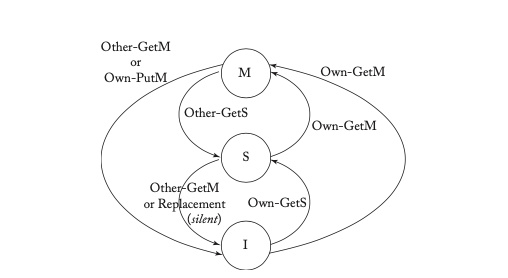
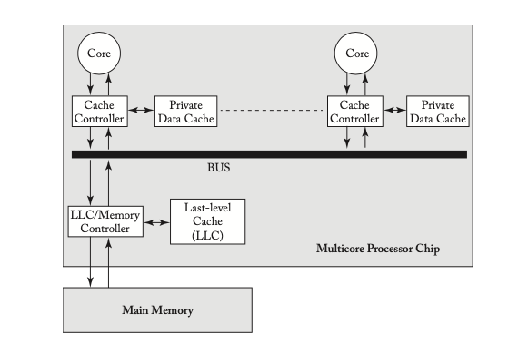
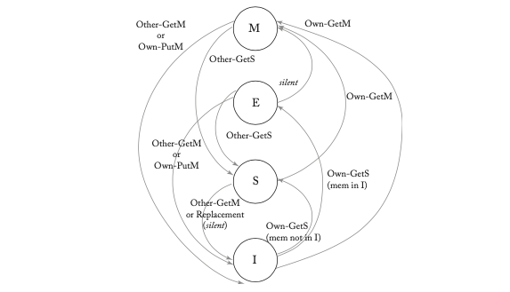
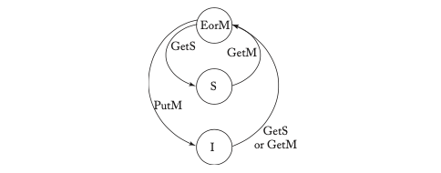
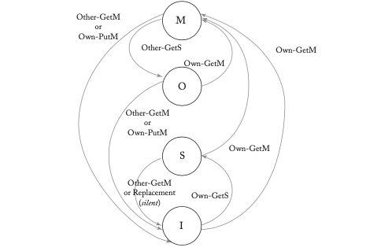
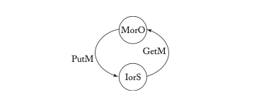
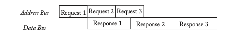
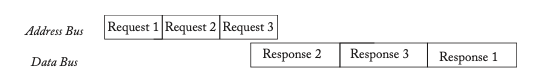
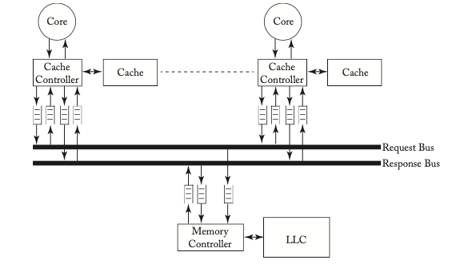
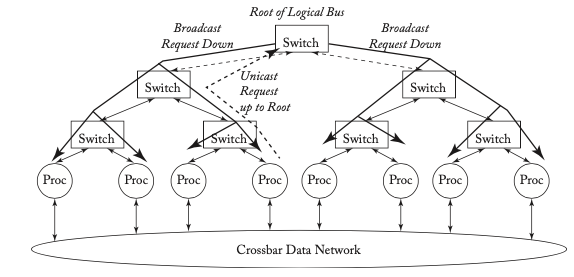

# Chapter 7 Snooping Coherence Protocols

In this chapter, we present snooping coherence protocols. Snooping protocols were the first widely deployed class of protocols and they continue to be used in a variety of systems. Snooping protocols offer many attractive features, including low- latency coherence transactions and a conceptually simpler design than the alternative, directory protocols (Chapter 8).

We first introduce snooping protocols at a high level (Section 7.1). We then present a simple system with a complete but unsophisticated three- state (MSI) snooping protocol (Section 7.2). This system and protocol serve as a baseline upon which we later add system features and protocol optimizations. The protocol optimizations that we discuss include the additions of the Exclusive state (Section 7.3) and the Owned state (Section 7.4), as well as higher performance interconnection networks (Sections 7.5 and 7.6). We then discuss commercial systems with snooping protocols (Section 7.7) before concluding the chapter with a discussion of snooping and its future (Section 7.8).

Given that some readers may not wish to delve too deeply into snooping, we have organized the chapter such that readers may skim or skip Sections 7.3- 7.6, if they so choose.

## 7.1 INTRODUCTION TO SNOOPING

Snooping protocols are based on one idea: all coherence controllers observe (snoop) coherence requests in the same order and collectively "do the right thing" to maintain coherence. By requiring that all requests to a given block arrive in order, a snooping system enables the distributed coherence controllers to correctly update the finite state machines that collectively represent a cache block's state.

Traditional snooping protocols broadcast requests to all coherence controllers, including the controller that initiated the request. The coherence requests typically travel on an ordered broadcast network, such as a bus. The ordered broadcast ensures that every coherence controller observes the same series of coherence requests in the same order, i.e., that there is a total order of coherence requests. Since a total order subsumes all per- block orders, this total order guarantees that all coherence controllers can correctly update a cache block's state.

To illustrate the importance of processing coherence requests in the same per- block order, consider the examples in Tables 7.1 and 7.2 where both core C1 and core C2 want to get the same block A in state M. In Table 7.1, all three coherence controllers observe the same per- block order of coherence requests and collectively maintain the single- writer- multiple- reader (SWMR) invariant. Ownership of the block progresses from the LLC/memory to core C1 to core C2. Every coherence controller independently arrives at the correct conclusion about the block's state as a result of each observed request. Conversely, Table 7.2 illustrates how incoherence might arise if core C2 observes a different per- block order of requests than core C1 and the LLC/memory. First, we have a situation in which both core C1 and core C2 are simultaneously in state M, which violates the SWMR invariant. Next, we have a situation in which no coherence controller believes it is the owner and thus a coherence request at this time would not receive a response (perhaps resulting in deadlock).

**Table 7.1: Snooping coherence example. All activity involves block A (denoted "A.").**

| Time | Core C1 | Core C2 | LLC/Memory |
|------|---------|---------|-------------|
| 0 | A:I | A:I | A:I (LLC/memory is owner) |
| 1 | A:GetM from Core C1/M | A:GetM from Core C1/I | A:GetM from Core C1/M (LLC/memory is not owner) |
| 2 | A:GetM from Core C2/I | A:GetM from Core C2/M | A:GetM from Core C2/M |

**Table 7.2: Snooping (In)coherence example. All activity involves block A (denoted "A.").**

| Time | Core C1 | Core C2 | LLC/Memory |
|------|---------|---------|-------------|
| 0 | A:I | A:I | A:I (LLC/memory is owner) |
| 1 | A:GetM from Core C1/M | A:GetM from Core C2/M | A:GetM from Core C1/M (LLC/memory is not owner) |
| 2 | A:GetM from Core C2/I | A:GetM from Core C1/I | A:GetM from Core C2/M |

Traditional snooping protocols create a total order of coherence requests across all blocks, even though coherence requires only a per- block order of requests. Having a total order makes it easier to implement memory consistency models that require a total order of memory references, such as SC and TSO. Consider the example in Table 7.3 which involves two blocks A and B; each block is requested exactly once and so the system trivially observes per- block request orders. Yet because cores C1 and C2 observe the GetM and GetS requests out- of- order, this execution violates both the SC and TSO memory consistency models.

**Table 7.3: Per-block order, coherence, and consistency.** States and operations that pertain to address A are preceeded by the prefix "A:", and we denote a block A in state X with value V as "A:X[V]." If the value is stale, we omit it (e.g., "A:I"). Note that there are two blocks in this example, A and B, with A initially in state S at Core C2 and B initially in state M at Core C1.

| Time | Core C1 | Core C2 | LLC/Memory |
|------|---------|---------|-------------|
| 0 | A:I B:M[0] | A:S[0] B:I | A:S[0] B:M |
| 1 | A:GetM from Core C1/M[0] store A = 1 B:M[0] | A:S[0] B:I | A:S[0] B:M |
| 2 | A:M[1] store B = 1 B:M[1] | A:S[0] B:I | A:GetM from Core C1/M B:M |
| 3 | A:M[1] B:GetS from Core C2/S[1] | A:S[0] B:I | A:M B:GetS from Core C2/S[1] |
| 4 | A:M[1] B:S[1] | A:S[0] B:GetS from Core C2/S[1] r1 = B[1] | A:M B:S[1] |
| 5 | A:M[1] B:S[1] | A:S[0] r2 = A[0] B:S[1] | A:M B:S[1] |
| 6 | A:M[1] B:S[1] | A:GetM from Core1/I B:S[1] | A:M B:S[1] |

r1 = 1, r2 = 0 violates SC and TSO

> **Sidebar: How Snooping Depends on a Total Order of Coherence Requests**
>
> At first glance, the reader may assume that the problem in Table 7.3 arises because the SWMR invariant is violated for block A in cycle 1, since C1 has an M copy and C2 still has an S copy. However, Table 7.4 illustrates the same example, but enforces a total order of coherence requests. This example is identical until cycle 4, and thus has the same apparent SWMR violation. However, like the proverbial "tree in the forest," this violation does not cause a problem because it is not observed (i.e., there is "no one there to hear it"). Specifically, because the cores see both requests in the same order, C2 invalidates block A before it can see the new value for block B. Thus, when C2 reads block A, it must get the new value and therefore yields a correct SC and TSO execution.

**Table 7.4: Total order, coherence, and consistency.** States and operations that pertain to address A are preceded by the prefix "A.", and we denote a block A in state X with value V as "A:X[V]." If the value is stale, we omit it (e.g., "A:I").

| Time | Core C1 | Core C2 | LLC/Memory |
|------|---------|---------|-------------|
| 0 | A:I B:M[0] | A:S[0] B:I | A:S[0] B:M |
| 1 | A:GetM from Core C1/M[0] store A = 1 B:M[0] | A:S[0] B:I | A:S[0] B:M |
| 2 | A:M[1] store B = 1 B:M[1] | A:S[0] B:I | A:GetM from Core C1/M B:M |
| 3 | A:M[1] B:GetS from Core C2/S[1] | A:S[0] B:I | A:M B:GetS from Core C2/S[1] |
| 4 | A:M[1] B:S[1] | A:GetM from Core1/I B:I | A:M B:S[1] |
| 5 | A:M[1] B:S[1] | A:I B:GetS from Core C2/S[1] r1 = B[1] | A:M B:S[1] |
| 6 | A:GetS from Core C2/S[1] B:S[1] | A:GetS from Core C2/S[1] r2 = A[1] B:S[1] | A:GetS from Core C1/S[1] B:S[1] |

r1 = 1, r2 = 1 satisfies SC and TSO

Traditional snooping protocols use the total order of coherence requests to determine when, in a logical time based on snoop order, a particular request has been observed. In the example of Table 7.4, because of the total order, core C1 can infer that C2 will see the GetM for A before the GetS for B, and thus C2 does not need to send a specific acknowledgment message when it receives the coherence message. This implicit acknowledgment of request reception distinguishes snooping protocols from the directory protocols we study in the next chapter.

Thus far, we have discussed only coherence requests, but not the responses to these requests. The reason for this seeming oversight is that the key aspects of snooping protocols revolve around the requests. There are few constraints on response messages. They can travel on a separate interconnection network that does not need to support broadcast nor have any ordering requirements. Because response messages carry data and are thus much longer than requests, there are significant benefits to being able to send them on a simpler, lower- cost network. Notably, response messages do not affect the serialization of coherence transactions. Logically, a coherence transaction—which consists of a broadcast request and a unicast response—occurs when the request is ordered, regardless of when the response arrives at the requestor. The time interval between when the request appears on the bus and when the response arrives at the requestor does affect the implementation of the protocol (e.g., during this gap, are other controllers allowed to request this block? If so, how does the requestor respond?), but it does not affect the serialization of the transaction.

## 7.2 BASELINE SNOOPING PROTOCOL

In this section, we present a straightforward, unoptimized snooping protocol and describe its implementation on two different system models. The first, simple system model illustrates the basic approach for implementing snooping coherence protocols. The second, modestly more complex baseline system model illustrates how even relatively simple performance improvements may impact coherence protocol complexity. These examples provide insight into the key features of snooping protocols while revealing inefficiencies that motivate the features and optimizations presented in subsequent sections of this chapter. Sections 7.5 and 7.6 discuss how to adapt this baseline protocol for more advanced system models.

### 7.2.1 HIGH- LEVEL PROTOCOL SPECIFICATION

The baseline protocol has only three stable states: M, S, and I. Such a protocol is typically referred to as an MSI protocol. Like the protocol in Section 6.3, this protocol assumes a write- back cache. A block is owned by the LLC/memory unless the block is in a cache in state M. Before presenting the detailed specification, we first illustrate a higher level abstraction of the protocol in order to understand its fundamental behaviors. In Figures 7.1 and 7.2, we show the transitions between the stable states at the cache and memory controllers, respectively.

There are three notational issues to be aware of. First, in Figure 7.1, the arcs are labeled with coherence requests that are observed on the bus. We intentionally omit other events, including loads, stores, and coherence responses. Second, the coherence events at the cache controller are labeled with either "Own" or "Other" to denote whether the cache controller observing the request is the requestor or not. Third, in Figure 7.2, we specify the state of a block at memory.

*(Figures 7.1 and 7.2 are described in text; in the PDF they show state transitions. We reproduce the description below.)*

*(Figure 7.1: MSI: Transitions between stable states at cache controller.)*

**Figure 7.1: MSI: Transitions between stable states at cache controller.**  
- From I: on Own-GetS → S; on Own-GetM → M; on Other-GetM → I (no change).  
- From S: on Other-GetM → I; on Own-GetM → M.  
- From M: on Other-GetS → S; on Other-GetM → I; on Own-PutM → I.

*(Figure 7.2: MSI: Transitions between stable states at memory controller.)*

**Figure 7.2: MSI: Transitions between stable states at memory controller.**  
- From IorS: on GetS or GetM → send data, stay IorS? Actually diagram shows: IorS on GetS → IorS (send data), on GetM → M (send data).  
- From M: on GetS → IorS (forward request to owner), on GetM → M? etc. We'll trust the original.

### 7.2.2 SIMPLE SNOOPING SYSTEM MODEL: ATOMIC REQUESTS, ATOMIC TRANSACTIONS

Figure 7.3 illustrates the simple system model, which is nearly identical to the baseline system model introduced in Figure 2.1. The only difference is that the generic interconnection network from Figure 2.1 has been specified as a bus. Each core can issue load and store requests to its cache controller; the cache controller will choose a block to evict when it needs to make room for another block. The bus facilitates a total order of coherence requests that are snooped by all coherence controllers. Like the example in the previous chapter, this system model has atomicity properties that simplify the coherence protocol. Specifically, this system implements two atomicity properties which we define as Atomic Requests and Atomic Transactions. The Atomic Requests property states that a coherence request is ordered in the same cycle that it is issued. This property eliminates the possibility of a block's state changing—due to another core's coherence request—between when a request is issued and when it is ordered. The Atomic Transactions property states that coherence transactions are atomic in that a subsequent request for the same block may not appear on the bus until after the first transaction completes (i.e., until after the response has appeared on the bus). Because coherence involves operations on a single block, whether or not the system permits subsequent requests to different blocks does not impact the protocol. Although simpler than most current systems, this system model resembles the SGI Challenge, a successful machine in the 1980s.

*(Figure 7.3: Simple snooping system mode.)*

#### Detailed Protocol Specification

Tables 7.5 and 7.6 present the detailed coherence protocol for the simple system model. Compared to the high- level description in Section 7.2.1, the most significant difference is the addition of two transient states in the cache controller and one in the memory controller. This protocol has very few transient states because the atomicity constraints of the simple system model greatly limit the number of possible message interleavings.

**Table 7.5: Simple snooping (atomic requests, atomic transactions): Cache controller**

| States | Processor Core Events | Bus Events | | | | | | |
|--------|----------------------|------------|-|-|-|-|-|-|
| | Load | Store | Replacement | Own-GetS | Own-GetM | Own-PutM | Data | Other-GetS | Other-GetM | Other-PutM |
| I | Issue GetS/ISD | Issue GetM/IMD | | | | | | | | |
| ISD | Stall Load | Stall Store | Stall Evict | | | | Copy data into cache, load hit /S | | (A) | (A) |
| IMD | Stall Load | Stall Store | Stall Evict | | | | Copy data into cache, store hit /M | (A) | (A) | |
| S | Load hit | Issue GetM/SMD | - | | | | | /I | /I | |
| SMD | Load hit | Stall Store | Stall Evict | | | | Copy data into cache, store hit /M | (A) | (A) | |
| M | Load hit | Store Hit | Issue PutM, send Data to memory /I | Send Data to req and memory /S | Send Data to req /I | | | | | |

*(Note: (A) denotes impossible due to atomic transactions.)*

**Table 7.6: Simple snooping (atomic requests, atomic transactions): Memory controller**

| State | Bus Events | | | |
|--------|------------|-|-|-|
| | GetS | GetM | PutM | Data from Owner |
| IorS | Send data block in Data message to requestor/IorS | Send data block in Data message to requestor/M | | |
| M | (A) | (A) | Update data block in memory/IorS | - |
| IorSD | (A) | (A) | - | - |

*(A) denotes impossible.*  

> **Flashback to Quiz Question 6:** In an MSI snooping protocol, a cache block may only be in one of three coherence states. True or false?
> **Answer:** False! Even for the simplest system model, there are more than three states, because of transient states.

Shaded entries in the table denote impossible (or at least erroneous) transitions. For example, a cache controller should never receive a Data message for a block that it has not requested (i.e., a block in state I in its cache). Similarly, the Atomic Transactions constraint prevents another core from issuing a subsequent request before the current transaction completes; the table entries labeled ("A") cannot occur due to this constraint. Blank entries denote legal transitions that require no action. These tables omit many implementation details that are not necessary for understanding the protocol. Also, in this protocol and the rest of the protocols in this chapter, we omit the event corresponding to Data for another core's transaction; a core never takes any action in response to observing Data on the bus for another core's transaction.

As with all MSI protocols, loads may be performed (i.e., hit) in states S and M, while stores hit only in state M. On load and store misses, the cache controller initiates coherence transactions by sending GetS and GetM requests, respectively. The transient states ISD, IMD, and SMD indicate that the request message has been sent, but the data response (Data) has not yet been received. In these transient states, because the requests have already been ordered, the transactions have already been ordered and the block is logically in state S, M, or M, respectively. A load or store must wait for the Data to arrive, though. Once the data response appears on the bus, the cache controller can copy the data block into the cache, transition to stable state S or M, as appropriate, and perform the pending load or store.

The system model's atomicity properties simplify cache miss handling in two ways. First, the Atomic Requests property ensures that when a cache controller seeks to upgrade permissions to a block - to go from I to S, I to M, or S to M - it can issue a request without worrying that another core's request might be ordered ahead of its own. Thus, the cache controller can transition immediately to state ISD, IMD, or SMD, as appropriate, to wait for a data response. Similarly, the Atomic Transactions property ensures that no subsequent requests for a block will occur until after the current transaction completes, eliminating the need to handle requests from other cores while in one of these transient states.

A data response may come from either the memory controller or another cache that has the block in state M. A cache that has a block in state S can ignore GetS requests because the memory controller is required to respond, but must invalidate the block on GetM requests to enforce the coherence invariant. A cache that has a block in state M must respond to both GetS and GetM requests, sending a data response and transitioning to state S or state I, respectively.

The LLC/memory has two stable states, M and IorS, and one transient state IorSD. In state IorS, the memory controller is the owner and responds to both GetS and GetM requests because this state indicates that no cache has the block in state M. In state M, the memory controller does not respond with data because the cache in state M is the owner and has the most recent copy of the data. However, a GetS in state M means that the cache controller will transition to state S, so the memory controller must also get the data, update memory, and begin responding to all future requests. It does this by transitioning immediately to the transient state IorSD and waits until it receives the data from the cache that owns it.

When the cache controller evicts a block due to a replacement decision, this leads to the protocol's two possible coherence downgrades: from S to I and from M to I. In this protocol, the S- to- I downgrade is performed "silently" in that the block is evicted from the cache without any communication with the other coherence controllers. In general, silent state transitions are possible only when all other coherence controllers' behavior remains unchanged; for example, a silent eviction of an owned block is not allowable. The M- to- I downgrade requires communication because the M copy of the block is the only valid copy in the system and cannot simply be discarded. Thus, another coherence controller (i.e., the memory controller) must change its state. To replace a block in state M, the cache controller issues a PutM request on the bus and then sends the data back to the memory controller. At the LLC, the block enters state IorS when the PutM request arrives, then transitions to state IorS when the Data message arrives. The Atomic Requests property simplifies the cache controller, by preventing an intervening request that might downgrade the state (e.g., another core's GetM request) before the PutM gets ordered on the bus. Similarly, the Atomic Transactions property simplifies the memory controller by preventing other requests for the block until the PutM transaction completes and the memory controller is ready to respond to them.

#### Running Example

In this section, we present an example execution of the system to show how the coherence protocol behaves in a common scenario. We will use this example in subsequent sections both to understand the protocols and also to highlight differences between them. The example includes activity for just one block, and initially, the block is in state I in all caches and in state IorS at the LLC/memory.

In this example, illustrated in Table 7.7, cores C1 and C2 issue load and store instructions, respectively, that miss on the same block. Core C1 attempts to issue a GetS and core C2 attempts to issue a GetM. We assume that core C1's request happens to get serialized first and the Atomic Transactions property prevents core C2's request from reaching the bus until C1's request completes. The memory controller responds to C1 to complete the transaction on cycle 3. Then, core C2's GetM is serialized on the bus; C1 invalidates its copy and the memory controller responds to C2 to complete that transaction. Lastly, C1 issues another GetS. C2, the owner, responds with the data and changes its state to S. C2 also sends a copy of the data to the memory controller because the LLC/memory is now the owner and needs an up- to- date copy of the block. At the end of this execution, C1 and C2 are in state S and the LLC/memory is in state IorS.

**Table 7.7: Simple snooping: Example execution. All activity is for one block.**

| Cycle | Core C1 | Core C2 | LLC/memory | Request on Bus | Data on Bus |
|-------|---------|---------|-------------|----------------|--------------|
| Initial | I | I | IorS | | |
| 1 | Load miss; issue GetS/ISD | | | | |
| 2 | | | | GetS (C1) | |
| 3 | | | Send response to C1 | | Data from LLC/mem |
| 4 | Store miss; stall due to Atomic Transactions | | | | |
| 5 | Copy data to cache; perform load/S | | | | |
| 6 | | Issue GetM/IMD | | | |
| 7 | | | | GetM (C2) | |
| 8 | | | Send response to C2/M | | Data from LLC/mem |
| 9 | | Copy data to cache; perform store/M | | | |
| 10 | Load miss; issue GetS/ISD | | | | |
| 11 | | | | GetS (C1) | |
| 12 | | | Send data to C1 and to LLC/mem/S | | Data from C2 |
| 13 | | | | | Data from C2 |
| 14 | Copy data from C2; perform load/S | | Copy data from C2/IorS | | |

### 7.2.3 BASELINE SNOOPING SYSTEM MODEL: NON-ATOMIC REQUESTS, ATOMIC TRANSACTIONS

The baseline snooping system model, which we use for most of the rest of this chapter, differs from the simple snooping system model by permitting non- atomic requests. Non- atomic requests arise from a number of implementation optimizations, but most commonly due to inserting a message queue (or even a single buffer) between the cache controller and the bus. By separating when a request is issued from when it is ordered, the protocol must address a window of vulnerability that did not exist in the simple snooping system. The baseline snooping system model preserves the Atomic Transactions property, which we do not relax until Section 7.5.

We present the detailed protocol specification, including all transient states, in Tables 7.8 and 7.9. Compared to the protocol for the simple snooping system in Section 7.2.2, the most significant difference is the much larger number of transient states. Relaxing the Atomic Requests property introduces numerous situations in which a cache controller observes a request from another controller on the bus in between issuing its coherence request and observing its own coherence request on the bus.

Taking the I- to- S transition as an example, the cache controller issues a GetS request and changes the block's state from I to ISAD. Until the requesting cache controller's own GetS is observed on the bus and serialized, the block's state is effectively I. That is, the requestor's block is treated as if it were in I; loads and stores cannot be performed and coherence requests from other nodes must be ignored. Once the requestor observes its own GetS, the request is ordered and block is logically S, but loads cannot be performed because the data has not yet arrived. The cache controller changes the block's state to ISD and waits for the data response from the previous owner. Because of the Atomic Transactions property, the data message is the next coherence message (to the same block). Once the data response arrives, the transaction is complete and the requestor changes the block's state to the stable S state and performs the load. The I- to- M transition proceeds similarly to this I- to- S transition.

**Table 7.8: MSI snooping protocol with atomic transactions-cache controller.** A shaded entry labeled "(A)" denotes that this transition is impossible because transactions are atomic on bus.

| States | Load | Store | Replacement | Own-GetS | Own-GetM | Own-PutM | Other-GetS | Other-GetM | Other-PutM | Other-DataResponse |
|--------|------|-------|-------------|----------|----------|----------|------------|------------|------------|--------------------|
| I | Issue GetS/ISAD | Issue GetM/IMAD | | | | | | | | |
| ISAD | Stall | Stall | Stall | -/ISD | - | - | - | - | - | - |
| ISD | Stall | Stall | Stall | (A) | (A) | - | /S | | | |
| IMAD | Stall | Stall | Stall | -/IMD | - | - | - | - | - | - |
| IMD | Stall | Stall | Stall | (A) | (A) | - | /M | | | |
| S | Hit | Issue GetM/SMAD | - | /I | | -/I | | | | |
| SMAD | Hit | Stall | Stall | -/SMD | - | -/IMAD | (A) | (A) | | |
| SMD | Hit | Stall | Stall | (A) | (A) | -/M | | | | |
| M | Hit | Hit | Issue PutM/MIA | Send data to requestor and to memory/S | Send data to requestor/I | | | | | |
| MIA | Hit | Hit | Stall | Send data to memory/I | Send data to requestor and to memory/I | IA | Send data to requestor/I | | | |
| IIA | Stall | Stall | Stall | Send NoData to memory/I | | | | | | |

*(Note: "IA" is a state? The table is complex; we present as best as possible.)*

**Table 7.9: MSI snooping protocol with atomic transactions-memory controller.** A shaded entry labeled "(A)" denotes that this transition is impossible because transactions are atomic on bus.

| State | GetS | GetM | PutM | Data from Owner | NoData |
|-------|------|------|------|-----------------|--------|
| IorS | Send data to requestor | Send data to requestor/M | | -/IorSD | |
| IorSD | (A) | (A) | Write data to LLC/memory/IorS | -/IorS | |
| M | - | - | -/MD | - | - |
| MD | (A) | (A) | Write data to LLC/IorS | -/M | |

The window of vulnerability also affects the M- to- I coherence downgrade, in a much more significant way. To replace a block in state M, the cache controller issues a PutM request and changes the block state to MIA; unlike the protocol in Section 7.2.2, it does not immediately send the data to the memory controller. Until the PutM is observed on the bus, the block's state is effectively M and the cache controller must respond to other cores' coherence requests for the block. In the case where no intervening coherence requests arrive, the cache controller responds to observing its own PutM by sending the data to the memory controller and changing the block state to state I. If an intervening GetS or GetM request arrives before the PutM is ordered, the cache controller must respond as if it were in state M and then transition to state IIA to wait for its PutM to appear on the bus. Once it sees its PutM, intuitively, the cache controller should simply transition to state I because it has already given up ownership of the block. Unfortunately, doing so will leave the memory controller stuck in a transient state because it also receives the PutM request. Nor can the cache controller simply send the data anyway because doing so might overwrite valid data. The solution is for the cache controller to send a special NoData message to the memory controller when it sees its PutM while in state IIA. The NoData message indicates to the memory controller that it is coming from a non- owner and lets the memory controller exit its transient state. The memory controller is further complicated by needing to know which stable state it should return to if it receives a NoData message. We solve this problem by adding a second transient memory state MD. Note that these transient states represent an exception to our usual transient state naming convention. In this case, state XD indicates that the memory controller should revert to state X when it receives a NoData message (and move to state IorS if it receives a data message).

#### 7.2.4 RUNNING EXAMPLE

Returning to the running example, illustrated in Table 7.10, core C1 issues a GetS and core C2 issues a GetM. Unlike the previous example (in Table 7.7), eliminating the Atomic Requests property means that both cores issue their requests and change their state. We assume that core C1's request happens to get serialized first, and the Atomic Transactions property ensures that C2's request does not appear on the bus until C1's transaction completes. After the LLC/memory responds to complete C1's transaction, core C2's GetM is serialized on the bus. C1 invalidates its copy and the LLC/memory responds to C2 to complete that transaction. Lastly, C1 issues another GetS. When this GetS reaches the bus, C2, the owner, responds with the data and changes its state to S. C2 also sends a copy of the data to the memory controller because the LLC/memory is now the owner and needs an up- to- date copy of the block. At the end of this execution, C1 and C2 are in state S and the LLC/memory is in state IorS.

**Table 7.10: Baseline snooping: Example execution**

| Cycle | Core C1 | Core C2 | LLC/memory | Request on Bus | Data on Bus |
|-------|---------|---------|-------------|----------------|--------------|
| 1 | Issue GetS/ISAD | | | | |
| 2 | | Issue GetM/IMAD | | | |
| 3 | | | | GetS (C1) | |
| 4 | -/ISD | | Send data to C1/IorS | | Data from LLC/mem |
| 5 | | | | | Data from LLC/mem |
| 6 | Copy data from LLC/mem/S | | | GetM (C2) | |
| 7 | -/I | -/IMD | Send data to C2/M | | Data from LLC/mem |
| 8 | | | | | Data from LLC/mem |
| 9 | | Copy data from LLC/mem/M | | | |
| 10 | Issue GetS/ISAD | | | | |
| 11 | | | | GetS (C1) | |
| 12 | -/ISD | | Send data to C1 and to LLC/mem/S | | Data from C2 |
| 13 | | | | | Data from C2 |
| 14 | Copy data from C2/S | | Copy data from C2/IorS | | |

#### 7.2.5 PROTOCOL SIMPLIFICATION

This protocol is relatively straightforward and sacrifices performance to achieve this simplicity. The most significant simplification is the use of atomic transactions on the bus. Having atomic transactions eliminates many possible transitions, denoted by "(A)" in the tables. For example, when a core has a cache block in state IMD, it is not possible for that core to observe a coherence request for that block from another core. If transactions were not atomic, such events could occur and would force us to redesign the protocol to handle them, as we show in Section 7.5.

Another notable simplification that sacrifices performance involves the event of a store request to a cache block in state S. In this protocol, the cache controller issues a GetM and changes the block state to SMAD. A higher performance but more complex solution would use an upgrade transaction, as discussed in the earlier sidebar.

## 7.3 ADDING THE EXCLUSIVE STATE

There are many important protocol optimizations, which we discuss in the next several sections. More casual readers may want to skip or skim these sections on first reading. One very commonly used optimization is to add the Exclusive (E) state, and in this section, we describe how to create a MESI snooping protocol by augmenting the baseline protocol from Section 7.2.3 with the E state. Recall from Chapter 6 that if a cache has a block in the Exclusive state, then the block is valid, read- only, clean, exclusive (not cached elsewhere), and owned. A cache controller may silently change a cache block's state from E to M without issuing a coherence request.

### 7.3.1 MOTIVATION

The Exclusive state is used in almost all commercial coherence protocols because it optimizes a common case. Compared to an MSI protocol, a MESI protocol offers an important advantage in the situation in which a core first reads a block and then subsequently writes it. This is a typical sequence of events in many important applications, including single- threaded applications. In an MSI protocol, on a load miss, the cache controller will initiate a GetS transaction to obtain read permission; on the subsequent store, it will then initiate a GetM transaction to obtain write permission. However, a MESI protocol enables the cache controller to obtain the block in state E, instead of S, in the case that the GetS occurs when no other cache has access to the block. Thus, a subsequent store does not require the GetM transaction; the cache controller can silently upgrade the block's state from E to M and allow the core to write to the block. The E state can thus eliminate half of the coherence transactions in this common scenario.

### 7.3.2 GETTING TO THE EXCLUSIVE STATE

Before explaining how the protocol works, we must first figure out how the issuer of a GetS determines that there are no other sharers and thus that it is safe to go directly to state E instead of state S. There are at least two possible solutions:

- Adding a wired- OR "sharer" signal to bus: when the GetS is ordered on the bus, all cache controllers that share the block assert the "sharer" signal. If the requestor of the GetS observes that the "sharer" signal is asserted, the requestor changes its block state to S; else, the requestor changes its block state to E. The drawback to this solution is having to implement the wired- OR signal. This additional shared wire might not be problematic in this baseline snooping system model that already has a shared wire bus, but it would greatly complicate implementations that do not use shared wire buses (Section 7.6).

- Maintaining extra state at the LLC: an alternative solution is for the LLC to distinguish between states I (no sharers) and S (one or more sharers), which was not needed for the MSI protocols. In state I, the memory controller responds with data that is specially labeled as being Exclusive; in state S, the memory controller responds with data that is unlabeled. However, maintaining the S state exactly is challenging, since the LLC must detect when the last sharer relinquishes its copy. First, this requires that a cache controller issues a PutS message when it evicts a block in state S. Second, the memory controller must maintain a count of the sharers as part of the state for that block. This is much more complex and bandwidth intensive than our previous protocols, which allowed for silent evictions of blocks in S. A simpler, but less complete, alternative allows the LLC to conservatively track sharers; that is, the memory controller's state S means that there are zero- or- more caches in state S. The cache controller silently replaces blocks in state S, and thus the LLC stays in S even after the last sharer has been replaced. If a block in state M is written back (with a PutM), the state of the LLC block becomes I. This "conservative S" solution forgoes some opportunities to use the E state (i.e., when the last sharer replaces its copy before another core issues a GetM), but it avoids the need for explicit PutS transactions and still captures many important sharing patterns.

In the MESI protocol we present in this section, we choose the most implementable option—maintaining a conservative S state at the LLC—to both avoid the engineering problems associated with implementing wired- OR signals in high- speed buses and avoid explicit PutS transactions.

### 7.3.3 HIGH-LEVEL SPECIFICATION OF PROTOCOL

In Figures 7.4 and 7.5, we show the transitions between stable states in the MESI protocol. The MESI protocol differs from the baseline MSI protocol at both the cache and LLC/memory. At the cache, a GetS request transitions to S or E, depending upon the state at the LLC/memory when the GetS is ordered. Then, from state E, the block can be silently changed to M. In this protocol, we use a PutM to evict a block in E, instead of using a separate PutE; this decision helps keep the protocol specification concise, and it has no impact on the protocol functionality.

The LLC/memory has one more stable state than in the MSI protocol. The LLC/memory must now distinguish between blocks that are shared by zero or more caches (the conservative S state) and those that are not shared at all (I), instead of merging those into one single state as was done in the MSI protocol.

In this primer, we consider the E state to be an ownership state, which has a significant effect on the protocol. There are, however, protocols that do not consider the E state to be an ownership state, and the sidebar discusses the issues involved in such protocols.

*(Figure 7.4: MESI: Transitions between stable states at cache controller.)*

*(Figure 7.5: MESI: Transitions between stable states at memory controller.)*

> **Sidebar: MESI Snooping if E is Non-ownership State**
>
> If the E state is not considered an ownership state (i.e., a block in E is owned by the LLC/memory), then the protocol must figure out which coherence controller should respond to a request after the memory controller has given a block to a cache in state E. Because the transition from state E to state M is silent, the memory controller cannot know whether the cache holds the block in E, in which case the LLC/memory is the owner, or in M, in which case the cache is the owner. If a GetS or GetM is serialized on the bus at this point, the cache can easily determine whether it is the owner and should respond, but the memory controller cannot make this same determination.
>
> One solution to this problem is to have the LLC/memory wait for the cache to respond. When a GetS or GetM is serialized on the bus, a cache with the block in state M responds with data. The memory controller waits a fixed amount of time and, if no response appears in that window of time, the memory controller deduces that it is the owner and that it must respond. If a response from a cache does appear, the memory controller does not respond to the coherence request. This solution has a couple drawbacks, including potentially increased latency for responses from memory. Some implementations hide some or all of this latency by speculatively prefetching the block from memory, at the expense of increased memory bandwidth, power, and energy. A more significant drawback is having to design the system such that the caches' response latency is predictable and short.

### 7.3.4 DETAILED SPECIFICATION

In Tables 7.11 and 7.12, we present the detailed specification of the MESI protocol, including transient states. Differences with respect to the MSI protocol are highlighted with boldface font. The protocol adds to the set of cache states just the stable E state and the transient state EIA but there are several more LLC/memory states, including an extra transient state.

This MESI protocol shares all of the same simplifications present in the baseline MSI protocol. Coherence transactions are still atomic, etc.

**Table 7.11: MESI Snooping protocol—cache controller.** A shaded entry labeled "(A)" denotes that this transition is impossible because transactions are atomic on bus.

| States | Load | Store | Replacement | Own-GetS | Own-GetM | Own-PutM | Other-GetS | Other-GetM | Other-PutM | Own Data Response | Own Data Response (exclusive) |
|--------|------|-------|-------------|----------|----------|----------|------------|------------|------------|--------------------|-------------------------------|
| I | Issue GetS/ISAD | Issue GetM/IMAD | | | | | | | | | |
| ISAD | Stall | Stall | Stall | -/ISD | | | | | | | |
| ISD | Stall | Stall | Stall | (A) | (A) | (A) | -/S | -/E | | | |
| IMAD | Stall | Stall | Stall | -/IMD | | | | | | | |
| IMD | Stall | Stall | Stall | (A) | (A) | (A) | -/M | | | | |
| S | Hit | Issue GetM/SMAD | - | /I | | | | | | | |
| SMAD | Hit | Stall | Stall | -/SMD | - | -/IMAD | (A) | (A) | | | |
| SMD | Hit | Stall | Stall | (A) | (A) | -/M | | | | | |
| E | Hit | Hit | /M | Issue PutM/EIA | | Send data to requestor and to memory/S | Send data to requestor/I | | | | |
| M | Hit | Hit | Issue PutM/MIA | Send data to requestor and to memory/S | Send data to requestor/I | | | | | | |
| MIA | Hit | Hit | Stall | Send data to memory/I | Send data to requestor and to memory/I | IA | Send data to requestor/I | | | |
| EIA | Hit | Stall | Stall | Send No-Data-E to memory/I | Send data to requestor and to memory/I | IA | Send data to requestor/I | | | |
| IIA | Stall | Stall | Stall | Send No-Data to memory/I | | | | | | | |

**Table 7.12: MESI Snooping protocol—memory controller.** A shaded entry labeled "(A)" denotes that this transition is impossible because transactions are atomic on bus.

| State | GetS | GetM | PutM | Data | NoData | NoData-E |
|-------|------|------|------|------|--------|----------|
| I | Send data to requestor /EorM | Send data to requestor /EorM | - | /ID | | |
| S | Send data to requestor | Send data to requestor /EorM | - | /SD | | |
| EorM | - | - | - | /SD | | |
| PID | (A) | (A) | Write data to memory/I | -/I | -/I | |
| SD | (A) | (A) | Write data to memory/S | -/S | -/S | |
| EorMP | (A) | (A) | Write data to memory/I | -/EorM | -/I | |

*(Note: The table has some inconsistencies; we present as in original.)*

### 7.3.5 RUNNING EXAMPLE

We now return to the running example, illustrated in Table 7.13. The execution differs from the MSI protocol almost immediately. When C1's GetS appears on the bus, the LLC/memory is in state I and can thus send C1 Exclusive data. C1 observes the Exclusive data on the bus and changes its state to E (instead of S, as in the MSI protocol). The rest of the execution proceeds similarly to the MSI example, with minor transient state differences.

**Table 7.13: MESI: Example execution**

| Cycle | Core C1 | Core C2 | LLC/memory | Request on Bus | Data on Bus |
|-------|---------|---------|-------------|----------------|--------------|
| 1 | Issue GetS/ISAD | | | | |
| 2 | | Issue GetM/IMAD | | | |
| 3 | | | | GetS (C1) | |
| 4 | -/ISD | | Send exclusive data to C1/EorM | | Exclusive data from LLC/mem |
| 5 | | | | | Exclusive data from LLC/mem |
| 6 | Copy data from LLC/mem/E | | | GetM (C2) | |
| 7 | Send data to C2/I | -/MD | -/EorM | | Data from C1 |
| 8 | | | | | Data from C1 |
| 9 | | Copy data from C1/M | | | |
| 10 | Issue GetS/ISAD | | | | |
| 11 | | | | GetS (C1) | |
| 12 | -/ISD | | Send data to C1 and to LLC/mem/S | | Data from C2 |
| 13 | | | | | Data from C2 |
| 14 | Copy data from C2/S | | Copy data from C2/S | | |

## 7.4 ADDING THE OWNED STATE

A second important optimization is the Owned state, and in this section, we describe how to create a MOSI snooping protocol by augmenting the baseline protocol from Section 7.2.3 with the O state. Recall from Chapter 6 that if a cache has a block in the Owned state, then the block is valid, read- only, dirty, and the cache is the owner, i.e., the cache must respond to coherence requests for the block. We maintain the same system model as the baseline snooping MSI protocol; transactions are atomic but requests are not atomic.

### 7.4.1 MOTIVATION

Compared to an MSI or MESI protocol, adding the O state is advantageous in one specific and important situation: when a cache has a block in state M or E and receives a GetS from another core. In the MSI protocol of Section 7.2.3 and the MESI protocol of Section 7.3, the cache must change the block state from M or E to S and send the data to both the requestor and the memory controller. The data must be sent to the memory controller because the responding cache relinquishes ownership (by downgrading to state S) and the LLC/memory becomes the owner and thus must thus have an up- to- date copy of the data with which to respond to subsequent requests.

Adding the O state achieves two benefits: (1) it eliminates the extra data message to update the LLC/memory when a cache receives a GetS request in the M (and E) state, and (2) it eliminates the potentially unnecessary write to the LLC (if the block is written again before being written back to the LLC). Historically, for multi- chip multiprocessors, there was a third benefit, which was that the O state allows subsequent requests to be satisfied by the cache instead of by the far- slower memory. Today, in a multicore with an inclusive LLC, as in the system model in this primer, the access latency of the LLC is not nearly as long as that of off- chip DRAM memory. Thus, having a cache respond instead of the LLC is not as big of a benefit as having a cache respond instead of memory.

We now present a MOSI protocol and show how it achieves these two benefits.

### 7.4.2 HIGH-LEVEL PROTOCOL SPECIFICATION

We specify a high- level view of the transitions between stable states in Figures 7.6 and 7.7. The key difference is what happens when a cache with a block in state M receives a GetS from another core. In a MOSI protocol, the cache changes the block state to O (instead of S) and retains ownership of the block (instead of transferring ownership to the LLC/memory). Thus, the O state enables the cache to avoid updating the LLC/memory.

*(Figure 7.6: MOSI: Transitions between stable states at cache controller.)*

*(Figure 7.7: MOSI: Transitions between stable states at memory controller.)*

### 7.4.3 DETAILED PROTOCOL SPECIFICATION

In Tables 7.14 and 7.15, we present the detailed specification of the MOSI protocol, including transient states. Differences with respect to the MSI protocol are highlighted with boldface font. The protocol adds two transient cache states in addition to the stable O state. The transient OIA state helps handle replacements of blocks in state O, and the transient OMA state handles upgrades back to state M after a store. The memory controller has no additional transient states, but we rename what had been the M state to MorO because the memory controller does not need to distinguish between these two states.

**Table 7.14: MOSI Snooping protocol—cache controller.** A shaded entry labeled "(A)" denotes that this transition is impossible because transactions are atomic on bus.

| States | Load | Store | Replacement | Own-GetS | Own-GetM | Own-PutM | Other-GetS | Other-GetM | Other-PutM | Other-Response |
|--------|------|-------|-------------|----------|----------|----------|------------|------------|------------|----------------|
| I | Issue GetS/ISAD | Issue GetM/IMAD | | | | | | | | |
| ISAD | Stall | Stall | Stall | -/ISD | | | | | | |
| ISD | Stall | Stall | Stall | (A) | (A) | (A) | -/S | | | |
| IMAD | Stall | Stall | Stall | -/IMD | | | | | | |
| IMD | Stall | Stall | Stall | (A) | (A) | (A) | -/M | | | |
| S | Hit | Issue GetM/SMAD | - | /I | | | | | | |
| SMAD | Hit | Stall | Stall | -/SMD | - | -/IMAD | (A) | (A) | | |
| SMD | Hit | Stall | Stall | (A) | (A) | -/M | | | | |
| O | Hit | Issue GetM/OMA | Issue PutM/OIA | Send data to requestor | Send data to requestor/I | | | | | |
| OMA | Hit | Stall | Stall | -/M | Send data to requestor | Send data to requestor/IMAD | | | | |
| M | Hit | Hit | Issue PutM/MIA | Send data to requestor/O | Send data to requestor/I | | | | | |
| MIA | Hit | Hit | Stall | Send data to memory/I | Send data to requestor/OIA | Send data to requestor/IA | | | | |
| OIA | Stall | Stall | Stall | Send data to memory/I | Send data to requestor | Send data to requestor/IA | | | | |
| IIA | Stall | Stall | Stall | Send No-Data to memory/I | | | | | | |

**Table 7.15: MOSI Snooping protocol—memory controller.** A shaded entry labeled "(A)" denotes that this transition is impossible because transactions are atomic on bus.

| State | GetS | GetM | PutM | Data from Owner | NoData |
|-------|------|------|------|-----------------|--------|
| IorS | Send data to requestor | Send data to requestor/MorO | - | /IorSD | |
| IorSD | (A) | (A) | Write data to memory/IorS | -/IorS | |
| MorO | - | - | - | /MorOD | |
| MorOD | (A) | (A) | Write data to memory/IorS | -/MorO | |

### 7.4.4 RUNNING EXAMPLE

In Table 7.16, we return to the running example that we introduced for the MSI protocol. The example proceeds identically to the MSI example until C1's second GetS appears on the bus. In the MOSI protocol, this second GetS causes C2 to respond to C1 and change its state to O (instead of S). C2 retains ownership of the block and does not need to copy the data back to the LLC/ memory (unless and until it evicts the block, not shown).

**Table 7.16: MOSI: Example execution**

| Cycle | Core C1 (C1) | Core C2 (C2) | LLC/memory | Request on Bus | Data on Bus |
|-------|--------------|--------------|-------------|----------------|--------------|
| 1 | Issue GetS/ISAD | | | | |
| 2 | | Issue GetM/IMAD | | | |
| 3 | | | | GetS (C1) | |
| 4 | -/ISD | | Send data to C1/IorS | | Data from LLC/mem |
| 5 | | | | | Data from LLC/mem |
| 6 | Copy data from LLC/mem /S | | | GetM (C2) | |
| 7 | -/I | -/IMD | Send data to C2/MorO | | Data from LLC/mem |
| 8 | | | | | Data from LLC/mem |
| 9 | | Copy data from LLC/mem /M | | | |
| 10 | Issue GetS/ISAD | | | | |
| 11 | | | | GetS (C1) | |
| 12 | -/ISD | | Send data to C1/O | | Data from C2 |
| 13 | | | | | Data from C2 |
| 14 | Copy data from C2/S | | | | |

## 7.5 NON-ATOMIC BUS

The baseline MSI protocol, as well as the MESI and MOSI variants, all rely on the Atomic Transactions assumption. This atomicity greatly simplifies the design of the protocol, but it sacrifices performance.

### 7.5.1 MOTIVATION

The simplest way to implement atomic transactions is to use a shared- wire bus with an atomic bus protocol; that is, all bus transactions consist of an indivisible request- response pair. Having an atomic bus is analogous to having an unpipelined processor core; there is no way to overlap activities that could proceed in parallel. Figure 7.8 illustrates the operation of an atomic bus. Because a coherence transaction occupies the bus until the response completes, an atomic bus trivially implements atomic transactions. However, the throughput of the bus is limited by the sum of the latencies for a request and response (including any wait cycles between request and response, not shown). Considering that a response could be provided by off- chip memory, this latency bottlenecks bus performance.

Figure 7.9 illustrates the operation of a pipelined, non- atomic bus. The key advantage is not having to wait for a response before a subsequent request can be serialized on the bus, and thus the bus can achieve much higher bandwidth using the same set of shared wires. However, implementing atomic transactions becomes much more difficult (but not impossible). The atomic transactions property restricts concurrent transactions to the same block, but not different blocks. The SGI Challenge enforced atomic transactions on a pipelined bus using a fast table lookup to check whether or not another transaction was already pending for the same block.

*(Figure 7.8: Atomic bus.)*

*(Figure 7.9: Pipelined (non-atomic) bus.)*

*(Figure 7.10: Split transaction (non-atomic) bus.)*

### 7.5.2 IN-ORDER VS. OUT-OF-ORDER RESPONSES

One major design issue for a non- atomic bus is whether it is pipelined or split- transaction. A pipelined bus, as illustrated in Figure 7.9, provides responses in the same order as the requests. A split- transaction bus, illustrated in Figure 7.10, can provide responses in an order different from the request order.

The advantage of a split- transaction bus, with respect to a pipelined bus, is that a lowlatency response does not have to wait for a long- latency response to a prior request. For example, if Request 1 is for a block owned by memory and not present in the LLC and Request 2 is for a block owned by an on- chip cache, then forcing Response 2 to wait for Response 1, as a pipelined bus would require, incurs a performance penalty.

One issue raised by a split- transaction bus is matching responses with requests. With an atomic bus, it is obvious that a response corresponds to the most recent request. With a pipelined bus, the requestor must keep track of the number of outstanding requests to determine which message is the response to its request. With a split- transaction bus, the response must carry the identity of the request or the requestor.

### 7.5.3 NON-ATOMIC SYSTEM MODEL

We assume a system like the one illustrated in Figure 7.11. The request bus and the response bus are split and operate independently. Each coherence controller has connections to and from both buses, with the exception that the memory controller does not have a connection to make requests. We draw the FIFO queues for buffering incoming and outgoing messages because it is important to consider them in the coherence protocol. Notably, if a coherence controller stalls when processing an incoming request from the request bus, then all requests behind it (serialized after the stalled request) will not be processed by that coherence controller until it processes the currently stalled request. These queues are processed in a strict FIFO fashion, regardless of message type or address.

*(Figure 7.11: System model with split-transaction bus.)*

### 7.5.4 AN MSI PROTOCOL WITH A SPLIT-TRANSACTION BUS

In this section, we modify the baseline MSI protocol for use in a system with a split- transaction bus. Having a split- transaction bus does not change the transitions between stable states, but it has a large impact on the detailed implementation. In particular, there are many more possible transitions.

In Tables 7.17 and 7.18, we specify the protocol. Several transitions are now possible that were not possible with the atomic bus. For example, a cache can now receive an Other- GetS for a block it has in state ISD. All of these newly possible transitions are for blocks in transient states in which the cache is awaiting a data response; while waiting for the data, the cache first observes another coherence request for the block. Recall from Section 7.1 that a transaction is ordered based on when its request is ordered on the bus, not when the data arrives at the requestor. Thus, in each of these newly possible transitions, the cache has already effectively completed its transaction but just happens to not have the data yet. Returning to our example of ISD, the cache block is effectively in S. Thus, the arrival of an Other-GetS in this state requires no action to be taken because a cache with a block in S need not respond to an Other-GetS.

The newly possible transitions other than the above example, however, are more complicated. Consider a block in a cache in state IMD when an Other-GetS is observed on the bus. The cache block is effectively in state M and the cache is thus the owner of the block but does not yet have the block's data. Because the cache is the owner, the cache must respond to the Other-GetS, yet the cache cannot respond until it receives the data. The simplest solution to this situation is for the cache to stall processing of the Other-GetS until the data response arrives for its Own-GetM. At that point, the cache block will change to state M and the cache will have valid data to send to the requestor of the Other-GetS.

For the other newly possible transitions, at both the cache controller and the memory controller, we also choose to stall until data arrives to satisfy the in-flight request. This is the simplest approach, but it raises three issues. First, it sacrifices some performance, as we discuss in the next section.

Second, stalling raises the potential of deadlock. If a controller can stall on a message while awaiting another event (message arrival), the architect must ensure that the awaited event will eventually occur. Circular chains of stalls can lead to deadlock and must be avoided. In our protocol in this section, controllers that stall are guaranteed to receive the messages that un- stall them. This guarantee is easy to see because the controller has already seen its own request, the stall only affects the request network, and the controller is waiting for a Data message on the response network.

The third issue raised by stalling coherence requests is that, perhaps surprisingly, it enables a requestor to observe a response to its request before processing its own request. Consider the example in Table 7.19. Core C1 issues a GetM for block X and changes the state of X to IMAD. C1 observes its GetM on the bus and changes state to IMD. The LLC/memory is the owner of X and takes a long time to retrieve the data from memory and put it on the bus. In the meanwhile, core C2 issues a GetM for X that gets serialized on the bus but cannot be processed by C1 (i.e., C1 stalls). C1 issues a GetM for block Y that then gets serialized on the bus. This GetM for Y is queued up behind the previously stalled coherence request at C1 (the GetM from C2) and thus C1 cannot process its own GetM for Y. However, the owner, C2, can process this GetM for Y and responds quickly to C1. Thus, C1 can observe the response to its GetM for Y before processing its request. This possibility requires the addition of transient states. In this example, core C1 changes the state of block Y from IMAD to IMA. Similarly, the protocol also needs to add transient states ISA and SMA. In these transient states, in which the response is observed before the request, the block is effectively in the prior state. For example, a block in IMA is logically in state I because the GetM has not been processed yet; the cache controller does not respond to an observed GetS or GetM if the block is in IMA. We contrast IMA with IMD: in IMD, the block is logically in M and the cache controller must respond to observed GetS or GetM requests once data arrives.

This protocol has one other difference with respect to the previous protocols in this chapter, and the difference pertains to PutM transactions. The situation that is handled differently is when a core, say, core C1, issues a PutM, and a GetS or GetM from another core for the same block gets ordered before C1's PutM. C1 transitions from state MIA to IIA before it observes its own PutM. In the atomic protocols earlier in this chapter, C1 observes its own PutM and sends a NoData message to the LLC/memory. The NoData message informs the LLC/memory that the PutM transaction is complete (i.e., it does not have to wait for data). C1 cannot send a Data message to the LLC/memory in this situation because C1's data are stale and the protocol cannot send the LLC/memory stale data that would then overwrite the up- to- date value of the data. In the non- atomic protocols in this chapter, we augment the state of each block in the LLC with a field that holds the identity of the current owner of the block. The LLC updates the owner field of a block on every transaction that changes the block's ownership. Using the owner field, the LLC can identify situations in which a PutM from a non- owner is ordered on the bus; this is exactly the same situation in which C1 is in state IIA when it observes its PutM. Thus, the LLC knows what happened and C1 does not have to send a NoData message to the LLC. We chose to modify how PutM transactions are handled in the non- atomic protocols, compared to the atomic protocols, for simplicity. Allowing the LLC to directly identify this situation is simpler than requiring the use of NoData messages; with a non- atomic protocol, there can be a large number of NoData messages in the system and NoData messages can arrive before their associated PutM requests.

**Table 7.17: MSI Snooping protocol with split-transaction bus-cache controller**

| States | Load | Store | Replacement | Own-GetS or Own-GetM | Own-GetM | Own-PutM | Other-GetS | Other-GetM | Other-PutM | Own Data Response (for own request) |
|--------|------|-------|-------------|-----------------------|----------|----------|------------|------------|------------|--------------------------------------|
| I | Issue GetS/ISAD | Issue GetM/IMAD | | | | | | | | |
| ISAD | Stall | Stall | Stall | -/ISD | | | | | | |
| ISD | Stall | Stall | Stall | -/ISA | | | Stall (Load hit/S) | | | |
| ISA | Stall | Stall | Stall | | | | Load hit/S | | | |
| IMAD | Stall | Stall | Stall | -/IMD | | | | | | |
| IMD | Stall | Stall | Stall | -/IMA | | | Stall | Stall | Store hit/M | |
| IMA | Stall | Stall | Stall | | | | Store hit/M | | | |
| S | Hit | Issue GetM/SMAD | - | /I | | | | | | |
| SMAD | Hit | Stall | Stall | -/SMD | - | -/IMAD | -/SMA | | | |
| SMA | Hit | Stall | Stall | | | | Store hit/M | | | |
| SMD | Hit | Stall | Stall | (A) | (A) | -/M | | | | |
| M | Hit | Hit | Issue PutM/MIA | Send data to requestor and to memory/S | Send data to requestor/I | | | | | |
| MIA | Hit | Hit | Stall | Send data to requestor/I | Send data to requestor and to memory/I | IA | Send data to requestor/I | | | |
| IIA | Stall | Stall | Stall | -/I | | | | | | |

**Table 7.18: MSI Snooping protocol with split-transaction bus—memory controller**

| State | GetS | GetM | PutM from Owner | PutM from Non-Owner | Data |
|-------|------|------|-----------------|----------------------|------|
| IorS | Send data to requestor | Send data to requestor, set Owner to requestor/M | - | - | - |
| M | - | - | Clear Owner /IorSD | Set Owner to requestor | Clear Owner /IorSD |
| IorSD | Stall | Stall | Stall | - | Write data to memory/IorS |
| IorSA | Clear Owner /IorS | - | Clear Owner /IorS | - | - |

**Table 7.19: Example: Response before request.** Initially, block X is in state I in both caches and block Y is in state M at core C2.

| Cycle | Core C1 (C1) | Core C2 (C2) | LLC/memory | Request on Bus | Data on Bus |
|-------|--------------|--------------|-------------|----------------|--------------|
| Initial | X:I, Y:I | X:I, Y:M | X:I, Y:M | | |
| 1 | X: store miss; issue GetM/IMAD | | | | |
| 2 | | | | X: GetM (C1) | |
| 3 | X: process GetM (C1) / IMD | X: process GetM (C1) - ignore | X: process GetM (C1) - LLC miss, start accessing X from DRAM | | |
| 4 | X: store miss; issue GetM/IMAD | | | | |
| 5 | Y: store miss; issue GetM/IMAD | | | X: GetM (C2) | |
| 6 | X: stall on GetM (C2) | X: process GetM (C2) / IMD | X: process GetM (C2) - ignore | Y: GetM (C1) | |
| 7 | Y: queue GetM (C1) | Y: process GetM (C1) - send data to C1/I | Y: process GetM (C1) - ignore | | Y: data from C2 |
| 8 | | | | | Y: data from C2 |
| 9 | Y: write data into cache/IMA | | | | |
| 10 | X: LLC miss completes, send data to C1 | | | X: data from LLC | |
| 11 | X: data from LLC | | | | X: data from LLC |
| 12 | X: write data into cache/M; Perform store | | | | |
| 13 | X: (unstall) process GetM (C2) - send data to C2/I | | | | |
| 14 | Y: process (in-order) GetM (C1)/M; perform store | | | X: data from C1 | |
| 15 | X: write data into cache/M; perform store | | | | |

### 7.5.5 AN OPTIMIZED, NON-STALLING MSI PROTOCOL WITH A SPLIT-TRANSACTION BUS

As mentioned in the previous section, we sacrificed some performance by stalling on the newly possible transitions of the system with the split- transaction bus. For example, a cache with a block in state ISD stalled instead of processing an Other- GetM for that block. However, it is possible that there are one or more requests after the Other- GetM, to other blocks, that the cache could process without stalling. By stalling a request, the protocol stalls all requests after the stalled request and delays those transactions from completing. Ideally, we would like a coherence controller to process requests behind a request that is stalled, but recall that—to support a total order of memory requests—snooping requires coherence controllers to observe and process requests in the order received. Reordering is not allowed.

The solution to this problem is to process all messages, in order, instead of stalling. Our approach is to add transient states that reflect messages that the coherence controller has received but must remember to complete at a later event. Returning to the example of a cache block in ISD, if the cache controller observes an Other- GetM on the bus, then it changes the block state to ISDI (which denotes "in I, going to S, waiting for data, and when data arrives will go to I"). Similarly, a block in IMD that receives an Other- GetS changes state to IMDS and must remember the requestor of the Other- GetS. When the data arrive in response to the cache's GetM, the cache controller sends the data to the requestor of the Other- GetS and changes the block's state to S.

In addition to the proliferation of transient states, a non- stalling protocol introduces a potential livelock problem. Consider a cache with a block in IMDS that receives the data in response to its GetM. If the cache immediately changes the block state to S and sends the data to the requestor of the Other- GetS, it does not get to perform the store for which it originally issued its GetM. If the core then re- issues the GetM, the same situation could arise again and again, and the store might never perform. To guarantee that this livelock cannot arise, we require that a cache in ISDI, IMDI, IMDS, or IMDSI (or any comparable state in a protocol with additional stable coherence states) perform one load or store to the block when it receives the data for its request. After performing one load or store, it may then change state and forward the block to another cache. We defer a more in- depth treatment of livelock to Section 9.3.2.

We present the detailed specification of the non- stalling MSI protocol in Tables 7.20 and 7.21. The most obvious difference is the number of transient states. There is nothing inherently complicated about any of these states, but they do add to the overall complexity of the protocol.

We have not removed the stalls from the memory controller because it is not feasible. Consider a block in IorSD. The memory controller observes a GetM from core C1 and currently stalls. However, it would appear that we could simply change the block's state to IorSDM while waiting for the data. Yet, while in IorSDM, the memory controller could observe a GetS from core C2. If the memory controller does not stall on this GetS, it must change the block state to IorSDMIorSD. In this state, the memory controller could observe a GetM from core C3. There is no elegant way to bound the number of transient states needed at the LLC/memory to a small number (i.e., smaller than the number of cores) and so, for simplicity, we have the memory controller stall.

**Table 7.20: Optimized MSI snooping with split-transaction bus-cache controller**

| States | Load | Store | Replacement | Own-GetS | Own-GetM | Own-PutM | Other-GetS | Other-GetM | Other-PutM | Own Data Response |
|--------|------|-------|-------------|----------|----------|----------|------------|------------|------------|--------------------|
| I | Issue GetS/ISAD | Issue GetM/IMAD | | | | | | | | |
| ISAD | Stall | Stall | Stall | -/ISD | - | - | - | - | - | - |
| ISD | Stall | Stall | Stall | Load hit/S | ISA | Stall | Stall | Load Hit/S | ISDI | |
| ISA | Stall | Stall | Stall | | | | Load hit/I | | | |
| ISDI | Stall | Stall | Stall | | | | Load hit/II | | | |
| IMAD | Stall | Stall | Stall | -/IMD | - | - | - | - | - | - |
| IMD | Stall | Stall | Stall | -/IMDS | -/IMDI | Store hit/M | IMA | Stall | |
| IMA | Stall | Stall | Stall | | | | Store hit/M | IMPI | | |
| IMPI | Stall | Stall | Stall | | | | Store hit, send data to GetM requestor/I | | | |
| IMPS | Stall | Stall | Stall | | | | Store hit, send data to GetS requestor and mem/S | | | |
| IMPSI | Stall | Stall | Stall | | | | Store hit, send data to GetS requestor and mem/I | | | |
| S | Hit | Issue GetM/SMAD | - | /ISM | | | | | | |
| SMAD | Hit | Stall | Stall | -/SMAD | - | -/SMID | (A) | (A) | | |
| SMID | Hit | Stall | Stall | Store hit/M | SMA | | | | | |
| SMA | Hit | Stall | Stall | | | | Store hit/M | SMPI | | |
| SMPI | Hit | Stall | Stall | | | | Store hit, send data to GetM requestor/I | | | |
| SMPS | Hit | Stall | Stall | | | | Store hit, send data to GetS requestor and mem/S | | | |
| SMPSI | Hit | Stall | Stall | | | | Store hit, send data to GetS requestor and mem/I | | | |
| M | Hit | Hit | Issue PutM/MIA | Send data to requestor and to memory/S | Send data to requestor/I | | | | | |
| MIA | Hit | Hit | Stall | Send data to requestor/I | Send data to requestor and to memory/I | | Send data to requestor/I | | | |
| IIA | Stall | Stall | Stall | | | | | | | |

**Table 7.21: Optimized MSI snooping with split-transaction bus-memory controller**

| State | GetS | GetM | PutM from Owner | PutM from Non-Owner | Data |
|-------|------|------|-----------------|----------------------|------|
| IorS | Send data to requestor | Send data to requestor, set Owner to requestor/M | - | - | - |
| M | - | - | Clear Owner /IorSD | Set Owner to requestor | Clear Owner /IorSD |
| IorSD | Stall | Stall | Stall | - | Write data to memory/IorS |
| IorSA | Clear Owner /IorS | - | Clear Owner /IorS | - | - |

## 7.6 OPTIMIZATIONS TO THE BUS INTERCONNECTION NETWORK

So far in this chapter we have assumed system models in which there exists a single shared- wire bus for coherence requests and responses or dedicated shared- wire buses for requests and responses. In this section, we explore two other possible system models that enable improved performance.

### 7.6.1 SEPARATE NON-BUS NETWORK FOR DATA RESPONSES

We have emphasized the need of snooping systems to provide a total order of broadcast coherence requests. The example in Table 7.2 showed how the lack of a total order of coherence requests can lead to incoherence. However, there is no such need to order coherence responses, nor is there a need to broadcast them. Thus, coherence responses could travel on a separate network that does not support broadcast or ordering. Such networks include crossbars, meshes, tori, butterflies, etc.

There are several advantages to using a separate, non- bus network for coherence responses.

- Implementability: it is difficult to implement high-speed shared-wire buses, particularly for systems with many controllers on the bus. Other topologies can use point-to-point links.
- Throughput: a bus can provide only one response at a time. Other topologies can have multiple responses in-flight at a time.
- Latency: using a bus for coherence responses requires that each response incur the latency to arbitrate for the bus. Other topologies can allow responses to be sent immediately without arbitration.

### 7.6.2 LOGICAL BUS FOR COHERENCE REQUESTS

Snooping systems require that there exist a total order of broadcast coherence requests. A shared- wire bus for coherence requests is the most straightforward way to achieve this total order of broadcasts, but it is not the only way to do so. There are two ways to achieve the same totally ordered broadcast properties as a bus (i.e., a logical bus) without having a physical bus.

- Other topologies with physical total order: a shared-wire bus is the most obvious topology for achieving a total order of broadcasts, but other topologies exist. One notable example is a tree with the coherence controllers at the leaves of the tree. If all coherence requests are unicasted to the root of the tree and then broadcast down the tree, then each coherence controller observes the same total order of coherence broadcasts. The serialization point in this topology is the root of the tree. Sun Microsystems used a tree topology in its Starfire multiprocessor [3], which we discuss in detail in Section 7.7.

- Logical total order: a total order of broadcasts can be obtained even without a network topology that naturally provides such an order. The key is to order the requests in logical time. Martin et al. [6] designed a snooping protocol, called Timestamp Snooping, that can function on any network topology. To issue a coherence request, a cache controller broadcasts it to every coherence controller and labels the broadcast with the logical time at which the broadcast message should be ordered. The protocol must ensure that (a) every broadcast has a distinct logical time, (b) coherence controllers process requests in logical time order (even when they arrive out of this order in physical time), and (c) no request at logical time T can arrive at a controller after that controller has passed logical time T. Agarwal et al. proposed a similar scheme called In-Network Snoop Ordering (INSO) [1].

> **Flashback to Quiz Question 7:** A snooping cache coherence protocol requires the cores to communicate on a bus. True or false?
> **Answer:** False! Snooping requires a totally ordered broadcast network, but that functionality can be implemented without a physical bus.

## 7.7 CASE STUDIES

We present two examples of real- world snooping systems: the Sun Starfire E10000 and the IBM Power5.

### 7.7.1 SUN STARFIRE E10000

Sun Microsystems's Starfire E10000 [3] is an interesting example of a commercial system with a snooping protocol. The coherence protocol itself is not that remarkable; the protocol is a typical MOESI snooping protocol with write- back caches. What distinguishes the E10000 is how it was designed to scale up to 64 processors. The architects innovated based on three important observations, which we discuss in turn.

First, shared- wire snooping buses do not scale to large numbers of cores, largely due to electrical engineering constraints. In response to this observation, the E10000 uses only pointto- point links instead of buses. Instead of broadcasting coherence requests on physical (sharedwire) buses, the E10000 broadcasts coherence requests on a logical bus. The key insight behind snooping protocols is that they require a total order of coherence requests, but this total order does not require a physical bus. As illustrated in Figure 7.12, the E10000 implements a logical bus as a tree, in which the processors are the leaves. All links in the tree are point- to- point, thus eliminating the need for buses. A processor unicasts a request up to the top of the tree, where it is serialized and then broadcast down the tree. Because of the serialization at the root, the tree provides totally ordered broadcast. A given request may arrive at two processors at different times, which is fine; the important constraint is that the processors observe the same total order of requests.

The second observation made by the E10000 architects is that greater coherence request bandwidth can be achieved by using multiple (logical) buses, while still maintaining a total order of coherence requests. The E10000 has four logical buses, and coherence requests are addressinterleaved across them. A total order is enforced by requiring processors to snoop the logical buses in a fixed, pre- determined order.

Third, the architects observed that data response messages, which are much larger than request messages, do not require the totally ordered broadcast network required for coherence requests. Many prior snooping systems implemented a data bus, which needlessly provides both broadcasting and total ordering, while limiting bandwidth. To improve bandwidth, the E10000 implements the data network as a crossbar. Once again, there are point- to- point links instead of buses, and the bandwidth of the crossbar far exceeds what would be possible with a bus (physical or logical).

The architecture of the E10000 has been optimized for scalability, and this optimized design requires the architects to reason about non- atomic requests and non- atomic transactions.

*(Figure 7.12: Starfire E10000 (drawn with only eight processors for clarity). A coherence request is unicast up to the root, where it is serialized, before being broadcast down to all processors.)*

### 7.7.2 IBM POWER5

The IBM Power5 [8] is a 2- core chip in which both cores share an L2 cache. Each Power5 chip has a fabric bus controller (FBC) that enables multiple Power5 chips to be connected together to create larger systems. Large systems contain up to eight nodes, where each node is a multi- chip module (MCM) with four Power5 chips.

Viewed abstractly, the IBM Power5 appears to use a fairly typical MESI snooping protocol implemented atop a split- transaction bus. However, this simplistic description misses several unique features that are worth discussing. In particular, we focus on two aspects: the ring topology of the interconnection network and the addition of novel variants of the MESI coherence states.

#### Snooping Coherence on a Ring

The Power5 uses an interconnection network that is quite different from what we have discussed thus far, and these differences have important impacts on the coherence protocol. Most significantly, the Power5 connects nodes with three unidirectional rings, which are used for carrying three types of messages: requests, snoop responses/decision messages, and data. Unidirectional rings do not provide a total order, unless all messages are required to start from the same node on the ring, which the Power5 does not. Rather, the requestor sends a request message around the ring and then absorbs the request when it sees it arrive back after traveling the entire ring. Each node observes the request on the ring and every processor in the node determines its snoop response. The first node to observe the request provides a single snoop response that is the aggregated snoop response of all of the processors on that node. A snoop response is not an actual data response, but rather a description of the action the chip or node would take. Without a totally ordered network, the chips/nodes cannot immediately act because they might not make consistent decisions about how to respond. The snoop response travels on the snoop response ring to the next node. This node similarly produces a single snoop response that aggregates the snoop response of the first node plus the snoop responses of all processors on the second node. When the aggregated snoop response of all nodes reaches the requestor chip, the requestor chip determines what every processor should do to respond to the request. The requestor chip broadcasts this decision along the ring to every node. This decision message is processed by every node/chip in the ring, and the node/chip that has been determined to be the one to provide a data response sends that data response on the data ring to the requestor.

This protocol is far more complicated than typical snooping protocols because of the lack of a totally ordered interconnection network. The protocol still has a total logical order of coherence requests, but without a totally ordered network, a node cannot immediately respond to a request because the request's position in the total order has not yet been determined by when it appears on the network. Despite the complexity, the Power5 design offers the advantages of having only point- to- point links and the simplicity of the ring topology (e.g., routing in a ring is so simple that switching can be faster than for other topologies). There have been other protocols that have exploited ring topologies and explored ordering issues for rings [2, 4, 7].

#### Extra Variants of Coherence States

The Power5 protocol is fundamentally a MESI protocol, but it has several "flavors" of some of these states. We list all of the states in Table 7.22. There are two new states that we wish to highlight. First, there is the SL variant of the Shared state. If an L2 cache holds a block in state SL, it may respond with data to a GetS from a processor on the same node, thus reducing this transaction's latency and reducing off- chip bandwidth demand; this ability to provide data distinguishes SL from S.

The other interesting new state is the T(agged) state. A block enters the T state when it is in Modified and receives a GetS request. Instead of downgrading to S, which it would do in a MESI protocol, or O, which it would do in a MOSI protocol, the cache changes the state to T. A block in state T is similar to the O state, in that it has a value that is more recent than the value in memory, and there may or may not be copies of the block in state S in other caches. Like the O state, the block may be read in the T state. Surprisingly, the T state is sometimes described as being a read- write state, which violates the SWMR invariant. Indeed, a store to state T may be performed immediately, and thus indeed violates the SWMR invariant in real (physical) time. However, the protocol still enforces the SWMR invariant in a logical time based on ring- order. Although the details of this ordering are beyond the scope of this primer, we think it helps to think of the T state as a variation on the E state. Recall that the E state allows a silent transition to M; thus a store to a block in state E may be immediately performed, so long as the state (atomically) transitions to state M. The T state is similar; a store in state T immediately transitions to state M. However, because there may also be copies in state S, a store in state T also causes the immediate issue of an invalidation message on the ring. Other cores may be attempting to upgrade from I or S to M, but the T state acts as the coherence ordering point and thus has priority and need not wait for an acknowledgment. It is not clear that this protocol is sufficient to support strong memory consistency models such as SC and TSO; however, as we discussed in Chapter 5, the Power memory model is one of the weakest memory consistency models. This Tagged state optimizes the common scenario of producer-consumer sharing, in which one thread writes a block and one or more other threads then read that block. The producer can re-obtain read-write access without having to wait as long each time.

**Table 7.22: Power5 L2 cache coherence states**

| State | Permissions | Description |
|-------|-------------|-------------|
| I | None | Invalid |
| S | Read-only | Shared |
| SL | Read-only | Shared local data source, but can respond with data to requests from processors in same node (sometimes referred to as F state, as in Intel QuickPath protocol (Section 8.8.4)) |
| S(S) | Read-only | Shared |
| Me(E) | Read-write | Exclusive |
| M(M) | Read-write | Modified |
| Mu | Read-write | Modified unsolicited - received read-write data in response to read-only request |
| T | Read-only | Tagged - was M, received GetS. T is sometimes described as being a read-write state, which violates the SWMR invariant since there are also blocks in state S. A better way to think of T is that it is like E: it can immediately transition to M. However, unlike E, this transition is not silent: a store to a block in T state immediately transitions to M but (atomically) issues an invalidation message on the ring. Although other caches may race with this request, the T state has priority, and thus is guaranteed to be ordered first and thus does not need to wait for the invalidations to complete. |

## 7.8 DISCUSSION AND THE FUTURE OF SNOOPING

Snooping systems were prevalent in early multiprocessors because of their reputed simplicity and because their lack of scalability did not matter for the relatively small systems that dominated the market. Snooping also offers performance advantages for non- scalable systems because every snooping transaction can be completed with two messages, which we will contrast against the three- message transactions of directory protocols.

Despite its advantages, snooping is no longer commonly used. Even for small- scale systems, where snooping's lack of scalability is not a concern, snooping is no longer common. Snooping's requirement of a totally ordered broadcast network is just too costly, compared to the low- cost interconnection networks that suffice for directory protocols. Furthermore, for scalable systems, snooping is clearly a poor fit. Systems with very large numbers of cores are likely to be bottlenecked by both the interconnection network bandwidth needed to broadcast requests and the coherence controller bandwidth required to snoop every request. For such systems, a more scalable coherence protocol is required, and it is this need for scalability that originally motivated the directory protocols we present in the next chapter.

Snooping could be part of the solution though, even for scalable systems. As we will see in Section 9.1.6, one powerful technique for tackling scale is to divide and conquer. For example, a system consisting of multiple multicore chips could be kept coherent using a snooping coherence protocol within a chip and a scalable directory protocol across the chips.

## 7.9 REFERENCES

[1] N. Agarwal, L.- S. Peh, and N. K. Jha. In- network snoop ordering (INSO): Snoopy coherence on unordered interconnects. In Proc. of the 14th International Symposium on High- Performance Computer Architecture, pp. 67- 78, February 2009. DOI: 10.1109/hpca.2009.4798238.

[2] L. A. Barroso and M. Dubois. Cache coherence on a slotted ring. In Proc. of the 20th International Conference on Parallel Processing, August 1991.

[3] A. Charlesworth. Starfire: Extending the SMP envelope. IEEE Micro, 18(1):39- 49, January/February 1998. DOI: 10.1109/40.653032.

[4] S. Frank, H. Burkhardt, III, and J. Rothnie. The KSR1: Bridging the gap between shared memory and MPPs. In Proc. of the 38th Annual IEEE Computer Society Computer Conference (COMPCON), pp. 285- 95, February 1993. DOI: 10.1109/cmpcon.1993.289682.

[5] M. Galles and E. Williams. Performance optimizations, implementation, and verification of the SGI Challenge multiprocessor. In Proc. of the Hawaii International Conference on System Sciences, 1994. DOI: 10.1109/hicss.1994.323177.

[6] M. M. K. Martin, D. J. Sorin, A. Ailamaki, A. R. Alameldeen, R. M. Dickson, C. J. Mauer, K. E. Moore, M. Plakal, M. D. Hill, and D. A. Wood. Timestamp snooping: An approach for extending SMPs. In Proc. of the 9th International Conference on Architectural Support for Programming Languages and Operating Systems, pp. 25- 36, November 2000. DOI: 10.1145/378993.378998.

[7] M. R. Marty and M. D. Hill. Coherence ordering for ring- based chip multiprocessors. In Proc. of the 39th Annual IEEE/ACM International Symposium on Microarchitecture, December 2006. DOI: 10.1109/micro.2006.14.

[8] B. Sinharoy, R. N. Kalla, J. M. Tendler, R. J. Eickemeyer, and J. B. Joyner. POWER5 system microarchitecture. IBM Journal of Research and Development, 49(4/5), July/September 2005. DOI: 10.1147/rd.494.0505.