# Chapter 8 Directory Coherence Protocols

In this chapter, we present directory coherence protocols. Directory protocols were originally developed to address the lack of scalability of snooping protocols. Traditional snooping systems broadcast all requests on a totally ordered interconnection network and all requests are snooped by all coherence controllers. By contrast, directory protocols use a level of indirection to avoid both the ordered broadcast network and having each cache controller process every request.

We first introduce directory protocols at a high level (Section 8.1). We then present a system with a complete but unsophisticated three- state (MSI) directory protocol (Section 8.2). This system and protocol serve as a baseline upon which we later add system features and protocol optimizations. We then explain how to add the Exclusive state (Section 8.3) and the Owned state (Section 8.4) to the baseline MSI protocol. Next we discuss how to represent the directory state (Section 8.5) and how to design and implement the directory itself (Section 8.6). We then describe techniques for improving performance and reducing the implementation costs (Section 8.7). We then discuss commercial systems with directory protocols (Section 8.8) before concluding the chapter with a discussion of directory protocols and their future (Section 8.9).

Those readers who are content to learn just the basics of directory coherence protocols can skim or skip Section 8.3 through Section 8.7, although some of the material in these sections will help the reader to better understand the case studies in Section 8.8.

## 8.1 INTRODUCTION TO DIRECTORY PROTOCOLS

The key innovation of directory protocols is to establish a directory that maintains a global view of the coherence state of each block. The directory tracks which caches hold each block and in what states. A cache controller that wants to issue a coherence request (e.g., a GetS) sends it directly to the directory (i.e., a unicast message), and the directory looks up the state of the block to determine what actions to take next. For example, the directory state might indicate that the requested block is owned by core C2's cache and thus the request should be forwarded to C2 (e.g., using a new Fwd- GetS request) to obtain a copy of the block. When C2's cache controller receives this forwarded request, it unicasts a response to the requesting cache controller.

It is instructive to compare the basic operation of directory protocols and snooping protocols. In a directory protocol, the directory maintains the state of each block, and cache controllers send all requests to the directory. The directory either responds to the request or forwards the request to one or more other coherence controllers that then respond. Coherence transactions typically involve either two steps (a unicast request, followed by a unicast response) or three steps (a unicast request, K ≥ 1 forwarded requests, and K responses, where K is the number of sharers). Some protocols even have a fourth step, either because responses indirect through the directory or because the requestor notifies the directory on transaction completion. In contrast, snooping protocols distribute a block's state across potentially all of the coherence controllers. Because there is no central summary of this distributed state, coherence requests must be broadcast to all coherence controllers. Snooping coherence transactions thus always involve two steps (a broadcast request, followed by a unicast response).

Like snooping protocols, a directory protocol needs to define when and how coherence transactions become ordered with respect to other transactions. In most directory protocols, a coherence transaction is ordered at the directory. Multiple coherence controllers may send coherence requests to the directory at the same time, and the transaction order is determined by the order in which the requests are serialized at the directory. If two requests race to the directory, the interconnection network effectively chooses which request the directory will process first. The fate of the request that arrives second is a function of the directory protocol and what types of requests are racing. The second request might get (a) processed immediately after the first request, (b) held at the directory while awaiting the first request to complete, or (c) negatively acknowledged (NACKed). In the latter case, the directory sends a negative acknowledgment message (NACK) to the requestor, and the requestor must re- issue its request. In this chapter, we do not consider protocols that use NACKs, but we do discuss the possible use of NACKs and how they can cause livelock problems in Section 9.3.2.

Using the directory as the ordering point represents another key difference between directory protocols and snooping protocols. Traditional snooping protocols create a total order by serializing all transactions on the ordered broadcast network. Snooping's total order not only ensures that each block's requests are processed in per- block order but also facilitates implementing a memory consistency model. Recall that traditional snooping protocols use totally ordered broadcast to serialize all requests; thus, when a requestor observes its own coherence request this serves as notification that its coherence epoch may begin. In particular, when a snooping controller sees its own GetM request, it can infer that other caches will invalidate their S blocks. We demonstrated in Table 7.4 that this serialization notification is sufficient to support the strong SC and TSO memory consistency models.

In contrast, a directory protocol orders transactions at the directory to ensure that conflicting requests are processed by all nodes in per- block order. However, the lack of a total order means that a requestor in a directory protocol needs another strategy to determine when its request has been serialized and thus when its coherence epoch may safely begin. Because (most) directory protocols do not use totally ordered broadcast, there is no global notion of serialization. Rather, a request must be individually serialized with respect to all the caches that (may) have a copy of the block. Explicit messages are needed to notify the requestor that its request has been serialized by each relevant cache. In particular, on a GetM request, each cache controller with a shared (S) copy must send an explicit acknowledgment (Ack) message once it has serialized the invalidation message.

This comparison between directory and snooping protocols highlights the fundamental trade- off between them. A directory protocol achieves greater scalability (i.e., because it requires less bandwidth) at the cost of a level of indirection (i.e., having three steps, instead of two steps, for some transactions). This additional level of indirection increases the latency of some coherence transactions.

## 8.2 BASELINE DIRECTORY SYSTEM

In this section, we present a baseline system with a straightforward, modestly optimized directory protocol. This system provides insight into the key features of directory protocols while revealing inefficiencies that motivate the features and optimizations presented in subsequent sections of this chapter.

### 8.2.1 DIRECTORY SYSTEM MODEL

We illustrate our directory system model in Figure 8.1. Unlike for snooping protocols, the topology of the interconnection network is intentionally vague. It could be a mesh, torus, or any other topology that the architect wishes to use. One restriction on the interconnection network that we assume in this chapter is that it enforces point- to- point ordering. That is, if controller A sends two messages to controller B, then the messages arrive at controller B in the same order in which they were sent. Having point- to- point ordering reduces the complexity of the protocol, and we defer a discussion of networks without ordering until Section 8.7.3.

The only differences between this directory system model and the baseline system model in Figure 2.1 is that we have added a directory and we have renamed the memory controller to be the directory controller. There are many ways of sizing and organizing the directory, and for now we assume the simplest model: for each block in memory, there is a corresponding directory entry. In Section 8.6, we examine and compare more practical directory organization options. We also assume a monolithic LLC with a single directory controller; in Section 8.7.1, we explain how to distribute this functionality across multiple banks of an LLC and multiple directory controllers.

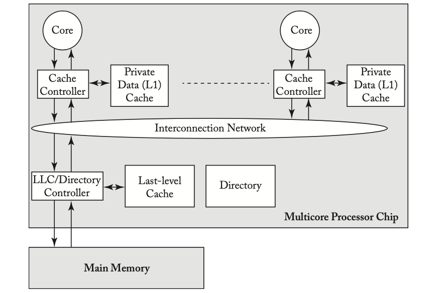

*Figure 8.1: Directory system model.*

### 8.2.2 HIGH-LEVEL PROTOCOL SPECIFICATION

The baseline directory protocol has only three stable states: MSI. A block is owned by the directory controller unless the block is in a cache in state M. The directory state for each block includes the stable coherence state, the identity of the owner (if the block is in state M), and the identities of the sharers encoded as a one- hot bit vector (if the block is in state S). We illustrate a directory entry in Figure 8.2. In Section 8.5, we will discuss other encodings of directory entries.

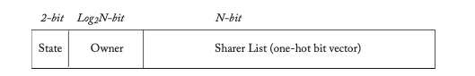

*Figure 8.2: Directory entry for a block in a system with N nodes.*

(2-bit State, log2 N-bit Owner, N-bit Sharer List (one-hot bit vector))

Before presenting the detailed specification, we first illustrate a higher level abstraction of the protocol in order to understand its fundamental behaviors. In Figure 8.3, we show the transactions in which a cache controller issues coherence requests to change permissions from I to S, I or S to M, M to I, and S to I. As with the snooping protocols in the last chapter, we specify the directory state of a block using a cache- centric notation (e.g., a directory state of M denotes that there exists a cache with the block in state M). Note that a cache controller may not silently evict a Shared block; that is, there is an explicit PutS request. We defer a discussion of protocols with silent evictions of shared blocks, as well as a comparison of silent vs. explicit PutS requests, until Section 8.7.4.

Most of the transactions are fairly straightforward, but two transactions merit further discussion here. The first is the transaction that occurs when a cache is trying to upgrade permissions from I or S to M and the directory state is S. The cache controller sends a GetM to the directory, and the directory takes two actions. First, it responds to the requestor with a message that includes the data and the "AckCount;" the AckCount is the number of current sharers of the block. The directory sends the AckCount to the requestor to inform the requestor of how many sharers must acknowledge having invalidated their block in response to the GetM. Second, the directory sends an Invalidation (Inv) message to all of the current sharers. Each sharer, upon receiving the Invalidation, sends an Invalidation- Ack (Inv- Ack) to the requestor. Once the requestor receives the message from the directory and all of the Inv- Ack messages, it completes the transaction. The requestor, having received all of the Inv- Ack messages, knows that there are no longer any readers of the block and thus it may write to the block without violating coherence.

The second transaction that merits further discussion occurs when a cache is trying to evict a block in state M. In this protocol, we have the cache controller send a PutM message that includes the data to the directory. The directory responds with a Put- Ack. If the PutM did not carry the data with it, then the protocol would require a third message—a data message from the cache controller to the directory with the evicted block that had been in state M—to be sent in a PutM transaction. The PutM transaction in this directory protocol differs from what occurred in the snooping protocol, in which a PutM did not carry data.

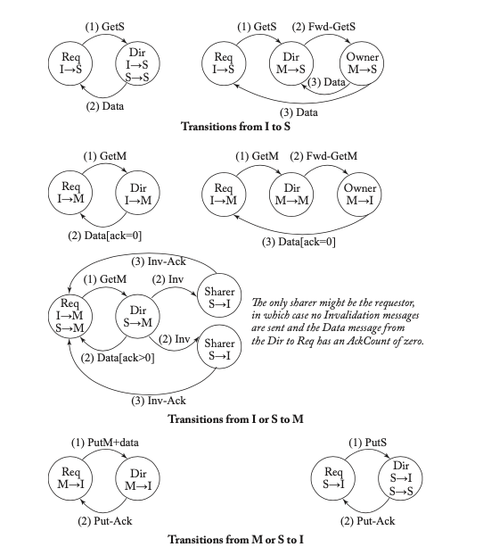

*Figure 8.3: High-level description of MSI directory protocol. In each transition, the cache con- troller that requests the transaction is denoted “Req.”)*

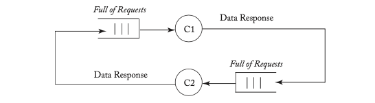

*Figure 8.4: Deadlock example.*

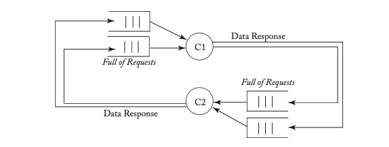

*Figure 8.5: Avoiding deadlock with separate networks.*

### 8.2.3 AVOIDING DEADLOCK

In this protocol, the reception of a message can cause a coherence controller to send another message. In general, if event A (e.g., message reception) can cause event B (e.g., message sending) and both these events require resource allocation (e.g., network links and buffers), then we must be careful to avoid deadlock that could occur if circular resource dependences arise. For example, a GetS request can cause the directory controller to issue a Fwd- GetS message; if these messages use the same resources (e.g., network links and buffers), then the system can potentially deadlock. In Figure 8.4, we illustrate a deadlock in which two coherence controllers C1 and C2 are responding to each other's requests, but the incoming queues are already full of other coherence requests. If the queues are FIFO, then the responses cannot pass the requests. Because the queues are full, each controller stalls trying to send a response. Because the queues are FIFO, the controller cannot switch to work on a subsequent request (or get to the response). Thus, the system deadlocks.

A well- known solution for avoiding deadlock in coherence protocols is to use separate networks for each class of message. The networks can be physically separate or logically separate (called virtual networks), but the key is avoiding dependences between classes of messages.

Figure 8.5 illustrates a system in which request and response messages travel on separate physical networks. Because a response cannot be blocked by another request, it will eventually be consumed by its destination node, breaking the cyclic dependence.

The directory protocol in this section uses three networks to avoid deadlock. Because a request can cause a forwarded request and a forwarded request can cause a response, there are three message classes that each require their own network. Request messages are GetS, GetM, and PutM. Forwarded request messages are Fwd- GetS, Fwd- GetM, Inv(aliadation), and PutAck. Response messages are Data and Inv- Ack. The protocols in this chapter require that the Forwarded Request network provides point- to- point ordering; other networks have no ordering constraints nor are there any ordering constraints between messages traveling on different networks.

We defer a more thorough discussion of deadlock avoidance, including more explanation of virtual networks and the exact requirements for avoiding deadlock, until Section 9.3.

*Figures 8.4 and 8.5: Deadlock example diagrams.*

### 8.2.4 DETAILED PROTOCOL SPECIFICATION

We present the detailed protocol specification, including all transient states, in Tables 8.1 and 8.2. Compared to the high- level description in Section 8.2.2, the most significant difference is the transient states. The coherence controllers must manage the states of blocks that are in the midst of coherence transactions, including situations in which a cache controller receives a forwarded request from another controller in between sending its coherence request to the directory and receiving all of its necessary response messages, including Data and possible Inv- Acks. The cache controllers can maintain this state in the miss status handling registers (MSHRs) that cores use to keep track of outstanding coherence requests. Notationally, we represent these transient states in the form XY^AD, where the superscript A denotes waiting for acknowledgment and the superscript D denotes waiting for data. (This notation differs from the snooping protocols, in which the superscript A denoted waiting for a request to appear on the bus.)

**Table 8.1: MSI directory protocol—cache controller**

| States | Load | Store | Replacement | Fwd-GetS | Fwd-GetM | Inv | Put-Ack | Data from Dir (ack=0) | Data from Dir (ack>0) | Data from Owner | Inv-Ack | Last-Inv-Ack |
|--------|------|-------|-------------|----------|----------|-----|---------|-----------------------|-----------------------|-----------------|---------|---------------|
| I | Send GetS to Dir/IS^D | Send GetM to Dir/IM^AD | | | | | | | | | | |
| IS^D | Stall | Stall | Stall | | | | | Copy data into cache, load hit/S | | | | |
| IM^AD | Stall | Stall | Stall | | | | | | Copy data into cache, store hit/M | | | |
| IM^A | Stall | Stall | Stall | | | | | | /M | | | Copy data into cache, store hit/M |
| S | Hit | Send GetM to Dir/SM^AD | Send PutS to Dir/SI^A | Send Inv-Ack to Req/I | | | | | | | | |
| SM^AD | Hit | Stall | Stall | | | | | | Copy data into cache, store hit/M | | | |
| SM^A | Hit | Stall | Stall | | | | | | /M | | | Copy data into cache, store hit/M |
| SI^A | Stall | Stall | Stall | Send Inv-Ack to Req/II^A | | | | | | | | |
| M | Hit | Hit | Send PutM+data to Dir/MI^A | Send data to Req and Dir/S | Send data to Req/I | | | | | | | |
| MI^A | Stall | Stall | Stall | Send data to Req and Dir/SI^A | Send data to Req/II^A | | | | | | | |
| II^A | Stall | Stall | Stall | | | | | | | | | |

**Table 8.2: MSI directory protocol—directory controller**

| State | GetS | GetM | PutS-NotLast | PutS-Last | PutM+data from Owner | PutM+data from Non-Owner | Data |
|-------|------|------|--------------|-----------|----------------------|--------------------------|------|
| I | Send data to Req, add Req to Sharers/S | Send data to Req, set Owner to Req/M | | | Send Put-Ack to Req | Send Put-Ack to Req | |
| S | Send data to Req, add Req to Sharers | Send data to Req, send Inv to Sharers, clear Sharers, set Owner to Req/M | Remove Req from Sharers, send Put-Ack to Req | Remove Req from Sharers, send Put-Ack to Req/I | Remove Req from Sharers, send Put-Ack to Req | | |
| M | Send Fwd-GetS to Owner, add Req and Owner to Sharers, clear Owner/S^D | Send Fwd-GetM to Owner, set Owner to Req | | | Send Put-Ack to Req | Send Put-Ack to Req | Copy data to memory, clear Owner, send Put-Ack to Req/I |
| S^D | Stall | Stall | Remove Req from Sharers, send Put-Ack to Req | Remove Req from Sharers, send Put-Ack to Req | Remove Req from Sharers, send Put-Ack to Req | | Copy data to memory/S |

### 8.2.5 PROTOCOL OPERATION

The protocol enables caches to acquire blocks in states S and M and to replace blocks to the directory in either of these states.

#### I to S (common case #1)

The cache controller sends a GetS request to the directory and changes the block state from I to IS^D. The directory receives this request and, if the directory is the owner (i.e., no cache currently has the block in M), the directory responds with a Data message, changes the block's state to S (if it is not S already), and adds the requestor to the sharer list. When the Data arrives at the requestor, the cache controller changes the block's state to S, completing the transaction.

#### I to S (common case #2)

The cache controller sends a GetS request to the directory and changes the block state from I to IS^D. If the directory is not the owner (i.e., there is a cache that currently has the block in M), the directory forwards the request to the owner and changes the block's state to the transient state S^D. The owner responds to this Fwd- GetS message by sending Data to the requestor and changing the block's state to S. The now- previous owner must also send Data to the directory since it is relinquishing ownership to the directory, which must have an up- to- date copy of the block. When the Data arrives at the requestor, the cache controller changes the block state to S and considers the transaction complete. When the Data arrives at the directory, the directory copies it to memory, changes the block state to S, and considers the transaction complete.

#### I to S (race cases)

The above two I- to- S scenarios represent the common cases, in which there is only one transaction for the block in progress. Most of the protocol's complexity derives from having to deal with the less- common cases of multiple in- progress transactions for a block. For example, a reader may find it surprising that a cache controller can receive an Invalidation for a block in state IS^D. Consider core C1 that issues a GetS and goes to IS^D and another core C2 that issues a GetM for the same block that arrives at the directory after C1's GetS. The directory first sends C1 Data in response to its GetS and then an Invalidation in response to C2's GetM. Because the Data and Invalidation travel on separate networks, they can arrive out of order, and thus C1 can receive the Invalidation before the Data.

#### I or S to M

The cache controller sends a GetM request to the directory and changes the block's state from I to IM^AD. In this state, the cache waits for Data and (possibly) Inv- Acks that indicate that other caches have invalidated their copies of the block in state S. The cache controller knows how many Inv- Acks to expect, since the Data message contains the AckCount, which may be zero. Figure 8.3 illustrates the three common- case scenarios of the directory responding to the GetM request. If the directory is in state I, it simply sends Data with an AckCount of zero and goes to state M. If in state M, the directory controller forwards the request to the owner and updates the block's owner; the now- previous owner responds to the Fwd- GetM request by sending Data with an AckCount of zero. The last common case occurs when the directory is in state S. The directory responds with Data and an AckCount equal to the number of sharers, plus it sends Invalidations to each core in the sharer list. Cache controllers that receive Invalidation messages invalidate their shared copies and send Inv- Acks to the requestor. When the requestor receives the last Inv- Ack, it transitions to state M. Note the special Last- Inv- Ack event in Table 8.1, which simplifies the protocol specification.

These common cases neglect some possible races that highlight the concurrency of directory protocols. For example, core C1 has the cache block in state IM^A and receives a Fwd- GetS from C2's cache controller. This situation is possible because the directory has already sent Data to C1, sent Invalidation messages to the sharers, and changed its state to M. When C2's GetS arrives at the directory, the directory simply forwards it to the owner, C1. This Fwd- GetS may arrive at C1 before all of the Inv- Acks arrive at C1. In this situation, our protocol simply stalls and the cache controller waits for the Inv- Acks. Because Inv- Acks travel on a separate network, they are guaranteed not to block behind the unprocessed Fwd- GetS.

#### M to I

To evict a block in state M, the cache controller sends a PutM request that includes the data and changes the block state to MI^A. When the directory receives this PutM, it updates the LLC/memory, responds with a Put- Ack, and transitions to state I. Until the requestor receives the Put- Ack, the block's state remains effectively M and the cache controller must respond to forwarded coherence requests for the block. In the case where the cache controller receives a forwarded coherence request (Fwd- GetS or Fwd- GetM) between sending the PutM and receiving the Put- Ack, the cache controller responds to the Fwd- GetS or Fwd- GetM and changes its block state to SI^A or II^A, respectively. These transient states are effectively S and I, respectively, but denote that the cache controller must wait for a Put- Ack to complete the transition to I.

#### S to I

Unlike the snooping protocols in the previous chapter, our directory protocols do not silently evict blocks in state S. Instead, to replace a block in state S, the cache controller sends a PutS request and changes the block state to SI^A. The directory receives this PutS and responds with a Put- Ack. Until the requestor receives the Put- Ack, the block's state is effectively S. If the cache controller receives an Invalidation request after sending the PutS and before receiving the Put- Ack, it changes the block's state to II^A. This transient state is effectively I, but it denotes that the cache controller must wait for a Put- Ack to complete the transaction from S to I.

### 8.2.6 PROTOCOL SIMPLIFICATIONS

This protocol is relatively straightforward and sacrifices some performance to achieve this simplicity. We now discuss two simplifications:

- The most significant simplification, other than having only three stable states, is that the protocol stalls in certain situations. For example, a cache controller stalls when it receives a forwarded request while in a transient state. A higher performance option, discussed in Section 8.7.2, would be to process the messages and add more transient states.
- A second simplification is that the directory sends Data (and the AckCount) in response to a cache that is changing a block's state from S to M. The cache already has valid data and thus it would be sufficient for the directory to simply send a data-less AckCount. We defer adding this new type of message until we present the MOSI protocol in Section 8.4.

## 8.3 ADDING THE EXCLUSIVE STATE

As we previously discussed in the context of snooping protocols, adding the Exclusive (E) state is an important optimization because it enables a core to read and then write a block with only a single coherence transaction, instead of the two required by an MSI protocol. At the highest level, this optimization is independent of whether the cache coherence uses snooping or directories. If a core issues a GetS and the block is not currently shared by other cores, then the requestor may obtain the block in state E. The core may then silently upgrade the block's state from E to M without issuing another coherence request.

In this section, we add the E state to our baseline MSI directory protocol. As with the MESI snooping protocol in the previous chapter, the operation of the protocol depends on whether the E state is considered an ownership state or not. And, as with the MESI snooping protocol, the primary operational difference involves determining which coherence controller should respond to a request for a block that the directory gave to a cache in state E. The block may have been silently upgraded from E to M since the directory gave the block to the cache in state E.

In protocols in which an E block is owned, the solution is simple. The cache with the block in E (or M) is the owner and thus must respond to requests. A coherence request sent to the directory will be forwarded to the cache with the block in state E. Because the E state is an ownership state, the eviction of an E block cannot be performed silently; the cache must issue a PutE request to the directory. Without an explicit PutE, the directory would not know that the directory was now the owner and should respond to incoming coherence requests. Because we assume in this primer that blocks in E are owned, this simple solution is what we implement in the MESI protocol in this section.

In protocols in which an E block is not owned, an E block can be silently evicted, but the protocol complexity increases. Consider the case where core C1 obtains a block in state E and then the directory receives a GetS or GetM from core C2. The directory knows that C1 is either (i) still in state E, (ii) in state M (if C1 did a store with a silent upgrade from E to M), or (iii) in state I (if the protocol allows C1 to perform a silent PutE). If C1 is in M, the directory must forward the request to C1 so that C1 can supply the latest version of the data. If C1 is in E, C1 or the directory may respond since they both have the same data. If C1 is in I, the directory must respond. One solution, which we describe in more detail in our case study on the SGI Origin [10] in Section 8.8.1, is to have both C1 and the directory respond. Another solution is to have the directory forward the request to C1. If C1 is in I, C1 notifies the directory to respond to C2; else, C1 responds to C2 and notifies the directory that it does not need to respond to C2.

### 8.3.1 HIGH-LEVEL PROTOCOL SPECIFICATION

We specify a high- level view of the transactions in Figure 8.6, with differences from the MSI protocol highlighted. There are only two significant differences. First, there is a transition from I to E that can occur if the directory receives a GetS for a block in state I. Second, there is a PutE transaction for evicting blocks in state E. Because E is an ownership state, an E block cannot be silently evicted. Unlike a block in state M, the E block is clean, and thus the PutE does not need to carry data; the directory already has the most up- to- date copy of the block.

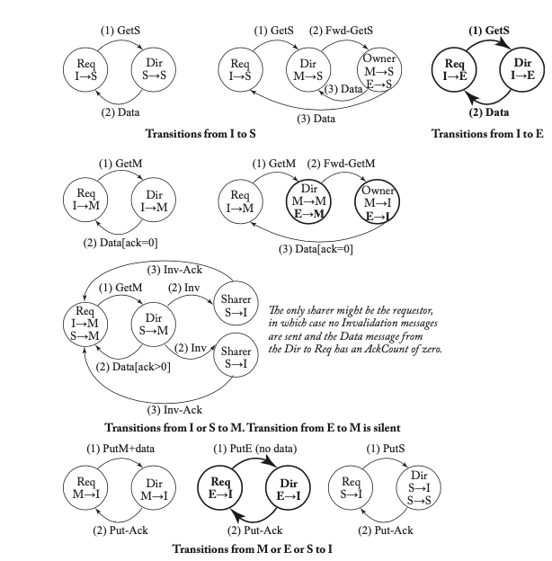

*Figure 8.6: High-level description of MESI directory protocol. In each transition, the cache controller that requests the transaction is denoted “Req.”)*

### 8.3.2 DETAILED PROTOCOL SPECIFICATION

In Tables 8.3 and 8.4, we present the detailed specification of the MESI protocol, including transient states. Differences with respect to the MSI protocol are highlighted with boldface font. The protocol adds to the set of cache states both the stable E state as well as transient states to handle transactions for blocks initially in state E.

This protocol is somewhat more complex than the MSI protocol, with much of the added complexity at the directory controller. In addition to having more states, the directory controller must distinguish between more possible events. For example, when a PutS arrives, the directory must distinguish whether this is the "last" PutS; that is, did this PutS arrive from the only current sharer? If this PutS is the last PutS, then the directory's state changes to I.

**Table 8.3: MESI directory protocol—cache controller**

| States | Load | Store | Replacement | Fwd-GetS | Fwd-GetM | Inv | Priv-Ack | Priv-Fwd | Data from Dir (ack=0) | Exclusive Data from Dir | Data from Dir (ack>0) | Data from Owner | Inv-Ack | Last-Inv-Ack |
|--------|------|-------|-------------|----------|----------|-----|----------|----------|-----------------------|------------------------|-----------------------|-----------------|---------|---------------|
| I | Send GetS to Dir/IS^D | Send GetM to Dir/IM^AD | | | | | | | | | | | | |
| IS^D | Stall | Stall | Stall | | | | | | | | | | | |
| IM^AD | Stall | Stall | Stall | | | | | | | | | | | |
| IM^A | Stall | Stall | Stall | | | | | | | | | | | |
| S | Hit | Send GetM to Dir/SM^AD | Send PutS to Dir/SI^A | Send Inv-Ack to Req/I | | | | | | | | | | |
| SM^AD | Hit | Stall | Stall | | | | | | | | | | | |
| SM^A | Hit | Stall | Stall | | | | | | | | | | | |
| SI^A | Stall | Stall | Stall | Send Inv-Ack to Req/II^A | | | | | | | | | | |
| E | Hit | Hit | /M | Issue PutE (no data) to Dir/EI^A | Send data to Req and Dir/S | Send data to Req/I | | | | | | | | |
| M | Hit | Hit | Send PutM+data to Dir/MI^A | Send data to Req and Dir/S | Send data to Req/I | | | | | | | | | |
| MI^A | Stall | Stall | Stall | Send data to Req and Dir/SI^A | Send data to Req/II^A | | | | | | | | |
| EI^A | Stall | Stall | Stall | Send data to Req and Dir/SI^A | Send data to Req/II^A | | | | | | | | |
| II^A | Stall | Stall | Stall | | | | | | | | | | |

**Table 8.4: MESI directory protocol—directory controller**

| State | GetS | GetM | PutS-NotLast | PutS-Last | PutM+data from Owner | PutM+data from Non-Owner | PutE | Data |
|-------|------|------|--------------|-----------|----------------------|--------------------------|------|------|
| I | Send Exclusive data to Req, set Owner to Req/E | Send data to Req, set Owner to Req/M | | | Send Put-Ack to Req | Send Put-Ack to Req | Send Put-Ack to Req | |
| S | Send data to Req, add Req to Sharers | Send data to Req, send Inv to Sharers, clear Sharers, set Owner to Req/M | Remove Req from Sharers, send Put-Ack to Req | Remove Req from Sharers, send Put-Ack to Req/I | Remove Req from Sharers, send Put-Ack to Req | | Remove Req from Sharers, send Put-Ack to Req | |
| E | Forward GetS to Owner, make Owner sharer, add Req to Sharers, clear Owner/S^D | Forward GetM to Owner, set Owner to Req/M | | | Send Put-Ack to Req | Send Put-Ack to Req | Copy data to mem, send Put-Ack to Req, clear Owner/I | Send Put-Ack to Req |
| M | Forward GetS to Owner, make Owner sharer, add Req to Sharers, clear Owner/S^D | Forward GetM to Owner, set Owner to Req | | | Send Put-Ack to Req | Send Put-Ack to Req | Copy data to mem, send Put-Ack to Req, clear Owner/I | |
| S^D | Stall | Stall | Remove Req from Sharers, send Put-Ack to Req | Remove Req from Sharers, send Put-Ack to Req | Remove Req from Sharers, send Put-Ack to Req | | | Copy data to LLC/mem/S |

## 8.4 ADDING THE OWNED STATE

For the same reason we added the Owned state to the baseline MSI snooping protocol in Chapter 7, an architect may want to add the Owned state to the baseline MSI directory protocol presented in Section 8.2. Recall from Chapter 2 that if a cache has a block in the Owned state, then the block is valid, read- only, dirty (i.e., it must eventually update memory), and owned (i.e., the cache must respond to coherence requests for the block). Adding the Owned state changes the protocol, compared to MSI, in three important ways: (1) a cache with a block in M that observes a Fwd- GetS changes its state to O and does not need to (immediately) copy the data back to the LLC/memory, (2) more coherence requests are satisfied by caches (in O state) than by the LLC/memory, and (3) there are more 3- hop transactions (which would have been satisfied by the LLC/memory in an MSI protocol).

### 8.4.1 HIGH-LEVEL PROTOCOL SPECIFICATION

We specify a high- level view of the transactions in Figure 8.7, with differences from the MSI protocol highlighted. The most interesting difference is the transaction in which a requestor of a block in state I or S sends a GetM to the directory when the block is in the O state in the owner cache and in the S state in one or more sharer caches. In this case, the directory forwards the GetM to the owner, and appends the AckCount. The directory also sends Invalidations to each of the sharers. The owner receives the Fwd- GetM and responds to the requestor with Data and the AckCount. The requestor uses this received AckCount to determine when it has received the last Inv- Ack. There is a similar transaction if the requestor of the GetM was the owner (in state O). The difference here is that the directory sends the AckCount directly to the requestor because the requestor is the owner.

This protocol has a PutO transaction that is nearly identical to the PutM transaction. It contains data for the same reason that the PutM transaction contains data, i.e., because both M and O are dirty states.

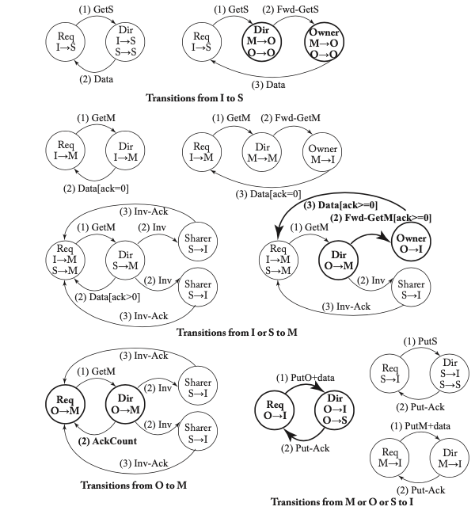

*Figure 8.7: High-level description of MOSI directory protocol. In each transition, the cache controller that requests the transaction is denoted "Req.")*

### 8.4.2 DETAILED PROTOCOL SPECIFICATION

Tables 8.5 and 8.6 present the detailed specification of the MOSI protocol, including transient states. Differences with respect to the MSI protocol are highlighted with boldface font. The protocol adds to the set of cache states both the stable O state as well as transient OM^AC, OM^A, and OI^A states to handle transactions for blocks initially in state O. The state OM^AC indicates that the cache is waiting for both Inv- Acks (A) from caches and an AckCount (C) from the directory, but not data. Because this block started in state O, it already had valid data.

An interesting situation arises when core C1's cache controller has a block in OM^AC or SM^AD and receives a Fwd- GetM or Invalidation from core C2 for that block. C2's GetM must have been ordered at the directory before C1's GetM, for this situation to arise. Thus, the directory state changes to M (owned by C2) before observing C1's GetM. When C2's Fwd- GetM or Invalidation arrives at C1, C1 must be aware that C2's GetM was ordered first. Thus, C1's cache state changes from either OM^AC or SM^AD to IM^AD. The forwarded GetM or Invalidation from C2 invalidated C1's cache block and now C1 must wait for both Data and Inv- Acks.

**Table 8.5: MOSI directory protocol—cache controller**

| States | Load | Store | Replacement | Fwd-GetS | Fwd-GetM | Inv | Priv-Ack | Priv-fwd | Data from Dir (ack=0) | Data from Dir (ack>0) | Data from Owner | Ack-Cont from Dir | Inv-Ack | Last-Inv-Ack |
|--------|------|-------|-------------|----------|----------|-----|----------|----------|-----------------------|-----------------------|-----------------|--------------------|---------|---------------|
| I | Send GetS to Dir/IS^D | Send GetM to Dir/IM^AD | | | | | | | | | | | | |
| IS^D | Stall | Stall | Stall | | | | | | | | | | | |
| IM^AD | Stall | Stall | Stall | | | | | | | | | | | |
| IM^A | Stall | Stall | Stall | | | | | | | | | | | |
| S | Hit | Send GetM to Dir/SM^AD | Send PutS to Dir/SI^A | Send Inv-Ack to Req/I | | | | | | | | | | |
| SM^AD | Hit | Stall | Stall | | | | | | | | | | | |
| SM^A | Hit | Stall | Stall | | | | | | | | | | | |
| SI^A | Stall | Stall | Stall | Send Inv-Ack to Req/II^A | | | | | | | | | | |
| O | Hit | Send GetM to Dir/OM^AD | Send PutO+data to Dir/OI^A | Send data to Req | Send data to Req/I | | | | | | | | | |
| OM^AD | Hit | Stall | Stall | Send data to Req | Send data to Req/I | | | | | | | | | |
| OM^A | Hit | Stall | Stall | Send data to Req | Send data to Req/I | | | | | | | | | |
| OI^A | Stall | Stall | Stall | Send data to Req | Send data to Req/I | | | | | | | | | |
| M | Hit | Hit | Send PutM+data to Dir/MI^A | Send data to Req/O | Send data to Req/I | | | | | | | | | |
| MI^A | Stall | Stall | Stall | Send data to Req/OI^A | Send data to Req/I | | | | | | | | | |
| II^A | Stall | Stall | Stall | | | | | | | | | | | |

**Table 8.6: MOSI directory protocol—directory controller**

| State | GetS | GetM from Owner | GetM from Non-Owner | PutS-NotLast | PutS-Last | PutM+data from Owner | PutM+data from Non-Owner | PutO+data | Data |
|-------|------|----------------|----------------------|--------------|-----------|----------------------|--------------------------|-----------|------|
| I | Send data to Req, add Req to Sharers/S | Send data to Req, set Owner to Req/M | | | | Send Put-Ack to Req | Send Put-Ack to Req | Send Put-Ack to Req | |
| S | Send data to Req, add Req to Sharers | Send data to Req, send Inv to Sharers, clear Sharers, set Owner to Req/M (if from Owner) | Send data to Req, send Inv to Sharers, clear Sharers, set Owner to Req/M | Remove Req from Sharers, send Put-Ack to Req | Remove Req from Sharers, send Put-Ack to Req/I | Remove Req from Sharers, send Put-Ack to Req | | Remove Req from Sharers, send Put-Ack to Req | |
| O | Forward GetS to Owner, make Owner sharer, add Req to Sharers, clear Owner/S^D | Forward GetM to Owner, set Owner to Req | Forward GetM to Owner, set Owner to Req | | | Send Put-Ack to Req | Send Put-Ack to Req | Copy data to mem, send Put-Ack to Req, clear Owner/I | |
| M | Forward GetS to Owner, make Owner sharer, add Req to Sharers, clear Owner/S^D | Forward GetM to Owner, set Owner to Req | Forward GetM to Owner, set Owner to Req | | | Send Put-Ack to Req | Send Put-Ack to Req | Copy data to mem, send Put-Ack to Req, clear Owner/I | |
| S^D | Stall | Stall | Stall | Remove Req from Sharers, send Put-Ack to Req | Remove Req from Sharers, send Put-Ack to Req | Remove Req from Sharers, send Put-Ack to Req | | | Copy data to LLC/mem/S |

## 8.5 REPRESENTING DIRECTORY STATE

In the previous sections, we have assumed a complete directory; that is, the directory maintains the complete state for each block, including the full set of caches that (may) have shared copies. Yet this assumption contradicts the primary motivation for directory protocols: scalability. In a system with a large number of caches (i.e., a large number of potential sharers of a block), maintaining the complete set of sharers for each block requires a significant amount of storage, even when using a compact bit- vector representation. For a system with a modest number of caches, it may be reasonable to maintain this complete set, but the architects of larger- scale systems may wish for more scalable solutions to maintaining directory state.

There are many ways to reduce how much state the directory maintains for each block. Here we discuss two important techniques: coarse directories and limited pointers. We discuss these techniques independently, but observe that they can be combined. We contrast each solution with the baseline design, illustrated in the top entry of Figure 8.8.

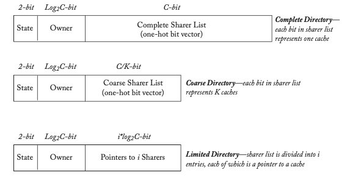

*Figure 8.8: Representing directory state for a block in a system with C nodes. Top: complete directory (2-bit state, log2 C-bit owner, C-bit sharer list). Middle: coarse directory (2-bit state, log2 C-bit owner, coarse sharer bits). Bottom: limited pointer directory (2-bit state, log2 C-bit owner, i pointers each log2 C bits).*

### 8.5.1 COARSE DIRECTORY

Having the complete set of sharers enables the directory to send Invalidation messages to exactly those cache controllers that have the block in state S. One way to reduce the directory state is to have a coarse directory: the directory maintains which coarse groups of caches (e.g., which chips) contain sharers. This reduces the number of sharer bits from C to G (the number of groups). On a GetM, the directory sends Invalidations to all caches in each group marked as having sharers. This may lead to unnecessary Invalidations (to caches that do not hold the block) but reduces storage.

### 8.5.2 LIMITED POINTER DIRECTORY

In a chip with C caches, a complete sharer list requires C entries, one bit each, for a total of C bits. However, studies have shown that many blocks have zero sharers or one sharer. A limited pointer directory exploits this observation by having i (i < C) entries, where each entry requires log2 C bits, for a total of i * log2 C bits, as illustrated in the bottom entry of Figure 8.8. A limited pointer directory requires some additional mechanism to handle (hopefully uncommon) situations in which the system attempts to add an i+1th sharer. There are three well- studied options for handling these situations, denoted using the notation Dir_iX [2, 8], where i refers to the number of pointers to sharers, and X refers to the mechanism for handling situations in which the system attempts to add an i+1th sharer.

- **Broadcast (Dir_iB)**: If there are already i sharers and another GetS arrives, the directory controller sets the block's state to indicate that a subsequent GetM requires the directory to broadcast the Invalidation to all caches (i.e., a new "too many sharers" state). A drawback of Dir_iB is that the directory could have to broadcast to all C caches even when there are only K sharers (i < K < C), requiring the directory controller to send (and the cache controllers to process) C - K unnecessary Invalidation messages. The limiting case, Dir0B, takes this approach to the extreme by eliminating all pointers and requiring a broadcast on all coherence operations. The original Dir0B proposal maintained two state bits per block, encoding the three MSI states plus a special "Single Sharer" state [3]. This new state helps eliminate a broadcast when a cache tries to upgrade its S copy to an M copy (similar to the Exclusive state optimization). Similarly, the directory's I state eliminates broadcast when memory owns the block. AMD's Coherent HyperTransport [6] implements a version of Dir0B that uses no directory state, forgoing these optimizations but eliminating the need to store any directory state. All requests sent to the directory are then broadcast to all caches.

- **No Broadcast (Dir_iNB)**: If there are already i sharers and another GetS arrives, the directory asks one of the current sharers to invalidate itself to make room in the sharer list for the new requestor. This solution can incur significant performance penalties for widely shared blocks (i.e., blocks shared by more than i nodes), due to the time spent invalidating sharers. Dir_iNB is especially problematic for systems with coherent instruction caches because code is frequently widely shared.

- **Software (Dir_iSW)**: If there are already i sharers and another GetS arrives, the system traps to a software handler. Trapping to software enables great flexibility, such as maintaining a full sharer list in software- managed data structures. However, because trapping to software incurs significant performance costs and implementation complexities, this approach has seen limited commercial acceptance.

## 8.6 DIRECTORY ORGANIZATION

Logically, the directory contains a single entry for every block of memory. Many traditional directory- based systems, in which the directory controller was integrated with the memory controller, directly implemented this logical abstraction by augmenting memory to hold the directory. For example, the SGI Origin added additional DRAM chips to store the complete directory state with each block of memory [10].

However, with today's multicore processors and large LLCs, the traditional directory design makes little sense. First, architects do not want the latency and power overhead of a directory access to off- chip memory, especially for data cached on chip. Second, system designers balk at the large off- chip directory state when almost all memory blocks are not cached at any given time. These drawbacks motivate architects to optimize the common case by caching only a subset of directory entries on chip. In the rest of this section, we discuss directory cache designs, several of which were previously categorized by Marty and Hill [13].

Like conventional instruction and data caches, a directory cache [7] provides faster access to a subset of the complete directory state. Because directories summarize the states of coherent caches, they exhibit locality similar to instruction and data accesses, but need only store each block's coherence state rather than its data. Thus, relatively small directory caches achieve high hit rates. Directory caching has no impact on the functionality of the coherence protocol; it simply reduces the average directory access latency. Directory caching has become even more important in the era of multicore processors. In older systems in which cores resided on separate chips and/or boards, message latencies were sufficiently long that they tended to amortize the directory access latency. Within a multicore processor, messages can travel from one core to another in a handful of cycles, and the latency of an off- chip directory access tends to dwarf communication latencies and become a bottleneck. Thus, for multicore processors, there is a strong incentive to implement an on- chip directory cache to avoid costly off- chip accesses.

The on- chip directory cache contains a subset of the complete set of directory entries. Thus, the key design issue is handling directory cache misses, i.e., when a coherence request arrives for a block whose directory entry is not in the directory cache.

We summarize the design options in Table 8.7 and describe them next.

**Table 8.7: Comparing directory cache designs**

| | Directory Cache Backed by DRAM (Section 8.6.1) | Inclusive Directory Cache Embedded in Inclusive LLC (Section 8.6.2) | Standalone Inclusive Directory Cache (Section 8.6.2) | Null Directory Cache (Section 8.6.3) |
|-|------------------------------------------------|--------------------------------------------------------------------|------------------------------------------------------|---------------------------------------|
| Directory location | DRAM | LLC | LLC | None |
| Uses DRAM | Yes | No | No | No |
| Miss at directory implies | Must access DRAM | Block must be I | Block must be I | Block could be in any state → must broadcast |
| Inclusion requirements | None | LLC includes L1s | Directory cache includes L1s | None |
| Implementation costs | DRAM plus separate on-chip cache | Larger LLC blocks; highly associative LLC | Larger LLC blocks | Highly associative storage for redundant tags | Storage for redundant tags | None |
| Replacement notification | None | None | Desirable | Required | Desirable | None |

### 8.6.1 DIRECTORY CACHE BACKED BY DRAM

The most straightforward design is to keep the complete directory in DRAM, as in traditional multi- chip multiprocessors, and use a separate directory cache structure to reduce the average access latency. A coherence request that misses in this directory cache leads to an access of this DRAM directory. This design, while straightforward, suffers from several important drawbacks. First, it requires a significant amount of DRAM to hold the directory, including state for the vast majority of blocks that are not currently cached on the chip. Second, because the directory cache is decoupled from the LLC, it is possible to hit in the LLC but miss in the directory cache, thus incurring a DRAM access even though the data is available locally. Finally, directory cache replacements must write the directory entries back to DRAM, incurring high latency and power overheads.

### 8.6.2 INCLUSIVE DIRECTORY CACHES

We can design directory caches that are more cost- effective by exploiting the observation that we need only cache directory states for blocks that are being cached on the chip. We refer to a directory cache as an inclusive directory cache if it holds directory entries for a superset of all blocks cached on the chip. An inclusive directory cache serves as a "perfect" directory cache that never misses for accesses to blocks cached on chip. There is no need to store a complete directory in DRAM. A miss in an inclusive directory cache indicates that the block is in state I; a miss is not the precursor to accessing some backing directory store.

We now discuss two inclusive directory cache designs, plus an optimization that applies to both designs.

#### Inclusive Directory Cache Embedded in Inclusive LLC

The simplest directory cache design relies on an LLC that maintains inclusion with the upperlevel caches. Cache inclusion means that if a block is in an upper- level cache then it must also be present in a lower- level cache. For the system model of Figure 8.1, LLC inclusion means that if a block is in a core's L1 cache, then it must also be in the LLC.

A consequence of LLC inclusion is that if a block is not in the LLC, it is also not in an L1 cache and thus must be in state I for all caches on the chip. An inclusive directory cache exploits this property by embedding the coherence state of each block in the LLC. If a coherence request is sent to the LLC/directory controller and the requested address is not present in the LLC, then the directory controller knows that the requested block is not cached on- chip and thus is in state I in all the L1s.

Because the directory mirrors the contents of the LLC, the entire directory cache may be embedded in the LLC simply by adding extra bits to each block in the LLC. These added bits can lead to non- trivial overhead, depending on the number of cores and the format in which directory state is represented. We illustrate the addition of this directory state to an LLC cache block in Figure 8.9, comparing it to an LLC block in a system without the LLC- embedded directory cache.

Unfortunately, LLC inclusion has several important drawbacks. First, while LLC inclusion can be maintained automatically for private cache hierarchies (if the lower- level cache has sufficient associativity [4]), for the shared caches in our system model, it is generally necessary to send special "Recall" requests to invalidate blocks from the L1 caches when replacing a block in the LLC (discussed later in this section). More importantly, LLC inclusion requires maintaining redundant copies of cache blocks that are in upper- level caches. In multicore processors, the collective capacity of the upper- level caches may be a significant fraction of (or sometimes, even larger than) the capacity of the LLC.

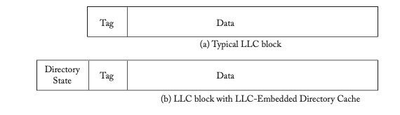

*Figure 8.9: The cost of implementing the LLC-embedded directory cache. Diagram comparing LLC block with and without directory bits.*

#### Standalone Inclusive Directory Cache

We now present an inclusive directory cache design that does not rely on LLC inclusion. In this design, the directory cache is a standalone structure that is logically associated with the directory controller, instead of being embedded in the LLC itself. For the directory cache to be inclusive, it must contain directory entries for the union of the blocks in all the L1 caches because a block in the LLC but not in any L1 cache must be in state I. Thus, in this design, the directory cache consists of duplicate copies of the tags at all L1 caches. Compared to the previous design, this design is more flexible, by virtue of not requiring LLC inclusion, but it has the added storage cost for the duplicate tags.

This inclusive directory cache has some significant implementation costs. Most notably, it requires a highly associative directory cache. (If we embed the directory cache in an inclusive LLC, then the LLC must also be highly associative.) Consider the case of a chip with C cores, each of which has a K- way set- associative L1 cache. The directory cache must be C*K- way associative to hold all L1 cache tags, and the associativity unfortunately grows linearly with core count. We illustrate this issue for K = 2 in Figure 8.10.

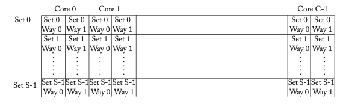

*Figure 8.10: Inclusive directory cache structure (assumes 2-way L1 caches). Each entry is the tag corresponding to that set and way for the core at the top of the column.*

The inclusive directory cache design also introduces some complexity, in order to keep the directory cache up- to- date. When a block is evicted from an L1 cache, the cache controller must notify the directory cache regarding which block was replaced by issuing an explicit PutS request (e.g., we cannot use a protocol with a silent eviction, as discussed in Section 8.7.4). One common optimization is to piggy- back the explicit PutS on the GetS or GetX request. Since the index bits must be the same, the PutS can be encoded by specifying which way was replaced. This is sometimes referred to as a "replacement hint," although in general it is required (and not truly a "hint").

#### Limiting the Associativity of Inclusive Directory Caches

To overcome the cost of the highly associative directory cache in the previous implementation, we present a technique for limiting its associativity. Rather than design the directory cache for the worst- case situation (C*K associativity), we limit the associativity by not permitting the worst- case to occur. That is, we design the directory cache to be A- way set associative, where A < C*K, and we do not permit more than A entries that map to a given directory cache set to be cached on chip. When a cache controller issues a coherence request to add a block to its cache, and the corresponding set in the directory cache is already full of valid entries, then the directory controller first evicts one of the blocks in this set from all caches. The directory controller performs this eviction by issuing a "Recall" request to all of the caches that hold this block in a valid state, and the caches respond with acknowledgments. Once an entry in the directory cache has been freed up via this Recall, then the directory controller can process the original coherence request that triggered the Recall.

The use of Recalls overcomes the need for high associativity in the directory cache but, without careful design, it could lead to poor performance. If the directory cache is too small, then Recalls will be frequent and performance will suffer. Conway et al. [6] propose a rule of thumb that the directory cache should cover at least the size of the aggregate caches it includes, but it can also be larger to reduce the rates of recalls. Also, to avoid unnecessary Recalls, this scheme works best with non- silent evictions of blocks in state S. With silent evictions, unnecessary Recalls will be sent to caches that no longer hold the block being recalled.

### 8.6.3 NULL DIRECTORY CACHE (WITH NO BACKING STORE)

The least costly directory cache is to have no directory cache at all. Recall that the directory state helps prune the set of coherence controllers to which to forward a coherence request. But as with Coarse Directories (Section 8.5.1), if this pruning is done incompletely, the protocol still works correctly, but unnecessary messages are sent and the protocol is less efficient than it could be. Taken to the extreme, a Dir0B protocol (Section 8.5.2) does no pruning whatsoever, in which case it does not actually need a directory at all (or a directory cache). Whenever a coherence request arrives at the directory controller, the directory controller simply forwards it to all caches (i.e., broadcasts the forwarded request). This directory cache design, which we call the Null Directory Cache, may seem simplistic, but it is popular for small- to medium- scale systems because it incurs no storage cost.

One might question the purpose of a directory controller if there is no directory state, but it serves two important roles. First, as with all other systems in this chapter, the directory controller is responsible for the LLC; it is, more precisely, an LLC/directory controller. Second, the directory controller serves as an ordering point in the protocol; if multiple cores concurrently request the same block, the requests are ordered at the directory controller. The directory controller resolves which request happens first.

## 8.7 PERFORMANCE AND SCALABILITY OPTIMIZATIONS

In this section, we discuss several optimizations to improve the performance and scalability of directory protocols.

### 8.7.1 DISTRIBUTED DIRECTORIES

So far we have assumed that there is a single directory attached to a single monolithic LLC. This design clearly has the potential to create a performance bottleneck at this shared, central resource. The typical, general solution to the problem of a centralized bottleneck is to distribute the resource. The directory for a given block is still fixed in one place, but different blocks can have different directories.

In older, multi- chip multiprocessors with N nodes—each node consisting of multiple chips, including the processor core and memory—each node typically had 1/N of the memory associated with it and the corresponding 1/Nth of the directory state.

We illustrate such a system model in Figure 8.11. The allocation of memory addresses to nodes is often static and often easily computable using simple arithmetic. For example, in a system with N directories, block B's directory entry might be at directory B modulo N. Each block has a home, which is the directory that holds its memory and directory state. Thus, we end up with a system in which there are multiple, independent directories managing the coherence for different sets of blocks. Having multiple directories provides greater bandwidth of coherence transactions than requiring all coherence traffic to pass through a single, central resource. Importantly, distributing the directory has no impact on the coherence protocol.

In today's world of multicore processors with large LLCs and directory caches, the approach of distributing the directory is logically the same as in the traditional multi- chip multiprocessors. We can distribute (bank) the LLC and directory cache. Each block has a home bank of the LLC with its associated bank of the directory cache.

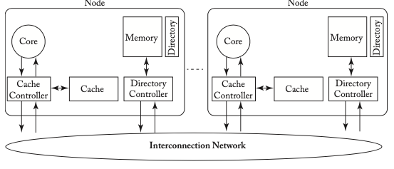

*Figure 8.11: Multiprocessor system model with distributed directory.*

### 8.7.2 NON-STALLING DIRECTORY PROTOCOLS

One performance limitation of the protocols presented thus far is that the coherence controllers stall in several situations. In particular, the cache controllers stall when they receive forwarded requests for blocks in certain transient states, such as IM^A. In Tables 8.8 and 8.9, we present a variant of the baseline MSI protocol that does not stall in these scenarios. For example, when a cache controller has a block in state IM^A and receives a Fwd- GetS, it processes the request and changes the block's state to IM^AS. This state indicates that after the cache controller's GetM transaction completes (i.e., when the last Inv- Ack arrives), the cache controller will change the block state to S. At this point, the cache controller must also send the block to the requestor of the GetS and to the directory, which is now the owner. By not stalling on the Fwd- GetS, the cache controller can improve performance by continuing to process other forwarded requests behind that Fwd- GetS in its incoming queue.

A complication in the non- stalling protocol is that, while in state IM^AS, a Fwd- GetM could arrive. Instead of stalling, the cache controller processes this request and changes the block's state to IM^ASI (in I, going to M, waiting for Inv- Acks, then going to S and then to I). A similar set of transient states arises for blocks in SM^A. Removing stalling leads to more transient states, in general, because the coherence controller must track (using new transient states) the additional messages it is processing instead of stalling.

We did not remove the stalls from the directory controller. As with the memory controllers in the snooping protocols in Chapter 7, we would need to add an impractically large number of transient states to avoid stalling in all possible scenarios.

**Table 8.8: Non-stalling MSI directory protocol—cache controller**

| States | Load | Store | Replacement | Fwd-GetS | Fwd-GetM | Inv | Put-Ack | Data from Dir (ack=0) | Data from Dir (ack>0) | Data from Owner | Inv-Ack | Last-Inv-Ack |
|--------|------|-------|-------------|----------|----------|-----|---------|-----------------------|-----------------------|-----------------|---------|---------------|
| I | Send GetS to Dir/IS^D | Send GetM to Dir/IM^AD | | | | | | | | | | |
| IS^D | Stall | Stall | Stall | | | | | /S | | | | |
| IS^I | Stall | Stall | Stall | | | | | /I | | | | |
| IS^DI | Stall | Stall | Stall | | | | | /I | | | | |
| IM^AD | Stall | Stall | Stall | | | | | | /M | | | |
| IM^A | Stall | Stall | Stall | | | | | | /M | | | -/M |
| IM^AS | Stall | Stall | Stall | | | | | | | Send data to Req and Dir/S | | |
| IM^ASI | Stall | Stall | Stall | | | | | | | Send data to Req and Dir/I | | |
| S | Hit | Send GetM to Dir/SM^AD | Send PutS to Dir/SI^A | Send Inv-Ack to Req/I | | | | | | | | |
| SM^AD | Hit | Stall | Stall | | | | | | /M | | | |
| SM^A | Hit | Stall | Stall | | | | | | /M | | | -/M |
| SM^AS | Hit | Stall | Stall | | | | | | | Send data to Req and Dir/S | | |
| SM^ASI | Hit | Stall | Stall | | | | | | | Send data to Req and Dir/I | | |
| M | Hit | Hit | Send PutM+data to Dir/MI^A | Send data to Req and Dir/S | Send data to Req/I | | | | | | | |
| MI^A | Stall | Stall | Stall | Send data to Req and Dir/SI^A | Send data to Req/II^A | | | | | | | |
| SI^A | Stall | Stall | Stall | Send Inv-Ack to Req/II^A | | | | | | | | |
| II^A | Stall | Stall | Stall | | | | | | | | | |

**Table 8.9: Non-stalling MSI directory protocol—directory controller**

| State | GetS | GetM from Owner | PutS-NotLast | PutS-Last | PutM+data from Owner | PutM+data from Non-Owner | Data |
|-------|------|----------------|--------------|-----------|----------------------|--------------------------|------|
| I | Send data to Req, add Req to Sharer/S | Send data to Req, set Owner to Req/M | | | Send Put-Ack to Req | Send Put-Ack to Req | |
| S | Send data to Req, add Req to Sharers | Send data to Req, set Owner to Req, send Inv to Sharers, clear Sharers/M | Send Put-Ack to Req, remove Req from Sharers | Send Put-Ack to Req, remove Req from Sharers/I | Remove Req from Sharers, send Put-Ack to Req | | |
| M | Forward GetS to Owner, add Req to Sharers, clear Owner/S^D | Forward GetM to Owner, set Owner to Req | | | Send Put-Ack to Req | Send Put-Ack to Req | Copy data to memory, send Put-Ack to Req, clear Owner/I |
| S^D | Stall | Stall | Send Put-Ack to Req, remove Req from Sharers | Send Put-Ack to Req, remove Req from Sharers | Remove Req from Sharers, send Put-Ack to Req | | Copy data to memory/S |

### 8.7.3 INTERCONNECTION NETWORKS WITHOUT POINT-TO-POINT ORDERING

We mentioned in Section 8.2, when discussing the system model of our baseline MSI directory protocol, that we assumed that the interconnection network provides point-to-point ordering for the Forwarded Request network. At the time, we claimed that point-to-point ordering simplifies the architect's job in designing the protocol because ordering eliminates the possibility of certain races.

We now present one example race that is possible if we do not have point-to-point ordering in the interconnection network. We assume the MOSI protocol from Section 8.4. Core C1's cache owns a block in state M. Core C2 sends a GetS request to the directory and core C3 sends a GetM request to the directory. The directory receives C2's GetS first and then C3's GetM. For both requests, the directory forwards them to C1.

- With point-to-point ordering (illustrated in Figure 8.12): C1 receives the Fwd-GetS, responds with Data, and changes the block state to O. C1 then receives the Fwd-GetM, responds with Data, and changes the block state to I. This is the expected outcome.
- Without point-to-point ordering (illustrated in Figure 8.13): The Fwd-GetM from C3 may arrive at C1 first. C1 responds with Data to C3 and changes the block state to I. The Fwd-GetS from C2 then arrives at C1. C1 is in I and cannot respond. The GetS request from C2 will never be satisfied and the system will eventually deadlock.

The directory protocols we have presented thus far are not compatible with interconnection networks that do not provide point-to-point order for the Forwarded Request network. To make the protocols compatible, we would have to modify them to correctly handle races like the one described above. One typical approach to eliminating races like these is to add extra handshaking messages. In the example above, the directory could wait for the cache controller to acknowledge reception of each forwarded request sent to it before forwarding another request to it.

Given that point-to-point ordering reduces complexity, it would seem an obvious design decision. However, enforcing point-to-point ordering prohibits us from implementing some potentially useful optimizations in the interconnection network. Notably, it prohibits the unrestricted use of adaptive routing.

Adaptive routing enables a message to dynamically choose its path as it traverses the network, generally to avoid congested links or switches. Adaptive routing, although useful for spreading traffic and mitigating congestion, enables messages between endpoints to take different paths and thus arrive in a different order than that in which they were sent. Consider the example in Figure 8.14, in which Switch A sends two messages, M1 and then M2, to Switch D. With adaptive routing, they take different paths, as shown in the figure. If there happens to be more congestion at Switch B than at Switch C, then M2 could arrive at Switch D before M1, despite being sent after M1.

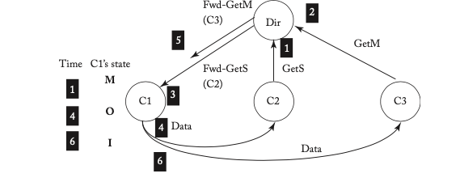

*Figure 8.12: Example with point-to-point ordering.*

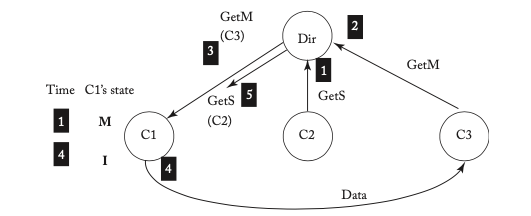

*Figure 8.13: Example without point-to-point ordering. Note that C2’s Fwd-GetS arrives at C1 in state I and thus C1 does not respond.*

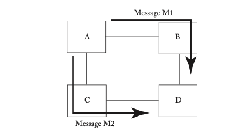

*Figure 8.14: Adaptive routing example.*

### 8.7.4 SILENT VS. NON-SILENT EVICTIONS OF BLOCKS IN STATE S

We designed our baseline directory protocol such that a cache cannot silently evict a block in state S (i.e., without issuing a PutS to notify the directory). To evict an S block, the cache must send a PutS to the directory and wait for a Put-Ack. Another option would be to allow silent evictions of S blocks. (A similar discussion could be made for blocks in state E, if one considers the E state to not be an ownership state, in which case silent evictions of E blocks are possible.)

#### Advantages of Silent PutS

The drawback to the explicit PutS is that it uses interconnection network bandwidth—albeit for small data-free PutS and Put-Ack messages—even in cases when it ends up not being helpful. For example if core C1 sends a PutS to the directory and then subsequently wants to perform a load to this block, C1 sends a GetS to the directory and re-acquires the block in S. If C1 sends this second GetS before any intervening GetM requests from other cores, then the PutS transaction served no purpose but did consume bandwidth.

#### Advantages of Explicit PutS

The primary motivation for sending a PutS is that a PutS enables the directory to remove the cache no longer sharing the block from its list of sharers. There are three benefits to having a more precise sharer list. First, when a subsequent GetM arrives, the directory need not send an Invalidation to this cache. The GetM transaction is accelerated by eliminating the Invalidation and having to wait for the subsequent Inv-Ack. Second, in a MESI protocol, if the directory is precisely counting the sharers, it can identify situations in which the last sharer has evicted its block; when the directory knows there are no sharers, it can respond to a GetS with Exclusive data. Third, recall from Section 8.6.2 that directory caches that use Recalls can benefit from having explicit PutS messages to avoid unnecessary Recall requests.

A secondary motivation for sending a PutS, and the reason our baseline protocol does send a PutS, is that it simplifies the protocol by eliminating some races. Notably, without a PutS, a cache that silently evicts a block in S and then sends a GetS request to re-obtain that evicted block in S can receive an Invalidation from the directory before receiving the data for its GetS. In this situation, the cache does not know if the Invalidation pertains to the first period in which it held the block in S or the second period (i.e., whether the Invalidation is serialized before or after the GetS). The simplest solution to this race is to pessimistically assume the worst case (the Invalidation pertains to the second period) and always invalidate the block as soon as its data arrives. More efficient solutions exist, but complicate the protocol.

## 8.8 CASE STUDIES

In this section, we discuss several commercial directory coherence protocols. We start with a traditional multi-chip system, the SGI Origin 2000. We then discuss more recently developed directory protocols, including AMD's Coherent HyperTransport and the subsequent HyperTransport Assist. Last, we present Intel's QuickPath Interconnect (QPI).

### 8.8.1 SGI ORIGIN 2000

The Silicon Graphics Origin 2000 [10] was a commercial multi-chip multiprocessor designed in the mid-1990s to scale to 1024 cores. The emphasis on scalability necessitated a scalable coherence protocol, resulting in one of the first commercial shared-memory systems using a directory protocol. The Origin's directory protocol evolved from the design of the Stanford DASH multiprocessor [11], as the DASH and Origin had overlapping architecture teams.

As illustrated in Figure 8.15, the Origin consists of up to 512 nodes, where each node consists of two MIPS R10000 processors connected via a bus to a specialized ASIC called the Hub. Unlike similar designs, Origin's processor bus does not exploit coherent snooping and simply connects the processors to each other and to the node's Hub. The Hub manages the cache coherence protocol and interfaces the node to the interconnection network. The Hub also connects to the node's portion of the distributed memory and directory. The network does not support any ordering, even point-to-point ordering between nodes. Thus, if Processor A sends two messages to Processor B, they may arrive in a different order than that in which they were sent.

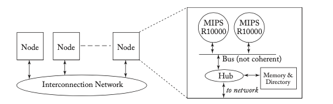

*Figure 8.15: SGI Origin.*

The Origin's directory protocol has a few distinguishing features that are worth discussing. First, because of its scalability, each directory entry contains fewer bits than necessary to represent every possible cache that could be sharing a block. The directory dynamically chooses, for each directory entry, to use either a coarse bit vector representation or a limited pointer representation (Section 8.5).

A second interesting feature in the protocol is that because the network provides no ordering, there are several new coherence message race conditions that are possible. Notably, the examples from Section 8.7.3 are possible. To maintain correctness, the protocol must consider all of these possible race conditions introduced by not enforcing ordering in the network.

A third interesting feature is the protocol's use of a non-ownership E state. Because the E state is not an ownership state, a cache can silently evict a block in state E (or state S).

A fourth interesting feature of the Origin is that is provides a special Upgrade coherence request to transition from S to M without needlessly requesting data, which is not unusual but does introduce a new race. There is a window of vulnerability between when processor P1 sends an Upgrade and when the Upgrade is serialized at the directory; if another processor's GetM or Upgrade is serialized first, then P1's state is I when its Upgrade arrives at the directory, and P1 in fact needs data. In this situation, the directory sends a negative acknowledgment (NACK) to P1, and P1 must send a GetM to the directory.

Another interesting feature of the Origin's E state is how requests are satisfied when a processor is in E. Consider the case where processor P1 obtains a block in state E. If P2 now sends a GetS to the directory, the directory must consider that P1 (a) might have silently evicted the block, (b) might have an unmodified value of the block (i.e., with the same value as at memory), or (c) might have a modified value of the block. To handle all of these possibilities, the directory responds with data to P2 and also forwards the request to P1. P1 sends P2 either new data (if in M) or just an acknowledgment. P2 must wait for both responses to arrive to know which message's data to use.

One other quirk of the Origin is that it uses only two networks (request and response) instead of the three required to avoid deadlock. A directory protocol has three message types (request, forwarded request, and response) and thus nominally requires three networks. Instead, the Origin protocol detects when deadlock could occur and sends a "backoff" message to a requestor on the response network. The backoff message contains the list of nodes that the request needs to be sent to, and the requestor can then send to them on the request network.

### 8.8.2 COHERENT HYPERTRANSPORT

Directory protocols were originally developed to meet the needs of highly scalable systems, and the SGI Origin is a classic example of such a system. Recently, however, directory protocols have become attractive even for small- to medium-scale systems because they facilitate the use of point-to-point links in the interconnection network. This advantage of directory protocols motivated the design of AMD's Coherent HyperTransport (HT) [5]. Coherent HT enables glueless connections of AMD processors into small-scale multiprocessors. Perhaps ironically, Coherent HT actually uses broadcasts, thus demonstrating that the appeal of directory protocols in this case is the use of point-to-point links, rather than scalability.

AMD observed that systems with up to eight processor chips can be built with only three point-to-point links per chip and a maximum chip-to-chip distance of three links. Eight processor chips, each with 6 cores, means a system with a respectable 48 cores. To keep the protocol simple, Coherent HT uses a variation on a Dir0B directory protocol (Section 8.5.2) that stores no stable directory state. Any coherence request sent to the directory is forwarded to all cache controllers (i.e., broadcast). Coherent HT can also be thought of as an example of a null directory cache: requests always miss in the (null) directory cache, so it always broadcasts. Because of the broadcasts, the protocol does not scale to large-scale systems, but that was not the goal.

In a system with Coherent HT, each processor chip contains some number of cores, one or more integrated memory controllers, one or more integrated HyperTransport controllers, and between one and three Coherent HT links to other processor chips. A "node" consists of a processor chip and its associated memory for which it is the home.

There are many viable interconnection network topologies, such as the four-node system shown in Figure 8.16. Significantly, this protocol does not require a total order of coherence requests, which provides greater flexibility for the interconnection network.

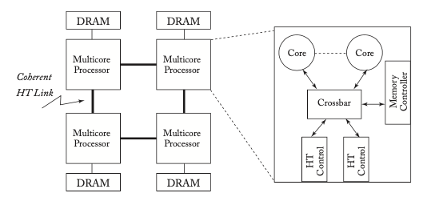

*Figure 8.16: Four-node coherent HyperTransport system (adapted from [5]).*

A coherence transaction works as follows. A core unicasts a coherence request to the directory controller at the home node, as in a typical directory protocol. Because the directory has no state and thus cannot determine which cores need to observe the request, the directory controller then broadcasts the forwarded request to all cores, including the requestor. (This broadcast is like what happens in a snooping protocol, except that the broadcast is not totally ordered and does not originate with the requestor.) Each core then receives the forwarded request and sends a response (either data or an acknowledgment) to the requestor. Once the requestor has received all of the responses, it sends a message to the directory controller at the home node to complete the transaction.

Looking at this protocol, one can view it as the best or worst of both worlds. Optimistically, it has point-to-point links with no directory state or complexity, and it is sufficiently scalable for up to eight processors. Pessimistically, it has the long three-hop latency of directories—or four hops, if you consider the message from the requestor to the home to complete the transaction, although this message is not on the critical path—with the high broadcast traffic of snooping. In fact, Coherent HT uses even more bandwidth than snooping because all broadcasted forwarded requests generate a response. The drawbacks of Coherent HT motivated an enhanced design called HyperTransport Assist [6].

### 8.8.3 HYPERTRANSPORT ASSIST

For the 12-core AMD Opteron processor-based system code-named Magny Cours, AMD developed HyperTransport Assist [6]. HT Assist enhances Coherent HT by eliminating the need to broadcast every forwarded coherence request. Instead of the Dir0B-like protocol of Coherent HT, HT Assist uses a directory cache similar to the design described in Section 8.6.2. Each multicore processor chip has an inclusive directory cache that has a directory entry for every block (a) for which it is the home and (b) that is cached anywhere in the system. There is no DRAM directory, thus preserving one of the key features of Coherent HT. A miss in the directory cache indicates that the block is not cached anywhere. HT Assist's directory cache uses Recall requests to handle situations in which the directory cache is full and needs to add a new entry. Although HT Assist appears from our description thus far to be quite similar to the design in Section 8.6.2, it has several distinguishing features that we present in greater detail.

First, the directory entries provide only enough information to determine whether a coherence request must be forwarded to all cores, forwarded to a single core, or satisfied by the home node's memory. That is, the directory does not maintain sufficient state to distinguish needing to forward a request to two cores from needing to forward the request to all cores. This design decision eliminated the storage cost of having to maintain the exact number of sharers of each block; instead, two directory states distinguish "one sharer" from "more than one sharer."

Second, the HT Assist design is careful to avoid incurring a large number of Recalls. AMD adhered to a rule of thumb that there should be at least twice as many directory entries as cached blocks. Interestingly, AMD chose not to send explicit PutS requests; their experiments apparently convinced them that the additional PutS traffic was not worth the limited benefit in terms of a reduction in Recalls.

Third, the directory cache shares the LLC. The LLC is statically partitioned by the BIOS at boot time, and the default is to allocate 1 MB to the directory cache and allocate the remaining 5 MB to the LLC itself. Each 64-byte block of the LLC that is allocated to the directory cache is interpreted as 16 4-byte directory entries, organized as four 4-way set-associative sets.

### 8.8.4 INTEL QPI

Intel developed its QuickPath Interconnect (QPI) [9, 12] for connecting processor chips starting with the 2008 Intel Core microarchitecture, and QPI first shipped in the Intel Core i7-9xx processor. Prior to this, Intel connected processor chips with a shared-wire bus called the Front- Side Bus (FSB). FSB evolved from a single shared bus to multiple buses, but the FSB approach was fundamentally bottlenecked by the electrical signaling limits of the buses. To overcome this limitation, Intel designed QPI to connect processor chips with point-to-point (i.e., non-bus) links. QPI specifies multiple levels of the networking stack, from physical layer to protocol layer. For purposes of this primer, we focus on the protocol layer here.

QPI supports five stable coherence states, the typical MESI states and the F(orward) state. The F state is a clean, read-only state, and it is distinguished from the S state because a cache with a block in F may respond with data (i.e., forward the data) to coherence requests. Only one cache may hold a block in F at a given time. The F state is somewhat similar to the O state, but differs in that a block in F is not dirty and can thus be silently evicted; a cache that wishes to evict a block in O must copy the block back to memory. The benefit of the F state is that it allows read-only data to be sourced from a cache, which is often faster than sourcing it from memory (which usually responds to requests when a block is read-only).

QPI provides two different protocol modes, depending on the size of the system: "home snoop" and "source snoop."

QPI's Home Snoop mode is effectively a scalable directory protocol (i.e., do not be confused by the word "snoop" in its name). As with typical directory protocols, a core C1 issues a request to the directory at the home node C2, and the directory forwards that request to only the node(s) that need to see it, say C3 (the owner in M). C3 responds with data to C1 and also sends a message to C2 to notify the directory. When the directory at C2 receives the notification from C3, it sends a "completion" message to C1, at which point C1 may use the data it received from C3. The directory serves as the serialization point in the protocol and resolves message races.

QPI's Source Snoop protocol mode is designed to have lower-latency coherence transactions, at the expense of not scaling well to large systems with many nodes. A core C1 broadcasts a request to all nodes, including the home. Each core responds to the home with a "snoop response" that indicates what state the block was in at that core; if the block was in state M, then the core sends the block to the requestor in addition to the snoop response to the home. Once the home has received all of the snoop responses for a request, the request has been ordered. At this point, the home either sends data to the requestor (if no core owned the block in M) or a non-data message to the requestor; either message, when received by the requestor, completes the transaction.

Source Snoop's use of broadcast requests is similar to a snooping protocol, but with the critical difference of the broadcast requests not traveling on a totally ordered broadcast network. Because the network is not totally ordered, the protocol must have a mechanism to resolve races (i.e., when two broadcasts race, such that core C1 sees broadcast A before broadcast B and core C2 sees B before A). This mechanism is provided by the home node, albeit in a way that differs from typical race ordering in directory protocols. Typically, the directory at the requested block's home orders two racing requests based on which request arrives at the home first. QPI's Source Snoop, instead, orders the requests based on which request's snoop responses have all arrived at the home.

Consider the race situation in which block A is initially in state I in the caches of both C1 and C2. C1 and C2 both decide to broadcast GetM requests for A (i.e., send a GetM to the other core and to the home). When each core receives the other core's GetM, it sends a snoop response to the home. Assume that C2's snoop response arrives at the home before C1's snoop response. In this case, C1's request is ordered first and the home sends data to C1 and informs C1 that there is a race. C1 then sends an acknowledgment to the home, and the home subsequently sends a message to C1 that both completes C1's transaction and tells C1 to send the block to C2. Handling this race is somewhat more complicated than in a typical directory protocol in which requests are ordered when they arrive at the directory.

Source Snoop mode uses more bandwidth than Home Snoop, due to broadcasting, but Source Snoop's common case (no race) transaction latency is less. Source Snoop is somewhat similar to Coherent HyperTransport, but with one key difference. In Coherent HT, a request is unicasted to the home, and the home broadcasts the request. In Source Snoop, the requestor broadcasts the request. Source Snoop thus introduces more complexity in resolving races because there is no single point at which requests can be ordered; Coherent HT uses the home for this purpose.

## 8.9 DISCUSSION AND THE FUTURE OF DIRECTORY PROTOCOLS

Directory protocols have come to dominate the market. Even in small-scale systems, directory protocols are more common that snooping protocols, largely because they facilitate the use of point-to-point links in the interconnection network. Furthermore, directory protocols are the only option for systems requiring scalable cache coherence. Although there are numerous optimizations and implementation tricks that can mitigate the bottlenecks of snooping, fundamentally none of them can eliminate these bottlenecks. For systems that need to scale to hundreds or even thousands of nodes, a directory protocol is the only viable option for coherence. Because of their scalability, we anticipate that directory protocols will continue their dominance for the foreseeable future.

It is possible, though, that future highly scalable systems will not be coherent or at least not coherent across the entire system. Perhaps such systems will be partitioned into subsystems that are coherent, but coherence is not maintained across the subsystems. Or perhaps such systems will follow the lead of supercomputers, like those from Cray, that have either not provided coherence [14] or have provided coherence but restricted what data can be cached [1].

## 8.10 REFERENCES

[1] D. Abts, S. Scott, and D. J. Lilja. So many states, so little time: Verifying memory coherence in the Cray X1. In Proc. of the International Parallel and Distributed Processing Symposium, 2003. DOI: 10.1109/ipdps.2003.1213087.

[2] A. Agarwal, R. Simoni, M. Horowitz, and J. Hennessy. An evaluation of directory schemes for cache coherence. In Proc. of the 15th Annual International Symposium on Computer Architecture, pp. 280–89, May 1988. DOI: 10.1109/isca.1988.5238.

[3] J. K. Archibald and J.-L. Baer. An economical solution to the cache coherence problem. In Proc. of the 11th Annual International Symposium on Computer Architecture, pp. 355–62, June 1984. DOI: 10.1145/800015.808205.

[4] J.-L. Baer and W.-H. Wang. On the inclusion properties for multi-level cache hierarchies. In Proc. of the 15th Annual International Symposium on Computer Architecture, pp. 73–80, May 1988. DOI: 10.1109/isca.1988.5212.

[5] P. Conway and B. Hughes. The AMD Opteron northbridge architecture. IEEE Micro, 27(2):10–21, March/April 2007. DOI: 10.1109/mm.2007.43.

[6] P. Conway, N. Kalyanasundharam, G. Donley, K. Lepak, and B. Hughes. Cache hierarchy and memory subsystem of the AMD Opteron processor. IEEE Micro, 30(2):16–29, March/April 2010. DOI: 10.1109/mm.2010.31.

[7] A. Gupta, W.-D. Weber, and T. Mowry. Reducing memory and traffic requirements for scalable directory-based cache coherence schemes. In Proc. of the International Conference on Parallel Processing, 1990. DOI: 10.1007/978-1-4615-3604-8_9.

[8] M. D. Hill, J. R. Larus, S. K. Reinhardt, and D. A. Wood. Cooperative shared memory: Software and hardware for scalable multiprocessors. ACM Transactions on Computer Systems, 11(4):300–18, November 1993. DOI: 10.1145/161541.161544.

[9] Intel Corporation. An Introduction to the Intel QuickPath Interconnect. Document Number 320412–001US, January 2009.

[10] J. Laudon and D. Lenoski. The SGI Origin: A ccNUMA highly scalable server. In Proc. of the 24th Annual International Symposium on Computer Architecture, pp. 241–51, June 1997. DOI: 10.1145/264107.264206.

[11] D. Lenoski, J. Laudon, K. Gharachorloo, W.-D. Weber, A. Gupta, J. Hennessy, M. Horowitz, and M. Lam. The Stanford DASH multiprocessor. IEEE Computer, 25(3):63–79, March 1992. DOI: 10.1109/2.121510.

[12] R. A. Maddox, G. Singh, and R. J. Safranek. Weaving High Performance Multiprocessor Fabric: Architecture Insights into the Intel QuickPath Interconnect. Intel Press, 2009.

[13] M. R. Marty and M. D. Hill. Virtual hierarchies to support server consolidation. In Proc. of the 34th Annual International Symposium on Computer Architecture, June 2007. DOI: 10.1145/1250662.1250670.

[14] S. L. Scott. Synchronization and communication in the Cray T3E multiprocessor. In Proc. of the 7th International Conference on Architectural Support for Programming Languages and Operating Systems, pp. 26–36, October 1996.