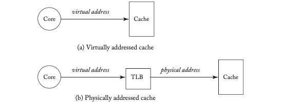
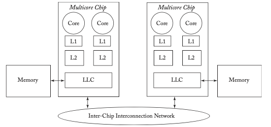
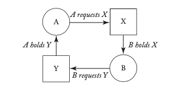
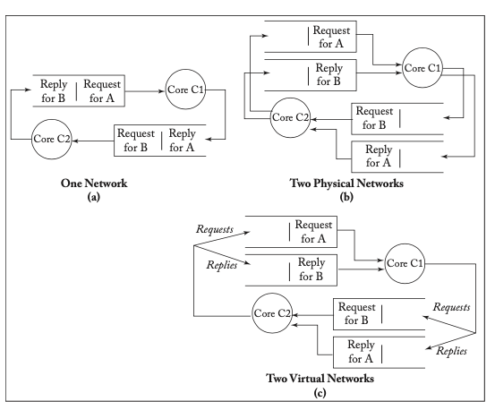

## 9. Advanced Topics in Coherence

In Chapters 7 and 8, we have presented snooping and directory coherence protocols in the context of the simplest system models that were sufficient for explaining the fundamental issues of these protocols. In this chapter, we extend our presentation of coherence in several directions. In Section 9.1, we discuss the issues involved in designing coherence protocols for more sophisticated system models. In Section 9.2, we describe optimizations that apply to both snooping and directory protocols. In Section 9.3, we explain how to ensure that a coherence protocol remains live (i.e., avoids deadlock, livelock, and starvation). In Section 9.4, we present token coherence protocols [12], a class of protocols that subsumes both snooping and directory protocols. We conclude in Section 9.5 with a brief discussion of the future of coherence.

### 9.1 System Models

Thus far, we have assumed a simple system model, in which each processor core has a single-level write-back data cache that is physically addressed. This system model omitted numerous features that are typically present in commercial systems, such as instruction caches (Section 9.1.1), translation lookaside buffers (Section 9.1.2), virtually addressed caches (Section 9.1.3), write-through caches (Section 9.1.4), coherent DMA (Section 9.1.5), and multiple levels of caches (Section 9.1.6).

#### 9.1.1 Instruction Caches

All modern cores have at least one level of instruction cache, raising the question of whether and how to support instruction cache coherence. Although truly self-modifying code is rare, cache blocks containing instructions may be modified when the operating system loads a program or library, a just-in-time (JIT) compiler generates code, or a dynamic run-time system re-optimizes a program.

Adding instruction caches to a coherence protocol is superficially straightforward; blocks in an instruction cache are read-only and thus in either stable state I or S. Furthermore, the core never writes directly to the instruction cache; a core modifies code by performing stores to its data cache. Thus, the instruction cache's coherence controller takes action only when it observes a GetM from another cache (possibly its own L1 data cache) to a block in state S and simply invalidates the block.

Instruction cache coherence differs from data cache coherence for several reasons. Most importantly, once fetched, an instruction may remain buffered in the core's pipeline for many cycles (e.g., consider a core that fills its 128-instruction window with a long sequence of loads, each of which misses all the way to DRAM). Software that modifies code needs some way to know when a write has affected the fetched instruction stream. Some architectures, such as the AMD Opteron, address this issue using a separate structure that tracks which instructions are in the pipeline. If this structure detects a change to an in-flight instruction, it flushes the pipeline. However, because instructions are modified far less frequently than data, other architectures require the software to explicitly manage coherence. For example, the Power architecture provides the `icbi` (instruction cache block invalidate) instruction to invalidate an instruction cache entry.

#### 9.1.2 Translation Lookaside Buffers (TLBs)

Translation lookaside buffers (TLBs) are caches that hold a special type of data: translations from virtual to physical addresses. As with other caches, they must be kept coherent. Like instruction caches, they have not historically participated in the same all-hardware coherence protocols that handle data caches. The traditional approach to TLB coherence is TLB shootdown [18], a software-managed coherence scheme that may or may not have some hardware support. In a classic implementation, a core invalidates a translation entry (e.g., by clearing the page table entry’s PageValid bit) and sends an inter-processor interrupt to all cores. Each core receives its interrupt, traps to a software handler, either invalidates the specific translation entry from its TLBs or flushes all entries from its TLBs (depending upon the platform). Each core must also ensure that there are no instructions in flight which are using the now-stale translation, typically by flushing the pipeline. Each core then sends an acknowledgment back to the initiating core, using an interprocessor interrupt. The initiating core waits for all of the acknowledgments, ensuring that all stale translation entries have been invalidated, before modifying the translation (or reusing the physical page). Some architectures provide special support to accelerate TLB shootdown. For example, the Power architecture eliminates costly inter-processor interrupts by using a special `tlbie` (TLB invalidate entry) instruction; the initiating core executes a `tlbie` instruction, which broadcasts the invalidated virtual page number to all the cores and completes only once all cores have completed the invalidation.

Recent research proposed eliminating TLB shootdown and instead incorporating the TLBs into the existing all-hardware coherence protocol for the data and instruction caches [16]. This all-hardware solution is more scalable than TLB shootdown, but it requires a modification to the TLBs to enable them to be addressable in the same way as the data and instruction caches. That is, the TLBs must snoop the physical addresses of the blocks that hold translations in memory.

#### 9.1.3 Virtual Caches

Most caches in current systems—and all caches discussed thus far in this primer—are accessed with physical addresses, yet caches can also be accessed with virtual addresses. We illustrate both options in Figure 9.1. A virtually addressed cache (“virtual cache”) has one key advantage with respect to a physically addressed cache (“physical cache”): the latency of address translation is off the critical path.¹ This latency advantage is appealing for level-one caches, where latency is critical, but generally less compelling for lower level caches where latencies are less critical. Virtual caches, however, pose a few challenges to the architect of a coherence protocol:

*   Coherence protocols invariably operate on physical addresses, for compatibility with main memory, which would otherwise require its own TLB. Thus, when a coherence request arrives at a virtual cache, the request’s address must undergo reverse translation to obtain the virtual address with which to access the cache.
*   Virtual caches introduce the problem of synonyms. Synonyms are multiple virtual addresses that map to the same physical address. Without mechanisms in place to avoid synonyms, it is possible for synonyms to simultaneously exist in a virtual cache. Thus, not only does a virtual cache requires a mechanism for reverse translation but also any given reverse translation could result in multiple virtual addresses.

Because of the complexity of implementing virtual caches, they are rarely used in current systems. However, they have been used in a number of earlier systems, and it is possible that they could become more relevant again in the future.

*Figure 9.1: Physical vs. virtual addressed caches.*

#### 9.1.4 Write-Through Caches

Our baseline system model assumes writeback L1 data caches and a shared writeback LLC. The other option, write-through caches, has several advantages and disadvantages. The obvious disadvantages include significantly greater bandwidth and power to write data through to the next lower level of the memory hierarchy. In modern systems, these disadvantages effectively limit the write-through/writeback decision to the L1 cache.

The advantages of write-through L1s include the following.

*   A significantly simpler two-state VI (Valid and Invalid) coherence protocol. Stores write through to the LLC and invalidate all Valid copies in other caches.
*   An L1 eviction requires no action, besides changing the L1 state to Invalid, because the LLC always holds up-to-date data.
*   When the LLC handles a coherence request, it can respond immediately because it always has up-to-date data.
*   When an L1 observes another core’s write, it needs only to change the cache block’s state to Invalid. Importantly, this allows the L1 to represent each block’s state with a single, clearable flip-flop, eliminating complex arbitration or dual-ported state RAMs.
*   Finally, write-through caches also facilitate fault tolerance. Although a detailed discussion is outside the scope of this primer, a write-through L1 cache never holds the only copy of a block because the LLC always holds a valid copy. This allows the L1 to use only parity because it can always just invalidate a block with a parity error.

Write-through caches pose some challenges with multithreaded cores and shared L1 caches. Recall that TSO requires write atomicity, and thus all threads (except the thread performing the store) must see the store at the same time. Thus, if two threads T0 and T1 share the same L1 data cache, T0’s store to block A must prevent T1 from accessing the new value until all copies in other caches have been invalidated (or updated). Despite these complications and disadvantages, several designs use write-through L1 caches, including the Sun Niagara processors and AMD Bulldozer.

#### 9.1.5 Coherent Direct Memory Access (DMA)

In Chapter 2, when we first introduced coherence, we observed that incoherence can arise only if there are multiple actors that can read and write to caches and memory. Today, the most obvious collection of actors are the multiple cores on a single chip, but the cache coherence problem first arose in systems with a single core and direct memory access (DMA). A DMA controller is an actor that reads and writes memory under explicit system software control, typically at the page granularity. A DMA operation that reads memory should find the most recent version of each block, even if the block resides in a cache in state M or O. Similarly, a DMA operation that writes memory needs to invalidate all stale copies of the block.

It is straightforward to provide coherent DMA by adding a coherent cache to the DMA controller, and thus having DMA participate in the coherence protocol. In such a model, a DMA controller is indistinguishable from a dedicated core, guaranteeing that DMA reads will always find the most recent version of a block and DMA writes will invalidate all stale copies. However, adding a coherent cache to a DMA controller is undesirable for several reasons. First, DMA controllers have very different locality patterns than conventional cores, and they stream through memory with little, if any, temporal reuse. Thus, DMA controllers have little use for a cache larger than a single block. Second, when a DMA controller writes a block, it generally writes the entire block. Thus, fetching a block with a GetM is wasteful, since the entire data will be overwritten. Many coherence protocols optimize this case using special coherence operations. We could imagine adding a new GetM-NoData request to the protocols in this primer, which seeks M permission but expects only an acknowledgment message rather than a Data message. Other protocols use a special PutNewData message, which updates memory and invalidates all other copies including those in M and O.

DMA can also be made to work without hardware cache coherence, by requiring the operating system to selectively flush caches. For example, before initiating a DMA to or from a page P, the operating system could force all caches to flush page P using a protocol similar to TLB Shootdown (or using some other page flushing hardware support). This approach is inefficient, and thus generally only seen in some embedded systems, because the operating system must conservatively flush a page even if none of its blocks are in any cache.

#### 9.1.6 Multi-Level Caches and Hierarchical Coherence Protocols

Our baseline system assumes a single multicore chip with two levels of cache: private level-one data (L1) caches for each core and a shared last-level memory-side cache that holds both data and instructions (LLC). But many other combinations of chips and caches are possible. For example, Intel Nehalem and AMD Opteron processors support systems with multiple multicore chips as well as an additional level of private (per core) L2 caches. Figure 9.2 illustrates a system with two multicore processors, each having two cores with private L2 caches between the private L1s and shared LLC.

We next discuss multiple levels of caches on a single multicore chip, systems with multiple multicore processors, and hierarchical coherence protocols.

*Figure 9.2: System with multiple multicore chips.*

##### Multi-Level Caches

With multiple levels of caches, the coherence protocol must be sure to keep all of these caches coherent. Perhaps the most straightforward solution is to treat each cache completely independently. For example, the L1, L2, and LLC could each independently process all incoming coherence requests; this is the approach taken by the AMD Opteron [1].

However, we can also design the cache hierarchy such that not every cache needs to snoop every coherence request. As discussed in Section 8.6, a key design option is whether and which caches to make inclusive. An L2 is inclusive if it contains a superset of the blocks in the L1 caches. Consider the case of an inclusive L2 when the L2 snoops a GetM for block B from another core. If B is not in the L2, then there is no need to also snoop the L1 caches because B cannot be in any of them. Thus, an inclusive L2 cache can serve as a filter that reduces the amount of coherence request traffic that must be snooped by the L1 caches. If instead B is in the L2, then B might also be in the L1 caches and then the L1 caches must also snoop the request. This is the approach taken by the AMD Bulldozer.

Inclusion’s benefit—the reduction in L1 snoop bandwidth—must be traded off against the space wasted by redundant storage of inclusive blocks. The cache hierarchy can hold a greater number of distinct blocks if it is exclusive (i.e., if a block is in the L2 then it is not in the L1 caches) or non-inclusive (neither inclusive nor exclusive). Another reason not to provide inclusion is to avoid the complexity of maintaining inclusion (i.e., invalidating a block from the L1 when an L2 evicts that block).

##### Multiple Multicore Processors

Larger systems can be built by composing multiple multicore processor chips. While a full treatment of scalable systems is beyond the scope of this primer, we examine one key issue: how to use the LLC. In single-chip systems, the LLC is a memory-side cache logically associated with memory and thus can be largely ignored as far as coherence is concerned. In multi-chip systems, the LLC can alternatively be viewed as another level of the memory hierarchy. We present the options from the perspective of a given chip (the “local” chip) and its local memory; other chips are “remote” chips. The LLC could be used as:

*   A memory-side cache that holds blocks recently requested from the local memory. The requests could be either from only the local chip or from both local and remote chips.
*   A core-side cache that holds blocks recently requested by the cores on the chip. The blocks in the LLC could have homes on either this chip or other chips. In this case, the coherence protocol must usually operate among the LLCs and memories of the multiple multicore chips.

The LLC could also be used for both purposes, in a hybrid scheme. In a hybrid approach, the architects would have to decide how to allocate the LLC to these different demands.

##### Hierarchical Coherence Protocols

The protocols described in previous chapters are flat protocols, in that there was a single coherence protocol that every cache controller treats identically. However, once we introduce multiple levels of caches, we introduce the possible need for hierarchical coherence protocols.

Some systems are naturally hierarchical, including systems comprised of multiple multicore chips. Within each chip, there could be an intra-chip protocol, and there could be an inter-chip protocol across the chips. Coherence requests that can be satisfied by the intra-chip protocol do not interact with the inter-chip protocol; only when a request cannot be satisfied by another node on the chip does the request get promoted to the inter-chip protocol.

The choice of protocol at one level is largely independent of the choice at another level. For example, an intra-chip snooping protocol can be made compatible with an inter-chip directory protocol. Each chip would require a single directory controller that considers the entire chip to be a single node in the directory protocol. The inter-chip directory protocol could be identical to one of the directory protocols presented in Chapter 8, with the directory state naturally represented in a coarse fashion. Another possible hierarchical system could have directory protocols for both the intra- and inter-chip protocols, and the two directory protocols could be the same or even different from each other.

An advantage of hierarchical protocols for hierarchical systems is that it enables the design of a simple, potentially non-scalable intra-chip design for the commodity chip. When designing a chip, it would be beneficial to not have to design a single protocol that scales to the largest possible number of cores that could exist in a system. Such a protocol is likely to be overkill for the vast majority of systems that are comprised of a single chip.

There are numerous examples of hierarchical protocols for hierarchical systems. The Sun Wildfire prototype [5] connects multiple snooping systems together with a higher level directory protocol. The AlphaServer GS320 [4] has two levels of directory protocols, one within each quad-processor block and another across these blocks. The Stanford DASH machine [10] consisted of multiple snooping systems connected by a higher level directory protocol.

In a system with hundreds or thousands of cores, it might not make much sense to have a single coherence protocol. The system may be more likely to be divided, either statically or dynamically, into domains that each run a separate workload or separate virtual machine. In such a system, it may make sense to implement a hierarchical protocol that optimizes for intra-domain sharing yet still permits inter-domain sharing. Recent work by Marty and Hill [13] superposes a hierarchical coherence protocol on top of a multicore chip with a flat design. This design enables the common case—intra-domain sharing—to be fast while still allowing sharing across domains.

### 9.2 Performance Optimizations

There is a long history of research into optimizing the performance of coherence protocols. Rather than present a high-level survey, we focus on two optimizations that are largely independent of whether the underlying coherence protocol is snooping or directory. Why these two optimizations? Because they can be effective and they illustrate the kinds of optimizations that are possible.

#### 9.2.1 Migratory Sharing Optimization

In many multithreaded programs, a common phenomenon is migratory sharing. For example, one core may read and then write a data block, then a second core may read and write it, and so on. This pattern commonly arises from critical sections (e.g., the lock variable itself) in which the data block migrates from one core to another. In a typical protocol, each core performs a GetS transaction to read the data and then a subsequent GetM transaction to get write permission for the same block. However, if the system can predict that the data conforms to a migratory sharing pattern, cores could get an exclusive copy of the block when they first read it, thus reducing both the latency and bandwidth to access the data [2, 15, 17]. The migratory optimization is similar to the E state optimization, except that it also needs to return an exclusive copy when the block is in state M in some cache, not just when the block is in state I in all caches.

There are two basic approaches to optimizing migratory sharing. First, one can use some hardware predictor to predict that a particular block exhibits a migratory sharing pattern and issue a GetM rather than a GetS on a load miss. This approach requires no change to the coherence protocol but introduces a few challenges:

*   **Predicting migratory sharing:** we must design a hardware mechanism to predict when a block is undergoing migratory sharing. A simple approach is to use a table to record which blocks were first obtained with a GetS and then subsequently written, requiring a GetM. On each load miss, the coherence controller could consult the predictor to determine whether a block exhibits a migratory sharing pattern. If so, it could issue a GetM request, rather than a GetS.
*   **Mispredictions:** if a block is not migrating, then this optimization can hurt performance. Consider the extreme case of a system in which cores issue only GetM requests. Such a system would never permit multiple cores to share a block in a read-only state.

Alternatively, we can extend the coherence protocol with an additional Migratory M (MM) state. The MM state is equivalent to the state M, from a coherence perspective (i.e., dirty, exclusive, owned), but it indicates that the block was obtained by a GetS in response to a predicted migratory sharing pattern. If the local core proceeds to modify a block in MM, reinforcing the migratory sharing pattern, it changes the block to state M. If a core in state M receives a GetS from another core, it predicts that the access will be migratory and sends exclusive data (invalidating its own copy). If the Other-GetS finds the block in state MM, the migratory pattern has been broken and the core sends a shared copy and reverts to S (or possibly O). Thus, if many cores make GetS requests (without subsequent stores and GetM requests), all cores will receive S copies.

Migratory sharing is just one example of a phenomenon that, if detected, can be exploited to improve the performance of coherence protocols. There have been many schemes that target specific phenomena, as well as more general approaches to predicting coherence events [14].

#### 9.2.2 False Sharing Optimizations

One performance problem that can plague coherence protocols is false sharing. False sharing occurs when two cores are reading and writing different data that happen to reside on the same cache block. Even though the cores are not actually sharing the data on the block (i.e., the sharing is false), there can be a significant amount of coherence traffic between the cores for the block. This coherence traffic hurts performance when a core is waiting for coherence permissions to access a block, and it increases the load on the interconnection network. The likelihood of false sharing occurring is a function of the block size—a larger block can hold more unrelated pieces of data and thus larger blocks are more prone to false sharing—and the workload. There are at least two optimizations to mitigate the impact of false sharing.

##### Sub-Block Coherence

Without reducing the block size, we can perform coherence at a finer, sub-block granularity [7]. Thus, it is possible for a block in a cache to have different coherence states for different sub-blocks. Sub-blocking reduces false sharing, but it requires extra state bits for each block to hold the sub-block states.

##### Speculation

An architect can develop a hardware mechanism to predict when a block that is invalid in a cache is the victim of false sharing [6]. If the predictor believes the block is invalid due to false sharing, the core can speculatively use the data in the block until it obtains coherence permissions to the block. If the prediction was correct, this speculation overcomes the latency penalty of false sharing, but it does not reduce the traffic on the interconnection network.

### 9.3 Maintaining Liveness

In Chapter 2, we defined coherence and the invariants that must be maintained by a coherence protocol. These invariants are safety invariants; if these invariants are maintained, then the protocol will never allow unsafe (incorrect) behavior. Facetiously, it is easy to provide safety because an unplugged computer never does anything incorrect! The key is to provide both safety and liveness, where providing liveness requires the prevention of three classes of situations: deadlock, livelock, and starvation.

#### 9.3.1 Deadlock

As discussed briefly in Section 8.2.3, deadlock is the situation in which two or more actors wait for each other to perform some action, and thus never make progress. Typically, deadlock results from a cycle of resource dependences. Consider the simple case of two nodes A and B and two resources X and Y. Assume A holds resource Y and B holds resource X. If A requests X and B requests Y, then unless one node relinquishes the resource it already holds, these two nodes will deadlock. We illustrate this cyclical dependence graph in Figure 9.3. More generally, deadlock can result from cycles involving many nodes and resources. Note that partial deadlocks (e.g., the simple case of deadlock between only nodes A and B) can quickly become complete system deadlocks when other nodes wait for deadlocked nodes to perform some action (e.g., node C requests resource X).

*Figure 9.3: Example of deadlock due to cyclical resource dependences. Circles are nodes and squares are resources. An arc that ends at a resource denotes a request for that resource. An arc that starts at a resource denotes the holder of that resource.*

##### Protocol Deadlocks

In coherence protocols, deadlock can arise at the protocol level, at cache resource allocation, and in the network. Protocol deadlocks arise when a coherence controller waits for a message that will never be sent. For example, consider a (buggy) directory protocol that does not wait for a Put-Ack after sending a PutS, and instead immediately transitions to state I. If the directory controller sends an Inv (e.g., in response to core C1’s GetM request) to core C0 at the same time that core C0 sends a PutS to the directory, then C1 will never get an Inv-Ack from core C0 and will deadlock waiting for it. Such deadlocks represent protocol errors and usually arise from untested race conditions.

##### Cache Resource Deadlocks

Cache resource deadlocks arise when a cache controller must allocate a resource before performing some action. These deadlocks typically arise either when handling another core’s request or on writebacks. For example, consider a cache controller that has a set of shared buffers (e.g., transaction buffer entries, or TBEs) that may be allocated both when the core initiates a coherence request and when servicing another core’s request. If the core issues enough coherence requests to allocate all the buffers, then it cannot process another core’s request until it completes one of its own. If all cores reach this state, then the system deadlocks.

##### Protocol-Dependent Network Deadlocks

There are two causes of network deadlocks: deadlocks due to buggy routing algorithms, which are independent of the types of messages and the coherence protocol, and network deadlocks that arise because of the particular messages being exchanged during coherence protocol operation. We focus here on this latter category of protocol-dependent network deadlocks. Consider a directory protocol in which a request message may lead to a forwarded request and a forwarded request may lead to a response. The protocol must ensure three invariants to avoid cyclic dependences and thus deadlock.

**Sidebar: Virtual Networks**

Instead of using physically distinct networks, we can use distinct virtual networks. Consider two cores that are connected with a single point-to-point link. At the end of each link is a FIFO queue to hold incoming messages before the receiving core can process them. This single network is shown in Fig. 9.4a. To add another physical network, as shown in Fig. 9.4b, we duplicate the links and the FIFO queues. Requests travel on one physical network, and replies travel on the other physical network.

To avoid the cost of replicating the links and switches (switches not shown in figures), we can add a virtual network, as illustrated in Fig. 9.4c. The only cost of a virtual network is an additional FIFO queue at each switch and endpoint in the network. Adding the second virtual network in this example allows requests to not get stuck behind replies.

Virtual networks are related to virtual channels [3], and some papers use the terms interchangeably. However, we prefer to distinguish between them because they address different types of deadlocks. Virtual networks prevent messages of different classes from blocking each other and thus avoid message-level deadlocks.

Virtual channels are used at the network level to avoid deadlocks due to routing, regardless of the message types. To avoid routing deadlock, messages travel on multiple virtual channels (e.g., a message traveling west in a 2D torus might be required to use virtual channel 2). A virtual channel, like a virtual network, is implemented as an extra FIFO queue at each switch and end point in the network. Virtual channels are orthogonal to virtual networks; each virtual network may have some number of virtual channels to avoid routing deadlock.

*Figure 9.4: Virtual networks.*

*   As explained in Section 8.2.3, each message class must travel on its own network. The networks may be physical or virtual (see sidebar on “virtual networks”), but the key is avoiding situations in which a message of one class becomes stuck behind a message of another class in a FIFO buffer. In this example, requests, forwarded requests, and responses all travel on separate networks. A coherence controller thus has three incoming FIFOs, one for each network.
*   Message classes must have a dependence order. If a message of class A can cause a coherence controller to issue a message of class B, then a coherence controller may not stall the processing of an incoming class B message while waiting for a class A message. In the directory example, a coherence controller cannot stall the processing of a forwarded request while waiting for a request to arrive, nor can it stall the processing of a response while waiting for a forwarded request.
*   The last message class in this chain of dependences—the response message, in this directory example—must always be “sunk.” That is, if a coherence controller receives a response message, there must be no message class than can prevent it from being removed from its incoming queue.

These three invariants eliminate the possibility of a cycle. Even though a request can be stalled while waiting for responses or forwarded requests, every request will eventually be processed because the number of responses and forwarded requests is bounded by the number of outstanding transactions.

#### 9.3.2 Livelock

Livelock is a situation in which two or more actors perform actions and change states, yet never make progress. Livelock is a special case of starvation, discussed next. Livelock occurs most frequently in coherence protocols that use negative acknowledgment messages (NACKs). A node may issue a coherence request, but receive a NACK, prompting a retry. If contention or some repeatable race with another node causes this case to recur indefinitely, then the nodes livelock. The protocols in this primer do not use NACKs, so we focus on another well-known livelock scenario involving coherence permissions that can arise in these protocols.

This cause of livelock is the so-called “window of vulnerability” problem [8], an example of which is illustrated in Table 9.1. Consider a snooping protocol in which Core C1 issues a GetS request for block B and changes B’s state to `IS^AD` (in I, going to S, waiting for Own-GetS and data). At some point later, C1 observes its Own-GetS on the bus and changes B’s state to state `IS^D`. Between when B goes to state `IS^D` and when C1 receives the data response, C1 is vulnerable to observing a GetM request for B from another core on the bus. In an optimized protocol, like the protocol in Section 7.5.5, if a GetM arrives for B in state `IS^D`, C1 will change B’s state to `IS^DI`. In this transient state, when C1 later receives the data response, C1 changes B’s state to I. Because C1 cannot perform a load to a block in I, it must issue another GetS for B. However, this next GetS is just as susceptible to the window of vulnerability problem, and thus C1 may never make forward progress. The core is still active, and thus the system is not deadlocked, but it never makes forward progress. Somewhat perversely, this situation is most likely to arise for highly contended blocks, which means that most or all of the cores are likely to simultaneously be stuck and thus the system can livelock.

**Table 9.1: Livelock example for Core C1 trying to load block B in a snooping protocol**

| Cycle | Event (all for block B) | Core C1’s State for B |
|-------|------------------------|------------------------|
| 0     | Initial state          | I                      |
| 1     | Load request, issue GetS to bus | `IS^AD` |
| 2     | Observe Own-GetS on bus | `IS^D` |
| 3     | Observe Other-GetM on bus | `IS^DI` |
| 4     | Receive data for Own-GetS | I |
| 5     | Re-issue GetS to bus | `IS^AD` |
| 6     | Observe Own-GetS on bus | `IS^D` |
| 7     | Observe Other-GetM on bus | `IS^DI` |
| 8     | Receive data for Own-GetS | I |
| 9     | Etc. (never completing the load) | |

This window of vulnerability can be closed by requiring that C1 perform at least one load when it receives the data response. This load logically appears to occur at the time at which C1’s GetS is ordered (e.g., on the bus in a snooping protocol) and thus does not violate coherence. However, if certain conditions are not satisfied, performing this load could violate the memory consistency model. Satisfying these conditions is sometimes known as the Peekaboo problem, and we discuss it in more detail in the sidebar.

**Sidebar: Peekaboo Coherence Problem**

Table 9.2 illustrates what is sometimes called the Peekaboo Coherence problem. In this example, the locations A and B are initially zero, core C0 writes A first and then B, and core C1 reads B first and then A. Under both the SC and TSO memory consistency models, the only illegal outcome is r1=1 and r2=0. This example execution uses the optimized directory protocol from Section 8.7.2, but elides the directory controller’s actions (which are not pertinent to the example). PrefetchS is the one new operation in this example, which issues a GetS request if a readable block does not already reside in the cache.

The Peekaboo problem arises when a block is prefetched, invalidated before permission is received, and then a demand reference (demanded by a load or store, not a prefetch) occurs. If we perform the demand reference when the prefetched but already invalidated Data arrives, then the demand reference is effectively ordered at the time the block was invalidated. In this example, C1’s load A is effectively ordered at time 4 (when C1 receives the Inv for block A), while C1’s earlier (in program order) load B is ordered at time 7. Reordering these two loads violates both SC and TSO. Note that this problem can arise whether the prefetch operation results from an explicit prefetch instruction, hardware prefetcher, or speculative execution. This problem can also arise in optimized snooping protocols, such as the one in Section 7.5.5.

The simplest solution to the Peekaboo problem is to perform the load in the window of vulnerability if and only if that load was the oldest load in program order when the coherence request was first issued. In other words, the Peekaboo load is allowed to access the invalidated data only if all previous loads and stores before the Peekaboo load in program order were already performed before the coherence request for the Peekaboo load was first issued [11]. A complete analysis of why this solution is sufficient can be found in Manerkar et al. [11], but intuitively the problem cannot arise if a core issues coherence requests one at a time in the order of demand misses.

**Table 9.2: Example of Peekaboo Coherence problem**

| Time | Core C0 | Core C1 | Actions |
|------|---------|---------|---------|
| | A = B = 0 initially | | |
| | Store A = 1 | Store B = 1 | Prefetch A (prefetch for read-only access) |
| | | | Load r1 = B |
| | | | Load r2 = A |
| 0 | A:M[0] B:M[0] | A:I B:I | |
| 1 | | A: prefetchS miss, issue GetS/`IS^D` | |
| 2 | A: Receive Fwd-GetS, send Data[0]/S | | |
| 3 | A: store miss; issue GetM/`SM^AD` | | |
| 4 | A: receive Data[0](ack=1)/`SMA` | A: receive Inv, send Inv-Ack/`IS^DI` | |
| 5 | A: receive Inv-Ack, perform store/M[1] | | |
| 6 | B: store hit/M[1] | | |
| 7 | | B: load miss, issue GetS/`IS^D` | |
| 8 | B: receive Fwd-GetS, send Data[1]/S[1] | | |
| 9 | | B: receive Data[1], perform load r1=1/S[1] | |
| 10 | | A: load miss, stall/`IS^DI` | |
| 11 | | A: receive Data[0], perform load r2=0/I | |
| | | Core C1 observes A = 0 and B = 1, effectively reordering the loads. | |

This same window of vulnerability exists for stores to blocks in `IM^DS`, `IM^DSI`, or `IM^DI`. In these cases, the store to the block is never performed because the block’s state at the end of the transaction is either I or S, which is insufficient for performing a store. Fortunately, the same solution we presented for the load in `IS^DI` applies to stores in these states. A core that issues a GetM must perform at least one store when it receives the data, and the core must forward this newly written data to the other core(s) that requested the block in S and/or M between when it observes its own GetM and when it receives the data in response to its GetM. Note that the same restriction needed to avoid the Peekaboo problem still applies: namely, perform the store if and only if the store was the oldest load or store in program order at the time the coherence request was issued.

#### 9.3.3 Starvation

Starvation is a situation in which one or more cores fail to make forward progress while other cores are still actively making forward progress. The cores not making progress are considered to be starved. There are several root causes of starvation, but they tend to fall into two categories: unfair arbitration and incorrect use of negative acknowledgments.

Starvation can arise when at least one core cannot obtain a critical resource because the resource is always obtained or held by other cores. A classic example of this is an unfair bus arbitration mechanism in a bus-based snooping protocol. Consider a bus in which access to the bus is granted in a fixed priority order. If Core C1 wishes to make a request, it can make a request. If C2 wishes to make a request, it may make the request only if C1 has not first requested the bus. C3 must defer to C1 and C2, etc. In such a system, a core with a low priority may never gain permission to make a request and will thus starve. This well-known problem also has a well-known solution: fair arbitration.

The other main class of starvation causes is the incorrect use of negative acknowledgments (NACKs) in coherence protocols. In some protocols, a coherence controller that receives a coherence request may send a NACK to the requestor (often used in verb form as “the controller NACKed the request”), informing the requestor that the request was not satisfied and must be re-issued. NACKs are generally used by protocols to simplify situations in which there is another transaction in progress for the requested block. For example, in some directory protocols, the directory can NACK a request if the requested block is already in the midst of a transaction. Solving these protocol race conditions with NACKs appears, at least at first blush, to be conceptually easier than designing the protocol to handle some of these rare and complicated situations. However, the challenge is ensuring that a NACKed request eventually succeeds. Guaranteeing a lack of starvation, regardless of how many cores are requesting the same block at the same time, is challenging; one of the authors of this primer confesses to having designed a protocol with NACKs that led to starvation.

### 9.4 Token Coherence

Until fairly recently, coherence protocols could be classified as either snooping or directory or perhaps a hybrid of the two. There were many variants of each class and several hybrids, but protocols were fundamentally some combination of snooping and directory. In 2003, Martin et al. proposed a third protocol classification called Token Coherence [12]. There are two key ideas behind Token Coherence (TC).

TC protocols associate tokens with each block instead of state bits. There is a fixed number of tokens per block, and the cores can exchange—but not create or destroy—these tokens. A core with one or more tokens for a block can read the block, and a core with all of the tokens for a block can read or write to the block.

A TC protocol consists of two distinct parts: a correctness substrate and a performance protocol. The correctness substrate is responsible for ensuring safety (tokens are conserved) and liveness (all requests are eventually satisfied). The performance protocol specifies what a cache controller does on a cache miss. For example, in the TokenB performance protocol, all coherence requests are broadcast. In the TokenM protocol, coherence requests are multicast to a predicted set of sharers.

Token Coherence subsumes snooping and directory protocols, in that snooping and directory protocols can be interpreted as TC protocols. For example, an MSI snooping protocol is equivalent to a TC protocol with a broadcast performance protocol. The MSI states are equivalent to a core having all/some/none of the tokens for a block.

### 9.5 The Future of Coherence

Almost since coherence’s invention, some have predicted that it will soon go away because it adds hardware cost to store extra state, send extra messages, and verify that all is correct. However, we predict that coherence will remain commonly implemented because, in our judgment, the software cost of dealing with incoherence is often substantial and borne by a broader group of software engineers rather than the few hardware designers that confront implementing coherence. One piece of evidence for this claim is the adoption of coherence in recent heterogeneous systems, as we discuss in the next chapter. Differently from the protocols we discussed in Chapters 6–9, however, we will see that heterogeneous systems are suited to consistency-directed rather than consistency-agnostic coherence protocols.²

### 9.6 References

[1] P. Conway and B. Hughes. The AMD Opteron northbridge architecture. IEEE Micro, 27(2):10–21, March/April 2007. DOI: 10.1109/mm.2007.43. 195

[2] A. L. Cox and R. J. Fowler. Adaptive cache coherency for detecting migratory shared data. In Proc. of the 20th Annual International Symposium on Computer Architecture, pp. 98–108, May 1993. DOI: 10.1109/isca.1993.698549. 198

[3] W. J. Dally. Virtual channel flow control. IEEE Transactions on Parallel and Distributed Systems, 3(2):194–205, March 1992. DOI: 10.1109/71.127260. 201

[4] K. Gharachorloo, M. Sharma, S. Steely, and S. V. Doren. Architecture and design of AlphaServer GS320. In Proc. of the 9th International Conference on Architectural Support for Programming Languages and Operating Systems, pp. 13–24, November 2000. DOI: 10.1145/378993.378997. 197

[5] E. Hagersten and M. Koster. WildFire: A scalable path for SMPs. In Proc. of the 5th IEEE Symposium on High-Performance Computer Architecture, pp. 172–81, January 1999. DOI: 10.1109/hpca.1999.744361. 197

[6] J. Huh, J. Chang, D. Burger, and G. S. Sohi. Coherence decoupling: Making use of incoherence. In Proc. of the 11th International Conference on Architectural Support for Programming Languages and Operating Systems, October 2004. DOI: 10.1145/1024393.1024406. 199

[7] M. Kadiyala and L. N. Bhuyan. A dynamic cache sub-block design to reduce false sharing. In Proc. of the International Conference on Computer Design, 1995. DOI: 10.1109/iccd.1995.528827. 199

[8] J. Kubiatowicz, D. Chaiken, and A. Agarwal. Closing the window of vulnerability in multiphase memory transactions. In Proc. of the 5th International Conference on Architectural Support for Programming Languages and Operating Systems, pp. 274–84, October 1992. DOI: 10.1145/143365.143540. 203

[9] H. Q. Le et al. IBM POWER6 microarchitecture. IBM Journal of Research and Development, 51(6), 2007. DOI: 10.1147/rd.516.0639.

[10] D. Lenoski, J. Laudon, K. Gharachorloo, A. Gupta, and J. Hennessy. The directory-based cache coherence protocol for the DASH multiprocessor. In Proc. of the 17th Annual International Symposium on Computer Architecture, pp. 148–59, May 1990. DOI: 10.1109/isca.1990.134520. 197

[11] Y. A. Manerkar, D. Lustig, M. Pellauer, and M. Martonosi. CCICheck: using �hb graphs to verify the coherence-consistency interface. In Proc. of the 48th International Symposium on Microarchitecture, 2015. DOI: 10.1145/2830772.2830782. 205

[12] M. M. K. Martin, M. D. Hill, and D. A. Wood. Token coherence: Decoupling performance and correctness. In Proc. of the 30th Annual International Symposium on Computer Architecture, June 2003. DOI: 10.1109/isca.2003.1206999. 191, 207

[13] M. R. Marty and M. D. Hill. Virtual hierarchies to support server consolidation. In Proc. of the 34th Annual International Symposium on Computer Architecture, June 2007. DOI: 10.1145/1250662.1250670. 198

[14] S. S. Mukherjee and M. D. Hill. Using prediction to accelerate coherence protocols. In Proc. of the 25th Annual International Symposium on Computer Architecture, pp. 179–90, June 1998. DOI: 10.1109/isca.1998.694773. 199

[15] J. Nilsson and F. Dahlgren. Improving performance of load-store sequences for transaction processing workloads on multiprocessors. In Proc. of the International Conference on Parallel Processing, pp. 246–55, September 1999. DOI: 10.1109/icpp.1999.797410. 198

[16] B. F. Romanescu, A. R. Lebeck, D. J. Sorin, and A. Bracy. UNified instruction/translation/data (UNITD) coherence: One protocol to rule them all. In Proc. of the 15th International Symposium on High-Performance Computer Architecture, January 2010. DOI: 10.1109/hpca.2010.5416643. 192

[17] P. Stenström, M. Brorsson, and L. Sandberg. An adaptive cache coherence protocol optimized for migratory sharing. In Proc. of the 20th Annual International Symposium on Computer Architecture, pp. 109–18, May 1993. DOI: 10.1109/isca.1993.698550. 198

[18] P. J. Teller. Translation-lookaside buffer consistency. IEEE Computer, 23(6), pp. 26–36, June 1990. DOI: 10.1109/2.55498. 192